# High Level Design — Stock Decision Tool

---

## 1. System Overview

The Stock Decision Tool is a full-stack application that evaluates any US-listed stock or ETF across three investment horizons (short / medium / long term) and returns a structured **Buy / Wait / Avoid** recommendation backed by technical, fundamental, valuation, earnings, and sentiment analysis.

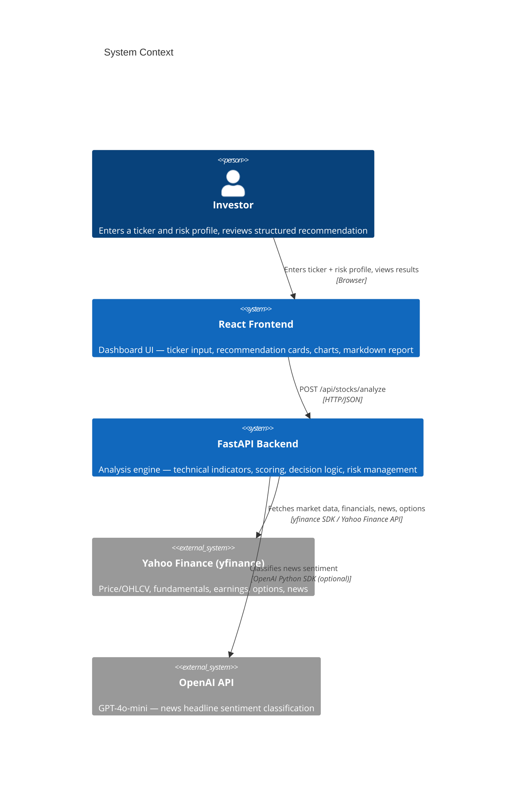

---

## 2. High-Level Architecture

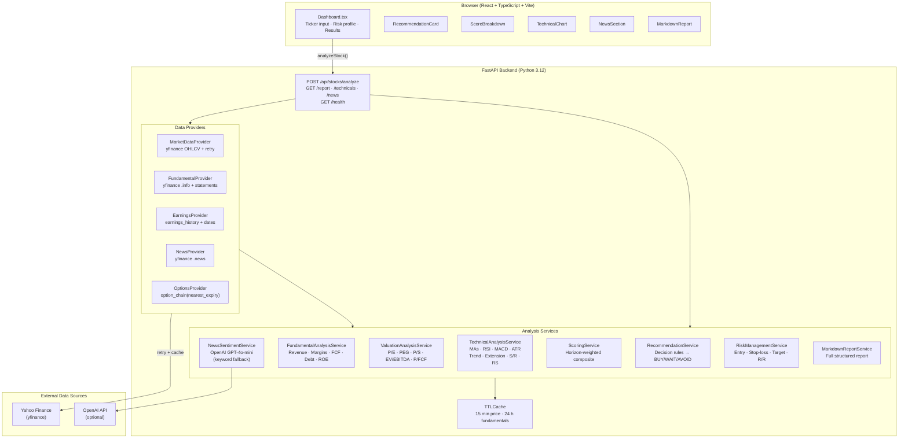

---

## 3. Request Lifecycle

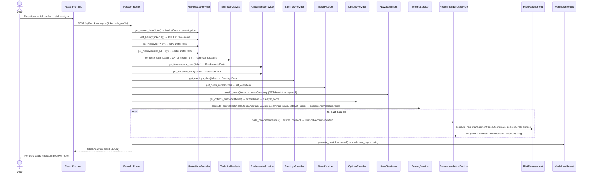

---

## 4. Analysis Pipeline

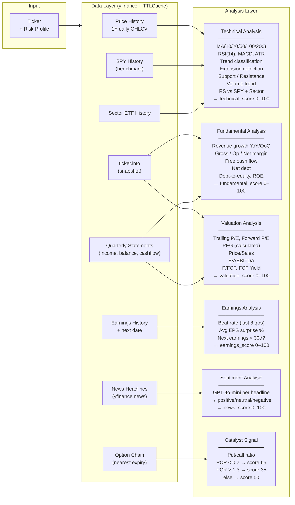

---

## 5. Scoring System

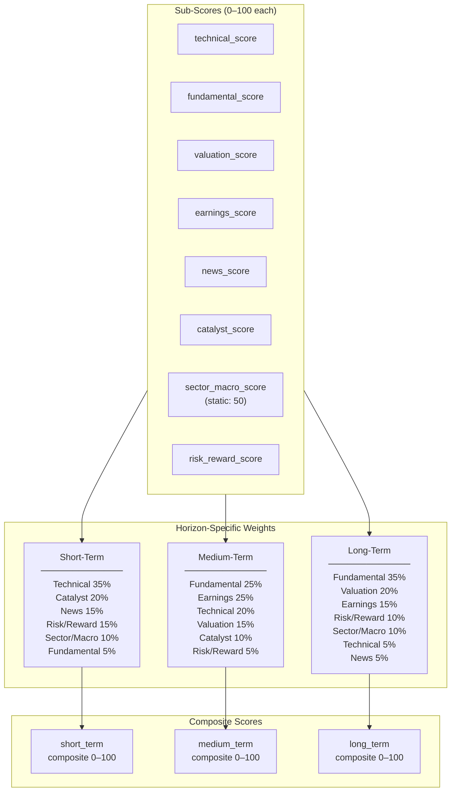

---

## 6. Decision Logic

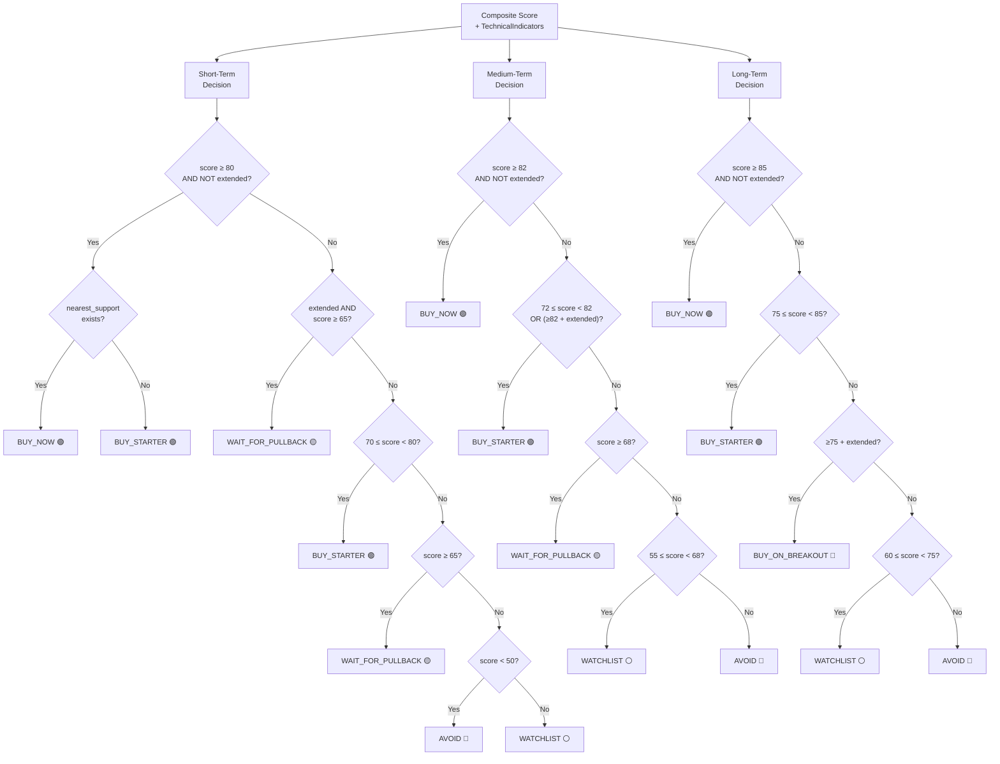

---

## 7. Risk Management Output

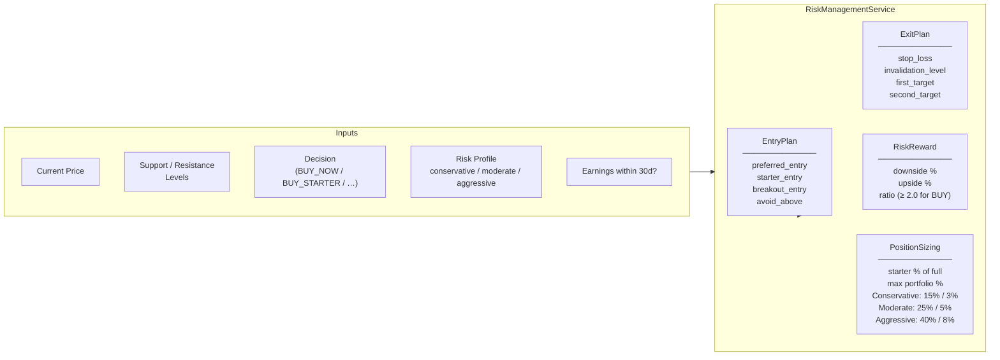

---

## 8. Frontend Component Tree

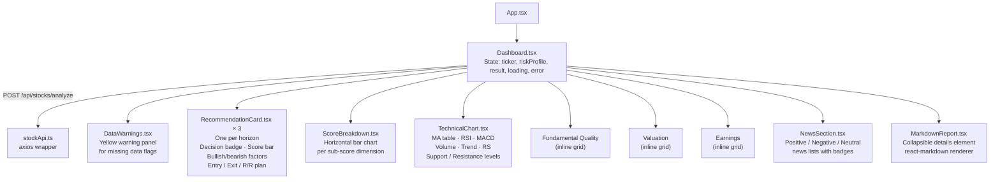

---

## 9. Data Model

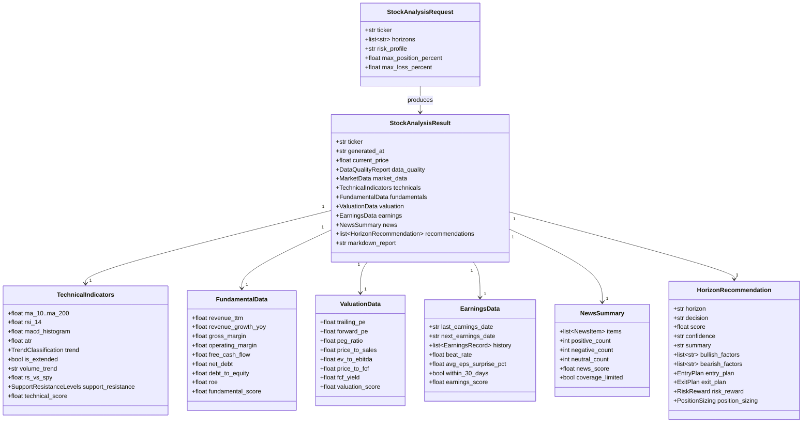

---

## 10. Caching Strategy

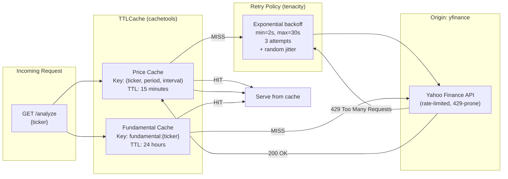

---

## 11. Backtest Architecture

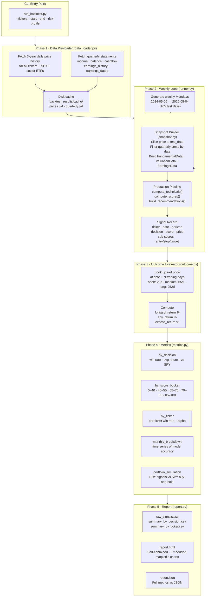

---

## 12. Look-Ahead Bias Prevention (Backtest)

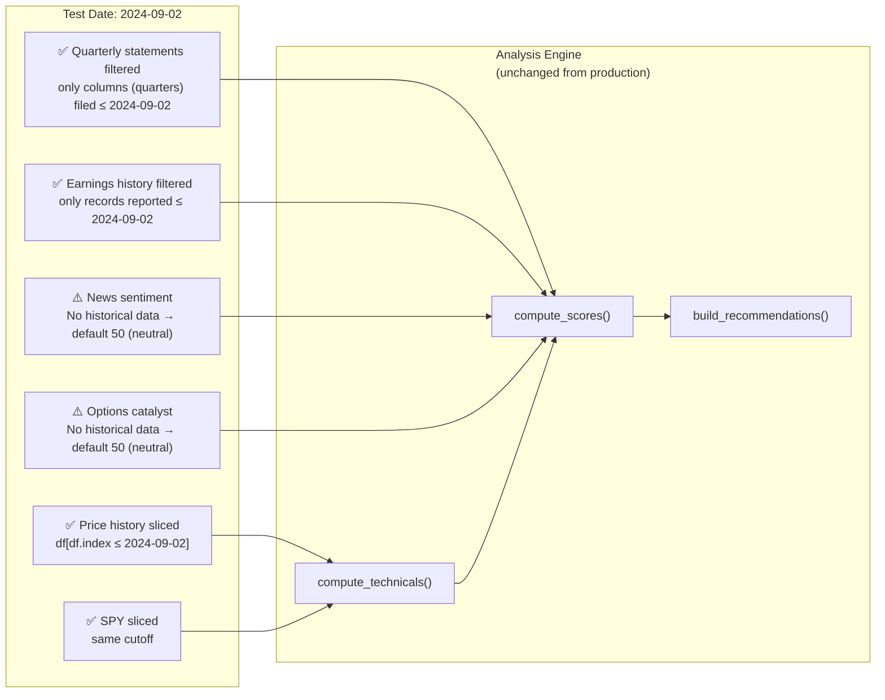

---

## 13. API Reference

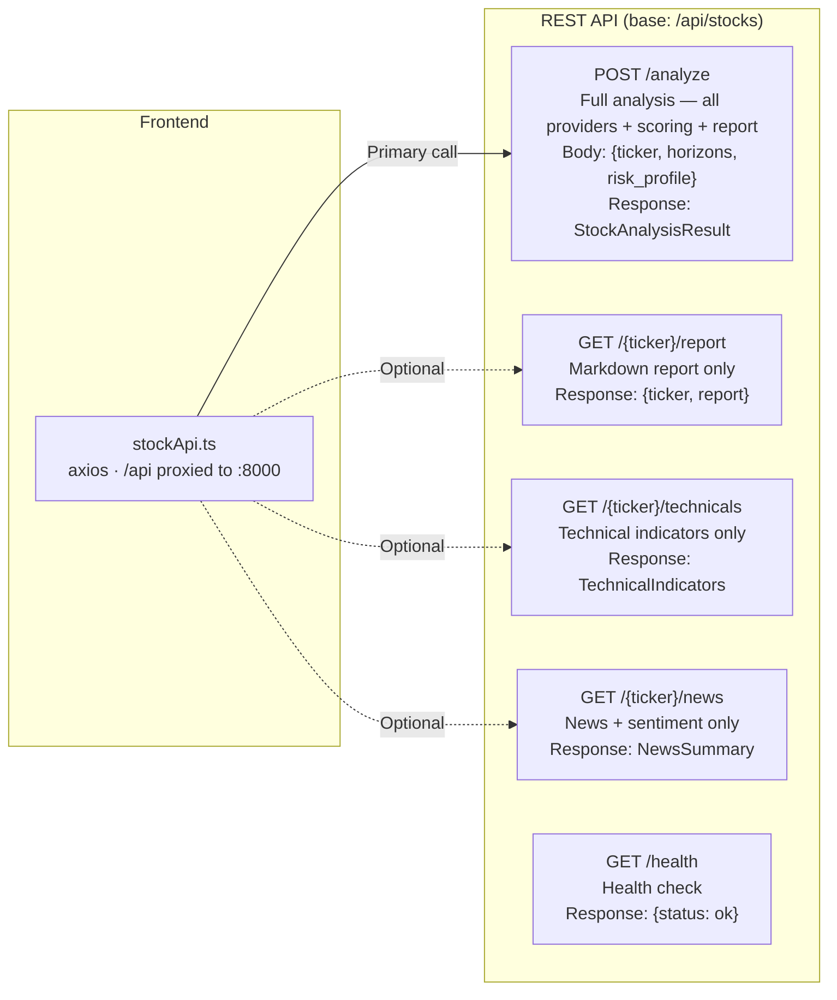

---

## 14. Technology Stack

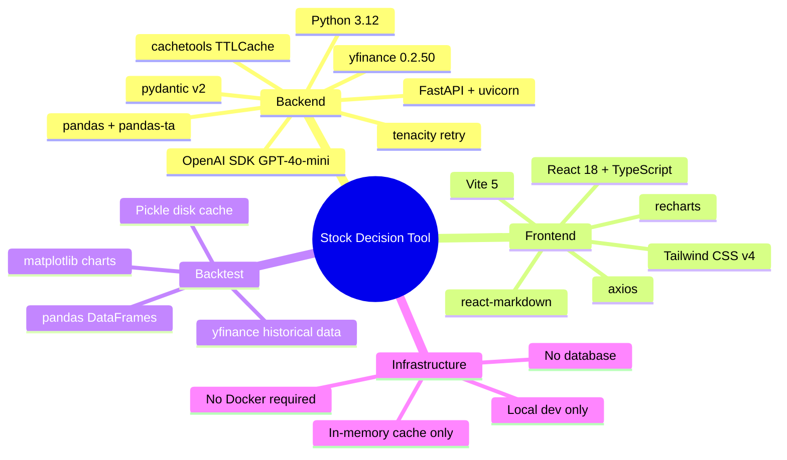

---

## 15. Known Limitations & Design Decisions

| Decision | Rationale | Trade-off |
|----------|-----------|-----------|
| **In-memory TTLCache** (no Redis) | Zero infra dependency for MVP | Cache lost on server restart; not shared across workers |
| **yfinance for all data** | Free, no API key required | Rate-limited (HTTP 429); limited news coverage; no historical options data |
| **OpenAI optional** | Tool works without API key (keyword fallback) | Keyword classifier is less accurate than GPT-4o-mini |
| **Static sector/macro score (50)** | No reliable free sector data via yfinance | Doesn't reflect real macro conditions |
| **No peer comparison** | yfinance doesn't support sector-level P/E comparison | Flags in data quality warnings |
| **Valuation penalizes high-multiple growth** | Conservative P/E / PEG scoring | Underscores expensive-but-growing tech names like NVDA, PLTR |
| **Backtest news/options = 50** | No historical news sentiment or options data available | Short-term backtest accuracy understated |
| **No database** | Simplicity; all state in HTTP response | No history, no user accounts, stateless |
