# High Level Design — Stock Decision Tool

---

## 1. System Overview

The Stock Decision Tool is a full-stack application that evaluates any US-listed stock or ETF across three investment horizons (short / medium / long term) and returns a structured recommendation backed by technical, fundamental, valuation, earnings, sentiment, archetype, and market-regime analysis.

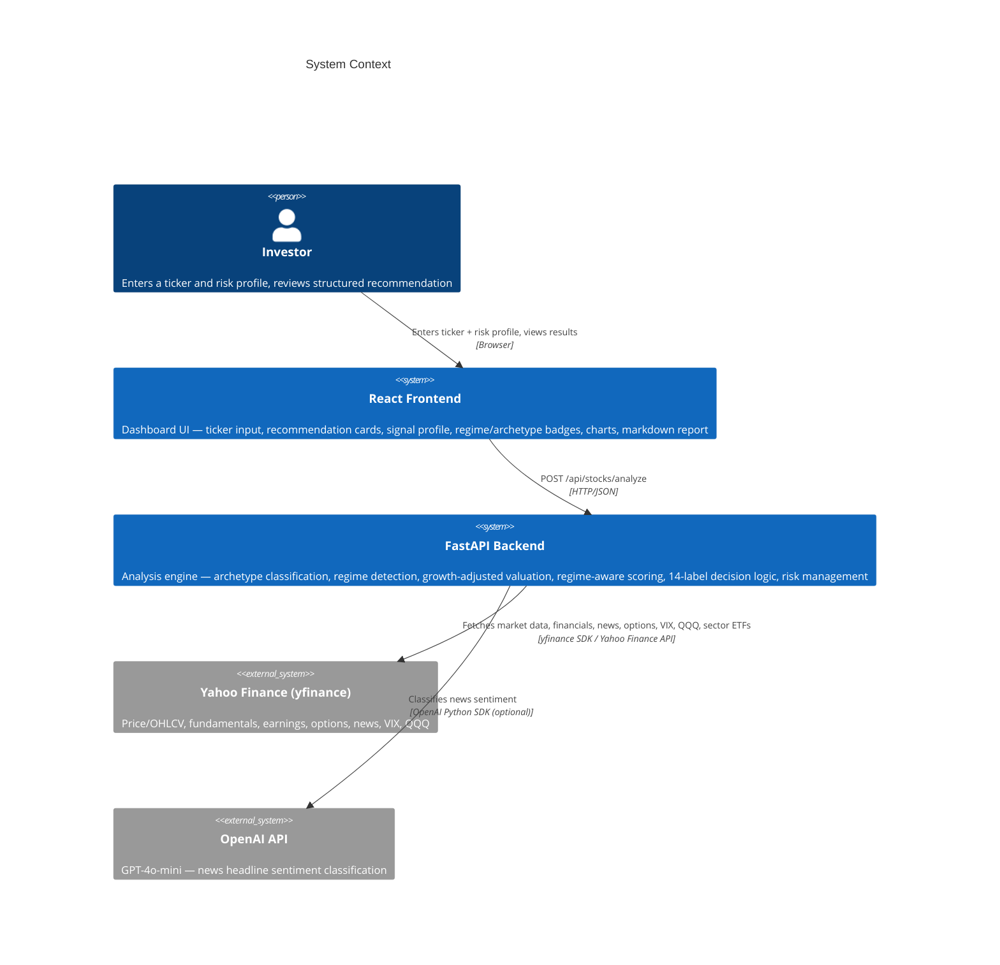

---

## 2. High-Level Architecture

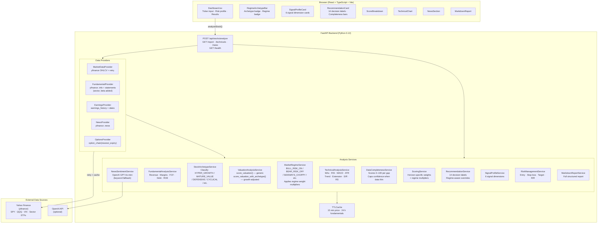

---

## 3. Request Lifecycle

```mermaid
sequenceDiagram
    actor User
    participant FE as React Frontend
    participant API as FastAPI Router
    participant MP as MarketDataProvider
    participant TA as TechnicalAnalysis
    participant FP as FundamentalProvider
    participant AS as StockArchetypeService
    participant VA as ValuationService
    participant EP as EarningsProvider
    participant NP as NewsProvider
    participant OP as OptionsProvider
    participant NS as NewsSentiment
    participant MR2 as MarketRegimeService
    participant DC as DataCompletenessService
    participant SS as ScoringService
    participant RS as RecommendationService
    participant SP as SignalProfileService
    participant RM as RiskManagement
    participant MD as MarkdownReport

    User->>FE: Enter ticker + risk profile → click Analyze
    FE->>API: POST /api/stocks/analyze {ticker, risk_profile}

    API->>MP: get_market_data(ticker) → MarketData + current_price
    API->>MP: get_history(ticker, 1y) → OHLCV DataFrame
    API->>MP: get_history(SPY, 1y) + get_history(QQQ, 1y)
    API->>MP: get_history(sector_ETF, 6mo) → sector DataFrame

    API->>TA: compute_technicals(df, spy_df, sector_df) → TechnicalIndicators

    API->>FP: get_fundamental_data(ticker) → FundamentalData (with sector, beta)
    API->>AS: classify_and_attach(fundamentals, valuation) → archetype + confidence
    API->>VA: score_valuation_with_archetype(valuation, archetype, ...) → archetype_adjusted_score
    API->>FP: get_valuation_data(ticker) → ValuationData

    API->>MP: get_history(^VIX, 1mo) → vix_level
    API->>MR2: classify_regime(spy_hist, qqq_hist, vix_level) → MarketRegimeAssessment

    API->>MP: compute_relative_strength(sector, spy, 63d) → sector_macro_score

    API->>EP: get_earnings_data(ticker) → EarningsData
    API->>NP: get_news_items(ticker) → list[NewsItem]
    API->>NS: classify_news(items) → NewsSummary (GPT-4o-mini or keyword)
    API->>OP: get_options_snapshot(ticker) → put/call ratio → catalyst_score

    API->>DC: compute_completeness(news, earnings, valuation, ...) → completeness, confidence_score, warnings

    API->>SS: compute_scores(technicals, fundamentals, valuation, earnings, news, catalyst_score, sector_macro_score, regime_assessment) → scores{short/medium/long}

    loop for each horizon
        API->>RS: build_recommendations(..., regime_assessment, completeness) → HorizonRecommendation
        RS->>RM: compute_risk_management(price, technicals, decision, risk_profile)
        RM-->>RS: EntryPlan · ExitPlan · RiskReward · PositionSizing
    end

    API->>SP: build_signal_profile(technicals, fundamentals, valuation, earnings, news) → SignalProfile
    API->>MD: generate_markdown(result) → markdown_report string
    API-->>FE: StockAnalysisResult (JSON) with archetype, market_regime, signal_profile
    FE-->>User: Renders cards, signal profile, regime/archetype badges, charts, markdown report
```

---

## 4. Analysis Pipeline

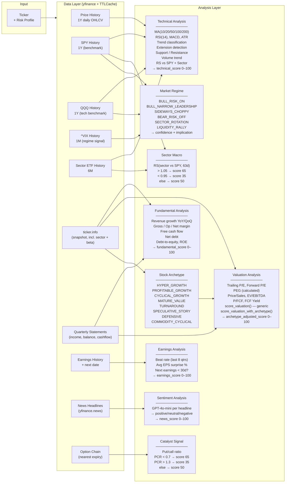

---

## 5. Scoring System

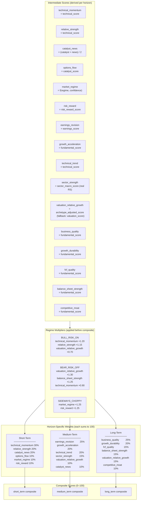

---

## 6. Decision Logic

All 14 decision labels. Regime and data-quality overrides fire before threshold logic.

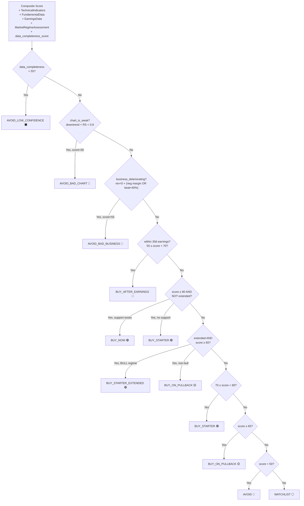

**Full label set (14):**

| Label | Color | Trigger |
|-------|-------|---------|
| `BUY_NOW` | 🟢 Green | Score ≥ 80, not extended, support exists |
| `BUY_STARTER` | 🟢 Emerald | Score 70–79, or ≥80 + extended |
| `BUY_STARTER_EXTENDED` | 🟢 Teal | Extended + score ≥ 65 + BULL regime |
| `BUY_ON_PULLBACK` | 🟡 Cyan | Extended + score ≥ 65 (non-bull) |
| `BUY_ON_BREAKOUT` | 🔵 Blue | Long-term only: ≥75 + extended |
| `BUY_AFTER_EARNINGS` | 🔵 Indigo | Earnings within 30d + 55 ≤ score < 70 |
| `WATCHLIST` | ⚪ Slate | 50 ≤ score < 65 |
| `WATCHLIST_NEEDS_CATALYST` | ⚪ Slate | Reserved for future use |
| `HOLD_EXISTING_DO_NOT_ADD` | 🟠 Orange | Reserved for position management |
| `AVOID_BAD_BUSINESS` | 🔴 Dark Red | Rev declining + neg margin or poor beat rate |
| `AVOID_BAD_CHART` | 🔴 Rose | Downtrend + RS vs SPY < 0.8 |
| `AVOID_BAD_RISK_REWARD` | 🔴 Red | Reserved |
| `AVOID_LOW_CONFIDENCE` | ⬛ Neutral | Data completeness < 55 |
| `AVOID` | 🔴 Red | Score < 50, no specific override |

---

## 7. Data Completeness & Confidence

```mermaid
flowchart LR
    subgraph Deductions["Completeness Deductions"]
        D1["No news items: -15"]
        D2["No options data: -15"]
        D3["No next earnings date: -10"]
        D4["No peer comparison: -5"]
        D5["Insufficient price history: -5"]
    end

    subgraph Rules["Confidence Rules"]
        R1["completeness < 60 → confidence_score capped at 60"]
        R2["completeness < 55 → decision forced to AVOID_LOW_CONFIDENCE"]
        R3["Full data → completeness = 100, confidence_score = 100"]
    end

    Deductions --> COMP["data_completeness_score\n(0–100)"]
    COMP --> Rules
    Rules --> REC["HorizonRecommendation\n.data_completeness_score\n.confidence_score\n.data_warnings"]
```

---

## 8. Signal Profile

Six human-readable signal dimensions derived from sub-scores, displayed as color-coded cards.

| Dimension | Labels | Source |
|-----------|--------|--------|
| `momentum` | VERY_BULLISH → VERY_BEARISH | technical_score + is_extended |
| `growth` | VERY_BULLISH → VERY_BEARISH | fundamental_score |
| `valuation` | ATTRACTIVE / FAIR / ELEVATED / RISKY | archetype_adjusted_score |
| `entry_timing` | IDEAL / ACCEPTABLE / EXTENDED / VERY_EXTENDED | is_extended + extension_pct |
| `sentiment` | VERY_BULLISH → VERY_BEARISH | news_score |
| `risk_reward` | EXCELLENT / GOOD / ACCEPTABLE / POOR | (earnings_score + technical_score) / 2 |

---

## 9. Risk Management Output

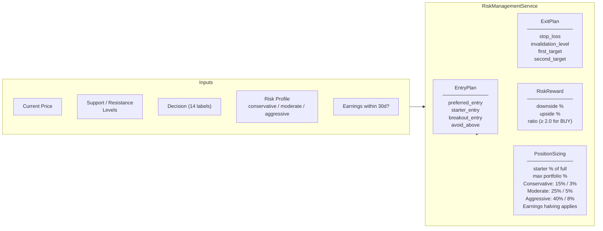

---

## 10. Frontend Component Tree

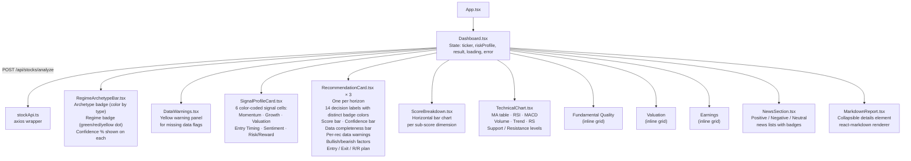

---

## 11. Data Model

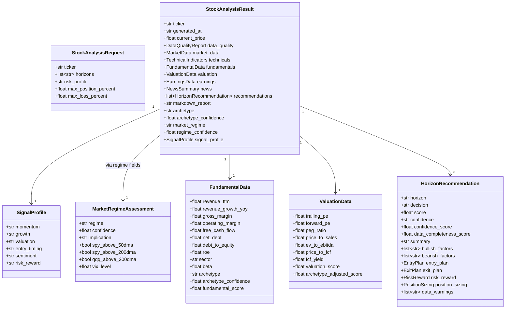

---

## 12. Caching Strategy

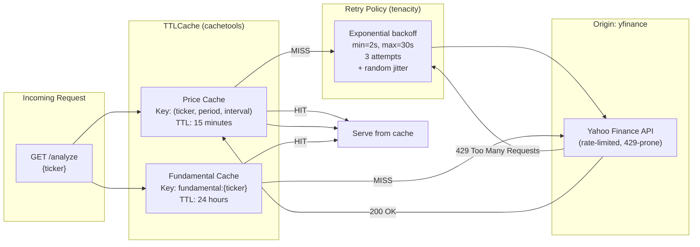

---

## 13. Backtest Architecture

```mermaid
flowchart TD
    subgraph CLI["CLI Entry Point"]
        RUN["run_backtest.py\n--tickers --start --end --risk-profile"]
    end

    subgraph DataLoader["Phase 1 · Data Pre-loader (data_loader.py)"]
        FETCH["Fetch 3-year daily price history\nfor all tickers + SPY + QQQ + sector ETFs"]
        QFETCH["Fetch quarterly statements\nincome · balance · cashflow\nearnings_history · earnings_dates"]
        DISK["Disk cache\nbacktest_results/cache/\nprices.pkl · quarterly.pkl"]
    end

    subgraph Runner["Phase 2 · Weekly Loop (runner.py)"]
        DATES["Generate weekly Mondays\n2024-05-06 → 2026-05-04\n~105 test dates"]
        SNAP["Snapshot Builder (snapshot.py)\nSlice price to test_date\nFilter quarterly stmts by date\nBuild FundamentalData · ValuationData · EarningsData"]
        ARCH2["classify_and_attach() → archetype\nscore_valuation_with_archetype()"]
        REG2["classify_regime(spy, qqq, vix=20)\n→ MarketRegimeAssessment"]
        SMAC2["compute_relative_strength(sector, spy, 63d)\n→ sector_macro_score (real RS)"]
        PIPE["Production Pipeline\ncompute_technicals()\ncompute_scores(regime_assessment)\nbuild_recommendations(regime_assessment)"]
        SIG["Signal Record\nticker · date · horizon\ndecision · score · archetype · market_regime\nprice · sub-scores · entry/stop/target\nforward_return · spy_return · qqq_return\nexcess_return · excess_return_vs_qqq"]
    end

    subgraph Outcome["Phase 3 · Outcome Evaluator (outcome.py)"]
        FWD["Look up exit price\nat date + N trading days\nshort: 20d · medium: 65d · long: 252d"]
        RET["Compute\nforward_return %\nspy_return %\nqqq_return %\nexcess_return vs SPY\nexcess_return_vs_qqq"]
    end

    subgraph Metrics["Phase 4 · Metrics (metrics.py)"]
        BD["by_decision (14 labels)\nwin rate · avg return · vs SPY"]
        BSB["by_score_bucket\n0–40 · 40–55 · 55–70 · 70–85 · 85–100"]
        BT["by_ticker\nper-ticker win rate + alpha"]
        BRG["by_regime\nBULL_RISK_ON / BEAR_RISK_OFF / …\nwin rate · avg_return · excess_vs_qqq"]
        BAT["by_archetype\nHYPER_GROWTH / MATURE_VALUE / …\nwin rate · avg_score · best_decision"]
        MB["monthly_breakdown\ntime-series of model accuracy"]
        SIM["portfolio_simulation\nBUY signals vs SPY buy-and-hold\n+ QQQ comparison"]
    end

    subgraph Output["Phase 5 · Report (report.py)"]
        CSV["raw_signals.csv\nsummary_by_decision.csv\nsummary_by_ticker.csv"]
        HTML["report.html\nSelf-contained · Embedded matplotlib charts"]
        JSON["report.json\nFull metrics as JSON\nIncludes by_regime + by_archetype"]
    end

    CLI --> DataLoader
    FETCH --> DISK
    QFETCH --> DISK
    DISK --> Runner
    DATES --> Runner
    Runner --> SNAP
    SNAP --> ARCH2
    ARCH2 --> REG2
    REG2 --> SMAC2
    SMAC2 --> PIPE
    PIPE --> SIG
    SIG --> Outcome
    FWD --> RET
    RET --> Metrics
    Metrics --> Output
```

---

## 14. Look-Ahead Bias Prevention (Backtest)

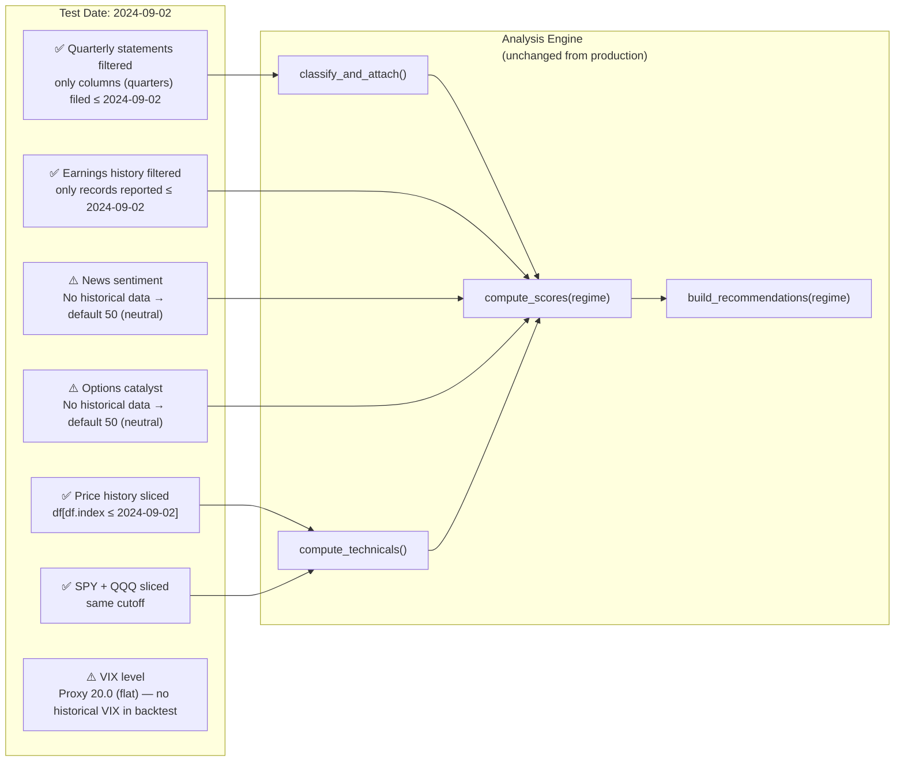

---

## 15. API Reference

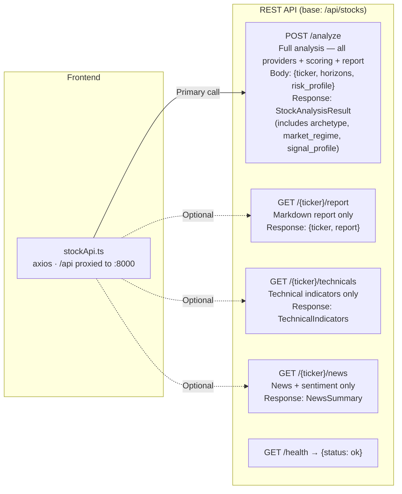

---

## 16. Technology Stack

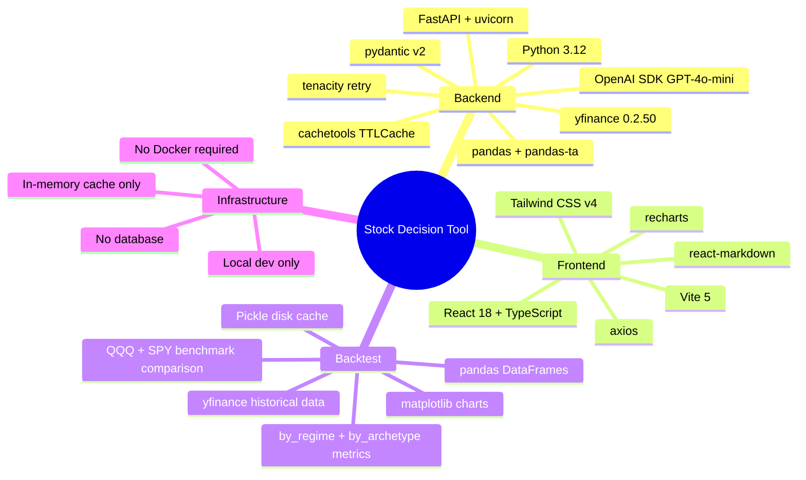

---

## 17. Known Limitations & Design Decisions

| Decision | Rationale | Trade-off |
|----------|-----------|-----------|
| **In-memory TTLCache** (no Redis) | Zero infra dependency for MVP | Cache lost on server restart; not shared across workers |
| **yfinance for all data** | Free, no API key required | Rate-limited (HTTP 429); limited news coverage; no historical options data |
| **OpenAI optional** | Tool works without API key (keyword fallback) | Keyword classifier is less accurate than GPT-4o-mini |
| **Sector macro score from real RS** | 6-month RS of sector ETF vs SPY — replaces static 50 | Threshold-based (65/50/35), not continuous |
| **Archetype defaults to PROFITABLE_GROWTH** | Safest fallback when data is ambiguous | May underweight hyper-growth signals for borderline cases |
| **VIX proxy = 20.0 in backtest** | No historical VIX available without a paid source | Regime classification in backtest is less accurate than production |
| **No peer comparison** | yfinance doesn't support sector-level P/E comparison | Flags in data quality warnings; -5 completeness deduction |
| **Growth-adjusted valuation (archetype-aware)** | Prevents NVDA/PLTR/AVGO from being penalised by raw P/E | HYPER_GROWTH stocks now score fairly; MATURE_VALUE scored conservatively |
| **Backtest news/options = 50** | No historical news sentiment or options data available | Short-term backtest accuracy understated |
| **No database** | Simplicity; all state in HTTP response | No history, no user accounts, stateless |
