# Low Level Design — Stock Decision Tool

> Reference document for implementation details, scoring algorithms, data contracts, and extension points.  
> Use this alongside [HLD.md](HLD.md) for any refactoring or enhancement work.

---

## Table of Contents

1. [Project Layout](#1-project-layout)
2. [Configuration & Environment](#2-configuration--environment)
3. [Cache Layer](#3-cache-layer)
4. [Data Providers](#4-data-providers)
5. [Technical Analysis Service](#5-technical-analysis-service)
6. [Fundamental Analysis Service](#6-fundamental-analysis-service)
7. [Valuation Analysis Service](#7-valuation-analysis-service)
8. [Stock Archetype Service](#8-stock-archetype-service)
9. [Market Regime Service](#9-market-regime-service)
10. [Earnings Analysis](#10-earnings-analysis)
11. [News Sentiment Service](#11-news-sentiment-service)
12. [Scoring Service](#12-scoring-service)
13. [Recommendation Service](#13-recommendation-service)
14. [Data Completeness Service](#14-data-completeness-service)
15. [Signal Profile Service](#15-signal-profile-service)
16. [Risk Management Service](#16-risk-management-service)
17. [Markdown Report Service](#17-markdown-report-service)
18. [API Router](#18-api-router)
19. [Pydantic Models (Full Schema)](#19-pydantic-models-full-schema)
20. [Frontend Internals](#20-frontend-internals)
21. [Backtest Engine Internals](#21-backtest-engine-internals)
22. [Error Handling Map](#22-error-handling-map)
23. [Test Coverage Map](#23-test-coverage-map)
24. [Extension Guide](#24-extension-guide)

---

## 1. Project Layout

```
usingGptStrategy/
├── backend/
│   ├── app/
│   │   ├── main.py                          # FastAPI app init, CORS, router mount
│   │   ├── config.py                        # Pydantic settings (env vars)
│   │   ├── cache/
│   │   │   └── cache_manager.py             # TTLCache singleton + helpers
│   │   ├── models/
│   │   │   ├── request.py                   # StockAnalysisRequest
│   │   │   ├── response.py                  # StockAnalysisResult, HorizonRecommendation, SignalProfile
│   │   │   ├── market.py                    # MarketData, TechnicalIndicators, MarketRegime, MarketRegimeAssessment
│   │   │   ├── fundamentals.py              # FundamentalData, ValuationData, StockArchetype
│   │   │   ├── earnings.py                  # EarningsData, EarningsRecord
│   │   │   └── news.py                      # NewsItem, NewsSummary
│   │   ├── providers/
│   │   │   ├── market_data_provider.py      # OHLCV, ticker.info, sector ETF
│   │   │   ├── fundamental_provider.py      # income_stmt, balance_sheet, cashflow
│   │   │   ├── earnings_provider.py         # earnings_history, earnings_dates
│   │   │   ├── news_provider.py             # ticker.news
│   │   │   └── options_provider.py          # option_chain (nearest expiry)
│   │   ├── services/
│   │   │   ├── technical_analysis_service.py
│   │   │   ├── fundamental_analysis_service.py
│   │   │   ├── valuation_analysis_service.py  # score_valuation + score_valuation_with_archetype
│   │   │   ├── stock_archetype_service.py     # classify_archetype, classify_and_attach
│   │   │   ├── market_regime_service.py       # classify_regime, REGIME_WEIGHT_ADJUSTMENTS
│   │   │   ├── news_sentiment_service.py
│   │   │   ├── data_completeness_service.py   # compute_completeness
│   │   │   ├── signal_profile_service.py      # build_signal_profile
│   │   │   ├── scoring_service.py
│   │   │   ├── recommendation_service.py
│   │   │   ├── risk_management_service.py
│   │   │   └── markdown_report_service.py
│   │   └── routers/
│   │       └── stock.py                     # All REST endpoints
│   ├── backtest/
│   │   ├── config.py                        # Ticker list, date range, BENCHMARK_TICKERS
│   │   ├── data_loader.py                   # Fetch + pickle-cache 3yr history
│   │   ├── snapshot.py                      # Time-sliced inputs for a test date
│   │   ├── runner.py                        # Weekly backtest loop (archetype + regime per snapshot)
│   │   ├── outcome.py                       # Forward return + QQQ benchmark computation
│   │   ├── metrics.py                       # Aggregation: win rate, by_regime, by_archetype
│   │   ├── report.py                        # CSV + self-contained HTML
│   │   └── run_backtest.py                  # CLI entry point
│   ├── tests/
│   │   ├── test_technical_analysis.py       # 38 tests
│   │   ├── test_fundamental_analysis.py     # 32 tests (incl. 8 growth-adj valuation tests)
│   │   ├── test_earnings_analysis.py        # 29 tests
│   │   ├── test_scoring_recommendation.py   # 53 tests (incl. US-004 + US-005 tests)
│   │   ├── test_stock_archetype.py          # 19 tests
│   │   ├── test_market_regime.py            # 18 tests
│   │   ├── test_data_completeness.py        # 16 tests
│   │   ├── test_signal_profile.py           # 22 tests
│   │   └── test_backtest_metrics.py         # 14 tests
│   ├── requirements.txt
│   └── .env.example
├── frontend/
│   └── src/
│       ├── App.tsx
│       ├── pages/Dashboard.tsx
│       ├── components/
│       │   ├── RecommendationCard.tsx        # 14-label badge colors, completeness/confidence bars
│       │   ├── SignalProfileCard.tsx         # 6-cell signal grid (new)
│       │   ├── RegimeArchetypeBar.tsx        # Archetype + regime pill badges (new)
│       │   ├── ScoreBreakdown.tsx
│       │   ├── TechnicalChart.tsx
│       │   ├── NewsSection.tsx
│       │   ├── DataWarnings.tsx
│       │   └── MarkdownReport.tsx
│       ├── api/stockApi.ts
│       └── types/stock.ts
├── HLD.md
├── LLD.md
├── backtest_plan.md
├── backtest_readme.md
├── backtest_results_2024_2026.md
└── README.md
```

---

## 2. Configuration & Environment

**File:** `backend/app/config.py`

```python
class Settings(BaseSettings):
    model_config = SettingsConfigDict(env_file=".env", env_file_encoding="utf-8")
    openai_api_key: str = ""            # Empty = keyword fallback for news sentiment
    cache_ttl_price_seconds: int = 900  # 15 min
    cache_ttl_fundamentals_seconds: int = 86400  # 24 h
    log_level: str = "INFO"

settings = Settings()   # module-level singleton, imported by all services
```

**Loading order:** `.env` file → environment variables → defaults.  
**`settings` is a module-level singleton** — imported directly, never passed as argument.

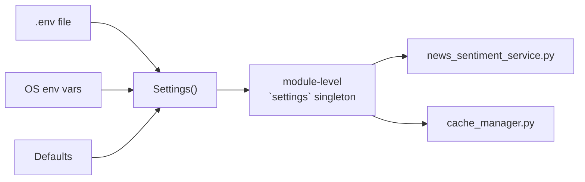

**Extension point:** Add new env vars by adding fields to `Settings`. Pydantic auto-reads them from `.env` with no other changes.

---

## 3. Cache Layer

**File:** `backend/app/cache/cache_manager.py`

### Design

Two separate `TTLCache` instances, both protected by a single `threading.Lock`:

| Cache | Variable | Key Format | TTL | Max entries |
|-------|----------|------------|-----|-------------|
| Price | `_price_cache` | `"{ticker}:{period}:{interval}"` | 900 s (15 min) | 256 |
| Fundamentals | `_fundamental_cache` | `"fundamental:{ticker}"` | 86400 s (24 h) | 256 |

```python
# All public functions
get_cached(cache, key)    → Optional[Any]   # thread-safe read
set_cached(cache, key, v) → None            # thread-safe write
price_cache_key(ticker, period, interval) → str
fundamental_cache_key(ticker)             → str
get_price_cache()         → TTLCache       # returns module-level instance
get_fundamental_cache()   → TTLCache       # returns module-level instance
```

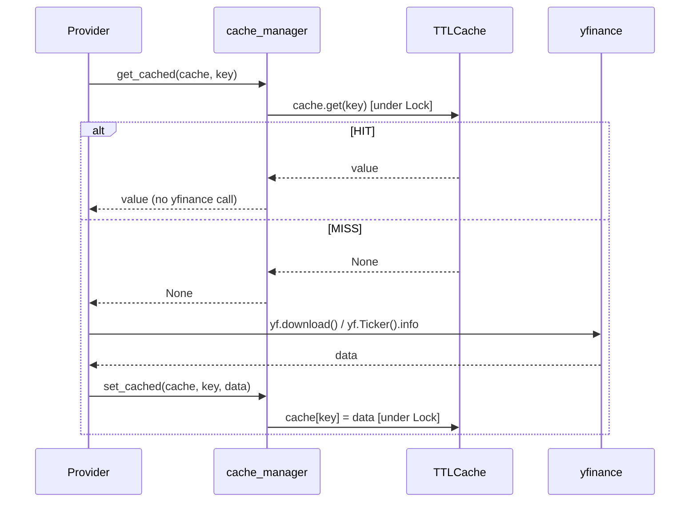

**Threading note:** The single `Lock` serialises all cache reads/writes. For a multi-worker deployment, this cache is **not shared** across processes — each uvicorn worker has its own in-memory cache.

**Enhancement opportunity:** Replace `TTLCache` with Redis to share cache across workers. Interface is already isolated — only `get_cached`/`set_cached` need to change.

---

## 4. Data Providers

### 4.1 MarketDataProvider

**File:** `backend/app/providers/market_data_provider.py`

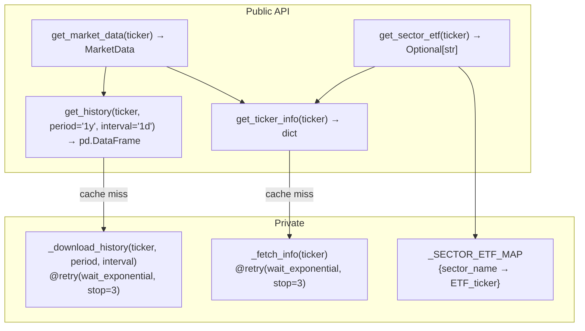

**`_download_history` internals:**
```python
@retry(
    retry=retry_if_exception_type(Exception),
    wait=wait_exponential(multiplier=2, min=2, max=30),   # 2s, 4s, 8s... capped at 30s
    stop=stop_after_attempt(3),
    reraise=True,   # re-raises after 3 failures
)
def _download_history(ticker, period, interval):
    df = yf.download(ticker, period=period, interval=interval,
                     progress=False, auto_adjust=True)
    if df.empty: raise ValueError(...)   # triggers retry
    return df
```

**MultiIndex column handling** (yfinance quirk for single ticker):
```python
if isinstance(df.columns, pd.MultiIndex):
    df.columns = df.columns.get_level_values(0)
# Result: always ["Open", "High", "Low", "Close", "Volume"]
```

**`get_market_data` — periods fetched:**
- `"1y"` — for 1-year return + avg volume 30d
- `"3mo"`, `"6mo"` — for 3M/6M returns
- `"ytd"` — for YTD return  
- `"1mo"` — for 1M return

**Sector ETF map** (used for relative strength vs sector):
```
Technology → XLK        Healthcare → XLV        Financial → XLF
Consumer Cyclical → XLY Consumer Defensive → XLP Energy → XLE
Industrials → XLI       Basic Materials → XLB    Real Estate → XLRE
Communication Services → XLC                      Utilities → XLU
```

---

### 4.2 FundamentalProvider

**File:** `backend/app/providers/fundamental_provider.py`


**Calculated fields:**
- `net_debt = total_debt - cash`
- `fcf_margin = free_cash_flow / revenue_ttm`
- `peg_ratio`: uses yfinance `pegRatio`; falls back to `forward_PE / (earningsGrowth × 100)` if missing
- `price_to_fcf = market_cap / free_cash_flow` (only when FCF > 0)
- `revenue_growth_qoq`: computed from `quarterly_income_stmt` — `(Q0 - Q1) / |Q1|`
- `sector` and `beta` are now fetched and stored on `FundamentalData` (used by archetype classifier)

---

### 4.3 EarningsProvider

**File:** `backend/app/providers/earnings_provider.py`

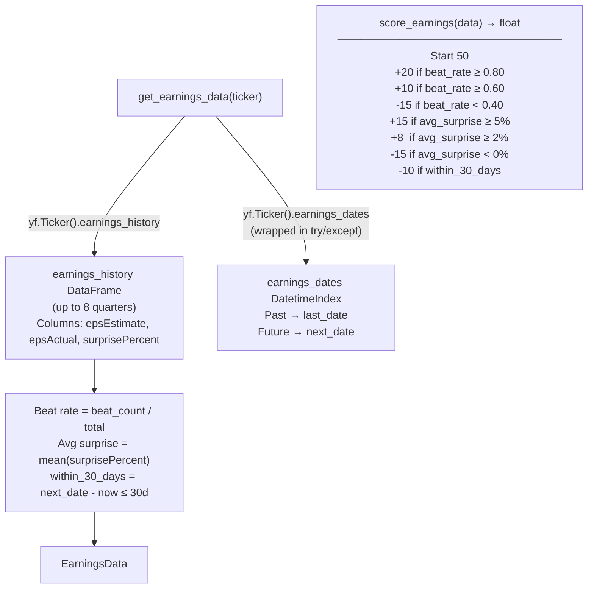

**KeyError guard:** `earnings_dates` raises `KeyError` for some tickers. Entire block is wrapped in `try/except Exception` — returns `None` for both dates gracefully.

---

### 4.4 NewsProvider

**File:** `backend/app/providers/news_provider.py`

```python
def get_news_items(ticker: str) -> list[NewsItem]:
    t = yf.Ticker(ticker)
    raw_news = t.news or []   # list of dicts from Yahoo Finance
    items = []
    for article in raw_news[:20]:   # cap at 20 articles
        items.append(NewsItem(
            title=article.get("title", ""),
            source=article.get("publisher"),
            published_at=str(article.get("providerPublishTime", "")),
            url=article.get("link"),
        ))
    return items
```

**Known limitation:** `ticker.news` is unreliable — some tickers return 0 articles, others return 20. Always flagged as `coverage_limited=True` in `NewsSummary`.

---

### 4.5 OptionsProvider

**File:** `backend/app/providers/options_provider.py`

```python
# Fetches nearest expiry option chain
# Returns: put_call_ratio = put_volume / call_volume
# Used only to derive catalyst_score in the router:
#   PCR < 0.7  → catalyst_score = 65  (bullish flow)
#   PCR > 1.3  → catalyst_score = 35  (bearish flow)
#   else       → catalyst_score = 50  (neutral)
```

`OptionsSnapshot` model: `available: bool`, `put_call_ratio: Optional[float]`, `implied_volatility: Optional[float]`.

---

## 5. Technical Analysis Service

**File:** `backend/app/services/technical_analysis_service.py`

### Function Map

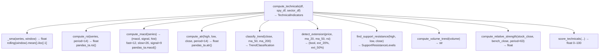

### Trend Classification Logic

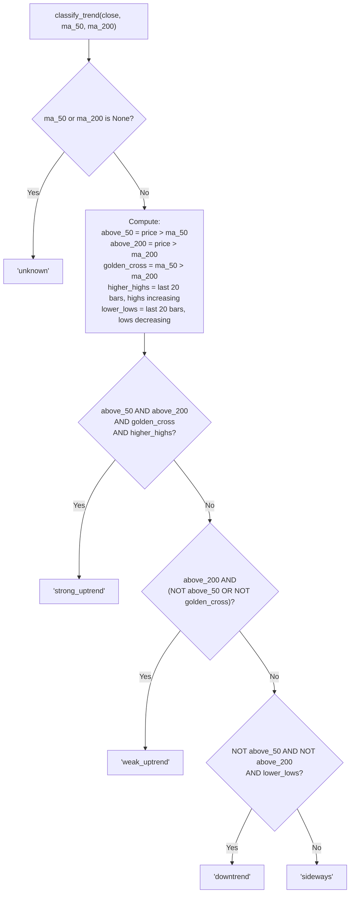

### Extension Detection Thresholds

| Condition | Threshold | Triggers `is_extended=True` |
|-----------|-----------|----------------------------|
| Price vs MA(20) | > 8% above | Yes |
| Price vs MA(50) | > 15% above | Yes |
| RSI | > 75 | Yes |

```python
# ext_20 = (price - ma_20) / ma_20 * 100   (percent above 20MA)
# ext_50 = (price - ma_50) / ma_50 * 100   (percent above 50MA)
# Any single condition above is sufficient to set is_extended = True
```

### Support / Resistance Algorithm

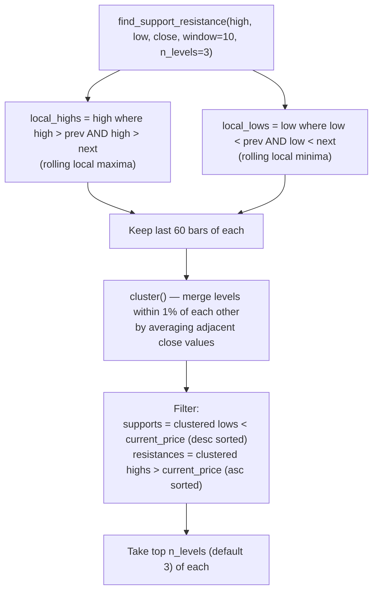

### Technical Score Formula

```
Base: 50

Trend:
  strong_uptrend  → +20
  weak_uptrend    → +5
  sideways        → -5
  downtrend       → -20
  unknown         → 0

RSI (14):
  50–70           → +15  (healthy momentum)
  40–50           → +5
  >75             → -5   (overbought)
  <30             → -15  (oversold)

MACD Histogram:
  > 0             → +10
  ≤ 0             → -10

Extension:
  is_extended     → -10

Volume:
  above_average   → +5
  below_average   → -5

RS vs SPY (63-day return ratio):
  > 1.2           → +10
  > 1.0           → +5
  < 0.8           → -10
  < 1.0           → -5

Support cushion (nearest_support):
  within 5%       → +5   (good risk/reward entry)
  beyond 15%      → -5

Clamped to [0, 100]
```

---

## 6. Fundamental Analysis Service

**File:** `backend/app/services/fundamental_analysis_service.py`

### Score Formula (starts at 50)

```
Revenue Growth YoY:           EPS Growth YoY:
  ≥ 20%  → +15                ≥ 20%  → +10
  ≥ 10%  → +8                 ≥ 10%  → +5
  ≥ 5%   → +3                 < 0%   → -10
  < 0%   → -15

Revenue Growth QoQ:           Gross Margin:
  ≥ 5%   → +5                 ≥ 50%  → +5
  < 0%   → -5                 ≥ 30%  → +2
                               < 10%  → -5

Operating Margin:             Free Cash Flow:
  ≥ 20%  → +5                 > 0    → +10
  ≥ 10%  → +2                 ≤ 0    → -10
  < 0%   → -5

FCF Margin:                   Net Debt vs Cash:
  ≥ 15%  → +5                 net_debt < 0 (net cash) → +5
  < 0%   → -5                 net_debt > cash × 2     → -5

Debt-to-Equity:               ROE:
  < 0.5  → +5                 ≥ 20%  → +5
  > 2.0  → -5                 < 0%   → -5

Clamped to [0, 100]
```

---

## 7. Valuation Analysis Service

**File:** `backend/app/services/valuation_analysis_service.py`

This service contains two scoring functions: the original archetype-neutral `score_valuation()` (kept for backward compatibility and used in the backtest engine) and the new `score_valuation_with_archetype()` which is called in the live pipeline after archetype classification.

### 7.1 score_valuation (baseline, archetype-neutral)

```
Forward P/E:                  PEG Ratio:
  ≤ 15   → +20               ≤ 1.0  → +15
  ≤ 20   → +10               ≤ 1.5  → +8
  ≤ 30   → 0                 ≤ 2.0  → 0
  ≤ 40   → -10               ≤ 3.0  → -10
  > 40   → -20               > 3.0  → -15

Price/Sales:                  EV/EBITDA:
  ≤ 2    → +10               ≤ 10   → +10
  ≤ 5    → +5                ≤ 15   → +5
  ≤ 10   → 0                 ≤ 25   → 0
  ≤ 20   → -5                ≤ 40   → -5
  > 20   → -10               > 40   → -10

FCF Yield:                    Trailing P/E (sanity check):
  ≥ 5%   → +10               ≤ 20   → +5
  ≥ 2%   → +5                > 60   → -5
  < 0%   → -10

Clamped to [0, 100]
```

### 7.2 score_valuation_with_archetype (growth-adjusted)

Called in the live pipeline after `classify_and_attach()`. Returns `ValuationData.archetype_adjusted_score`. The scoring service prefers this score over the raw `valuation_score` when it is > 0.

```mermaid
flowchart TD
    SVA["score_valuation_with_archetype(data, archetype, revenue_growth_yoy, operating_margin, gross_margin)"]

    SVA --> HG{"archetype ==\nHYPER_GROWTH or\nSPECULATIVE_STORY?"}
    HG -->|Yes| RULE40["Rule of 40 = rev_growth_pct + op_margin_pct\n≥ 60 → +15\n≥ 40 → +8\n≥ 20 → 0\n< 20 → -10\n\nPEG primary (softer: ≤ 2.5 → 0, ≤ 4.0 → -8)\nP/E soft (≤ 50 → 0, ≤ 80 → -5, >80 → -10)\nP/S: exempt if gross_margin > 60%\nFCF yield bonus if ≥ 3%"]

    SVA --> MV{"archetype ==\nMATURE_VALUE?"}
    MV -->|Yes| STRICT["Stricter thresholds\nP/E: ≤ 12 → +20, ≤ 18 → +12, > 35 → -20\nFCF yield: ≥ 6% → +15 (primary signal)\nP/S: > 10 → -8\nEV/EBITDA: > 25 → -10"]

    SVA --> CYC{"archetype ==\nCYCLICAL_GROWTH?"}
    CYC -->|Yes| CYCL["EV/EBITDA is primary (avoid P/E peak trap)\nP/E: ≤ 10 → +3 only (may be peak earnings)\nP/E: ≤ 20 → +8"]

    SVA --> DEF{"archetype ==\nDEFENSIVE or\nCOMMODITY_CYCLICAL?"}
    DEF -->|Yes| DEFL["Standard + stability bias\nFCF yield: ≥ 5% → +12\nP/E: > 40 → -18 (stricter than growth)"]

    SVA --> PROF{"else (PROFITABLE_GROWTH\nor TURNAROUND)"}
    PROF -->|Yes| ORIG["Fall through to score_valuation()\n(original formula)"]
```

**Key principle:** HYPER_GROWTH stocks with forward P/E > 40 but Rule of 40 ≥ 60 receive a positive adjustment instead of the -20 penalty from the baseline scorer. This corrects the systematic underscoring of NVDA, PLTR, and similar stocks.

---

## 8. Stock Archetype Service

**File:** `backend/app/services/stock_archetype_service.py`

### Archetype Enum

```python
class StockArchetype:
    HYPER_GROWTH       = "HYPER_GROWTH"       # rev growth > 30% or > 20% with high P/E
    PROFITABLE_GROWTH  = "PROFITABLE_GROWTH"  # rev > 15%, positive margins, FCF
    CYCLICAL_GROWTH    = "CYCLICAL_GROWTH"     # high beta, cyclical sector
    MATURE_VALUE       = "MATURE_VALUE"        # slow growth, stable earnings, FCF
    TURNAROUND         = "TURNAROUND"          # recovering from decline
    SPECULATIVE_STORY  = "SPECULATIVE_STORY"  # high P/S + unprofitable + fast growth
    DEFENSIVE          = "DEFENSIVE"           # low beta, Healthcare/Utilities/Consumer Def
    COMMODITY_CYCLICAL = "COMMODITY_CYCLICAL" # Energy/Basic Materials
```

### Classification Priority (first match wins)

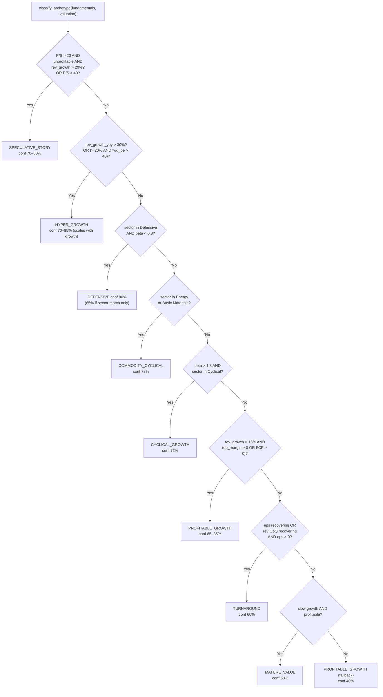

### Public API

```python
classify_archetype(fundamentals: FundamentalData, valuation: ValuationData) -> tuple[str, float]
    # Returns (archetype_string, confidence_0_to_100)

classify_and_attach(fundamentals: FundamentalData, valuation: ValuationData) -> FundamentalData
    # Mutates fundamentals.archetype and fundamentals.archetype_confidence in place, returns fundamentals
```

**Sector sets used:**
```python
_DEFENSIVE_SECTORS  = {"Healthcare", "Consumer Defensive", "Utilities"}
_COMMODITY_SECTORS  = {"Energy", "Basic Materials"}
_CYCLICAL_SECTORS   = {"Energy", "Basic Materials", "Industrials", "Consumer Cyclical"}
```

---

## 9. Market Regime Service

**File:** `backend/app/services/market_regime_service.py`

### Regime Enum

```python
class MarketRegime:
    BULL_RISK_ON           = "BULL_RISK_ON"           # SPY+QQQ above 200DMA, VIX < 20
    BULL_NARROW_LEADERSHIP = "BULL_NARROW_LEADERSHIP" # QQQ up, SPY equal-weight lagging
    SIDEWAYS_CHOPPY        = "SIDEWAYS_CHOPPY"        # SPY near 200DMA, indeterminate
    BEAR_RISK_OFF          = "BEAR_RISK_OFF"          # SPY below 200DMA, VIX > 25
    SECTOR_ROTATION        = "SECTOR_ROTATION"        # SPY stable, sector ETFs diverging
    LIQUIDITY_RALLY        = "LIQUIDITY_RALLY"        # SPY above 200DMA, VIX falling from >25
```

### Classification Decision Tree

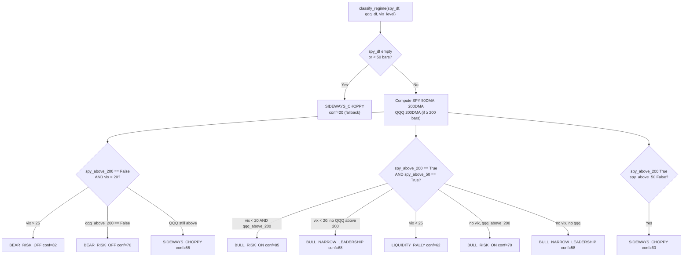

### Regime Weight Adjustments (`REGIME_WEIGHT_ADJUSTMENTS`)

Multipliers applied **per intermediate score key** in `_apply_regime_multipliers()`. Keys must match the weight dict key names in scoring_service.py.

| Regime | Key | Multiplier |
|--------|-----|-----------|
| BULL_RISK_ON | technical_momentum | 1.20 |
| BULL_RISK_ON | relative_strength | 1.15 |
| BULL_RISK_ON | growth_acceleration | 1.15 |
| BULL_RISK_ON | valuation_relative_growth | 0.70 |
| BULL_RISK_ON | fcf_quality | 0.90 |
| BEAR_RISK_OFF | valuation_relative_growth | 1.30 |
| BEAR_RISK_OFF | balance_sheet_strength | 1.25 |
| BEAR_RISK_OFF | fcf_quality | 1.20 |
| BEAR_RISK_OFF | technical_momentum | 0.90 |
| BEAR_RISK_OFF | catalyst_news | 0.90 |
| SIDEWAYS_CHOPPY | risk_reward | 1.25 |
| SIDEWAYS_CHOPPY | relative_strength | 1.10 |
| SIDEWAYS_CHOPPY | technical_momentum | 0.85 |
| BULL_NARROW_LEADERSHIP | technical_momentum | 1.15 |
| BULL_NARROW_LEADERSHIP | relative_strength | 1.20 |
| BULL_NARROW_LEADERSHIP | sector_strength | 1.15 |
| LIQUIDITY_RALLY | technical_momentum | 1.10 |
| LIQUIDITY_RALLY | catalyst_news | 1.10 |
| LIQUIDITY_RALLY | valuation_relative_growth | 0.80 |
| SECTOR_ROTATION | sector_strength | 1.30 |
| SECTOR_ROTATION | relative_strength | 1.15 |

### Public API

```python
classify_regime(spy_df, qqq_df, vix_level=None) -> MarketRegimeAssessment
    # Returns regime assessment with confidence + diagnostic flags

REGIME_WEIGHT_ADJUSTMENTS: dict[str, dict[str, float]]
    # Imported by scoring_service to apply per-key multipliers
```

---

## 10. Earnings Analysis

**File:** `backend/app/providers/earnings_provider.py`

### Data Sources

| Field | Source | Notes |
|-------|--------|-------|
| `history` | `ticker.earnings_history` | Up to 8 most recent quarters |
| `beat_count` / `miss_count` | Computed from `surprisePercent ≥ 0` | |
| `beat_rate` | `beat_count / (beat + miss)` | None if no data |
| `avg_eps_surprise_pct` | `mean(surprisePercent)` | None if no data |
| `last_earnings_date` | `earnings_dates` index, most recent past | try/except guarded |
| `next_earnings_date` | `earnings_dates` index, nearest future | try/except guarded |
| `within_30_days` | `(next_date - now).days ≤ 30` | False if next_date is None |

### Score Formula (in `score_earnings`)

```
Start: 50

Beat rate:                    Avg EPS Surprise:
  ≥ 80%  → +20               ≥ 5%   → +15
  ≥ 60%  → +10               ≥ 2%   → +8
  < 40%  → -15               < 0%   → -15

Upcoming earnings (<30d):
  within_30_days → -10  (binary event risk)

Clamped to [0, 100]
```

---

## 11. News Sentiment Service

**File:** `backend/app/services/news_sentiment_service.py`

### Classification Flow

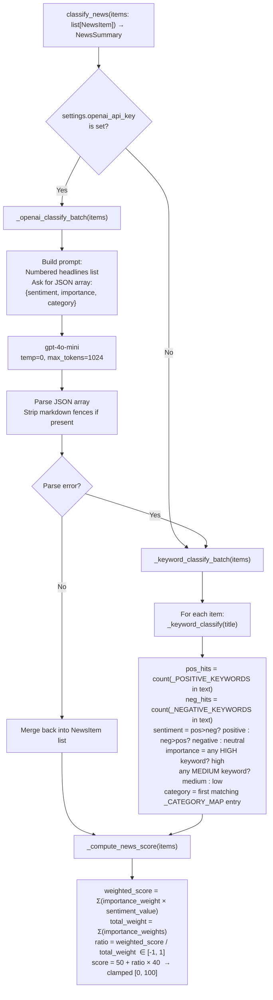

### Keyword Lists

**Positive keywords (sample):** beat, beats, raised guidance, upgrade, upgraded, price target raised, strong earnings, record revenue, customer win, partnership, fda approval, buyback, dividend increase, expansion, growth, profit, outperform, buy rating, insider buying

**Negative keywords (sample):** miss, missed, guidance cut, downgrade, downgraded, price target cut, earnings miss, revenue miss, layoffs, lawsuit, investigation, recall, margin pressure, slower growth, loss, bankruptcy, debt, dilution, regulatory probe, class action, insider selling

**Importance weights:**
```
high   → 3.0   (earnings, guidance, fda, acquisition, merger, sec, bankruptcy)
medium → 2.0   (upgrade, downgrade, analyst, partnership, buyback, dividend)
low    → 1.0   (everything else)
```

**Sentiment values for score:** `positive → 1.0`, `neutral → 0.0`, `negative → -1.0`

**Category priority order** (first match wins — legal before product to avoid "launch" matching product):
```
legal → earnings → analyst → management → macro → sector → product → other
```

### Score Formula
```
ratio = Σ(weight × sentiment_val) / Σ(weights)   ∈ [-1, 1]
score = 50 + ratio × 40   → range [10, 90] in practice
```

---

## 12. Scoring Service

**File:** `backend/app/services/scoring_service.py`

### Weights (all sum to 100, verified at module import time)

```python
SHORT_TERM_WEIGHTS = {
    "technical_momentum": 30,   # technicals.technical_score
    "relative_strength":  20,   # technicals.technical_score (RS component)
    "catalyst_news":      20,   # avg(catalyst_score, news_score)
    "options_flow":       10,   # catalyst_score (PCR-derived)
    "market_regime":      10,   # _regime_score(assessment)
    "risk_reward":        10,   # risk_reward_score (default 50)
}

MEDIUM_TERM_WEIGHTS = {
    "earnings_revision":          25,   # earnings.earnings_score
    "growth_acceleration":        20,   # fundamentals.fundamental_score
    "technical_trend":            20,   # technicals.technical_score
    "sector_strength":            15,   # sector_macro_score
    "valuation_relative_growth":  10,   # archetype_adjusted_score (or valuation_score)
    "catalyst_news":              10,   # avg(catalyst_score, news_score)
}

LONG_TERM_WEIGHTS = {
    "business_quality":           25,   # fundamentals.fundamental_score
    "growth_durability":          20,   # fundamentals.fundamental_score
    "fcf_quality":                15,   # fundamentals.fundamental_score
    "balance_sheet_strength":     15,   # fundamentals.fundamental_score
    "valuation_relative_growth":  15,   # archetype_adjusted_score (or valuation_score)
    "competitive_moat":           10,   # fundamentals.fundamental_score
}

# _verify_weights() called at module load — AssertionError if any sum ≠ 100
```

### Intermediate Score Mapping

Many LONG_TERM keys currently map to `fundamental_score` — they are deliberately split to allow future specialization (e.g. separate FCF score, moat score) without changing the weight structure.

```python
# SHORT_TERM intermediate scores (short_base dict)
{
    "technical_momentum": technicals.technical_score,
    "relative_strength":  technicals.technical_score,
    "catalyst_news":      avg(catalyst_score, news.news_score),
    "options_flow":       catalyst_score,
    "market_regime":      _regime_score(regime_assessment),
    "risk_reward":        risk_reward_score,
}

# MEDIUM_TERM intermediate scores (medium_base dict)
{
    "earnings_revision":         earnings.earnings_score,
    "growth_acceleration":       fundamentals.fundamental_score,
    "technical_trend":           technicals.technical_score,
    "sector_strength":           sector_macro_score,
    "valuation_relative_growth": val_score,   # archetype-adjusted if > 0
    "catalyst_news":             avg(catalyst_score, news.news_score),
}
```

### `_regime_score` — Converts regime + confidence to a 0–100 score

```python
def _regime_score(assessment: Optional[MarketRegimeAssessment]) -> float:
    # BULL_RISK_ON:            50 + conf × 0.35  → 50–85 range
    # BEAR_RISK_OFF:           50 - conf × 0.35  → 15–50 range
    # BULL_NARROW_LEADERSHIP,
    # LIQUIDITY_RALLY:         50 + conf × 0.15
    # SIDEWAYS_CHOPPY:         50.0
    # None:                    50.0
```

### `_apply_regime_multipliers` — Adjusts per-key scores

```python
def _apply_regime_multipliers(scores, assessment) -> dict[str, float]:
    # Reads REGIME_WEIGHT_ADJUSTMENTS[assessment.regime]
    # Multiplies each matching key's score by its multiplier
    # Clamps result to [0, 100]
    # Keys not in the multiplier map pass through unchanged
```

### `compute_scores` Signature

```python
def compute_scores(
    technicals: TechnicalIndicators,
    fundamentals: FundamentalData,
    valuation: ValuationData,
    earnings: EarningsData,
    news: NewsSummary,
    catalyst_score: float = 50.0,
    sector_macro_score: float = 50.0,
    risk_reward_score: float = 50.0,
    regime_assessment: Optional[MarketRegimeAssessment] = None,
) -> dict[str, dict[str, float]]:
```

**Return structure:**
```python
{
    "short_term":  {"composite": 62.5, "technical": 70.0, "fundamental": 85.0, ...
                    # all raw sub-scores + all adjusted intermediate scores},
    "medium_term": {"composite": 58.3, ...},
    "long_term":   {"composite": 61.1, ...},
}
```

**`_weighted_average` formula:**
```python
composite = Σ(score[key] * weight[key]) / Σ(weights)
# Missing keys default to 50.0 (neutral)
```

---

## 13. Recommendation Service

**File:** `backend/app/services/recommendation_service.py`

### 14 Decision Labels

```python
ALL_DECISIONS = {
    "BUY_NOW",                  # ≥ 80, not extended, support visible
    "BUY_STARTER",              # 70–80 or ≥ 80 + no support
    "BUY_STARTER_EXTENDED",     # strong but extended in BULL regime — smaller size
    "BUY_ON_PULLBACK",          # extended + non-bull regime, or 65–70
    "BUY_ON_BREAKOUT",          # long-term: strong but extended
    "BUY_AFTER_EARNINGS",       # short-term: earnings < 30d and score 55–70
    "WATCHLIST",                # 50–65 (short) or 55–68 (medium) or 60–75 (long)
    "WATCHLIST_NEEDS_CATALYST", # (reserved for future use)
    "HOLD_EXISTING_DO_NOT_ADD", # (reserved for future use)
    "AVOID",                    # generic low score fallback
    "AVOID_BAD_BUSINESS",       # revenue declining + margin or beat-rate deterioration
    "AVOID_BAD_CHART",          # downtrend + rs_vs_spy < 0.8
    "AVOID_BAD_RISK_REWARD",    # (reserved for future use)
    "AVOID_LOW_CONFIDENCE",     # data_completeness < 55.0 (forced override)
}
```

### Helper Functions

```python
def _is_bull_regime(regime) -> bool:
    # regime.regime in (BULL_RISK_ON, LIQUIDITY_RALLY)

def _is_bear_regime(regime) -> bool:
    # regime.regime == BEAR_RISK_OFF

def _chart_is_weak(technicals) -> bool:
    # trend.label == "downtrend" AND rs_vs_spy < 0.8
    # Both conditions required — weak RS alone is not enough

def _business_deteriorating(fundamentals, earnings) -> bool:
    # revenue_growth_yoy < 0
    # AND (operating_margin < -0.05 OR beat_rate < 0.40)
    # Revenue decline + either margin compression OR earnings miss history
```

### Decision Logic by Horizon

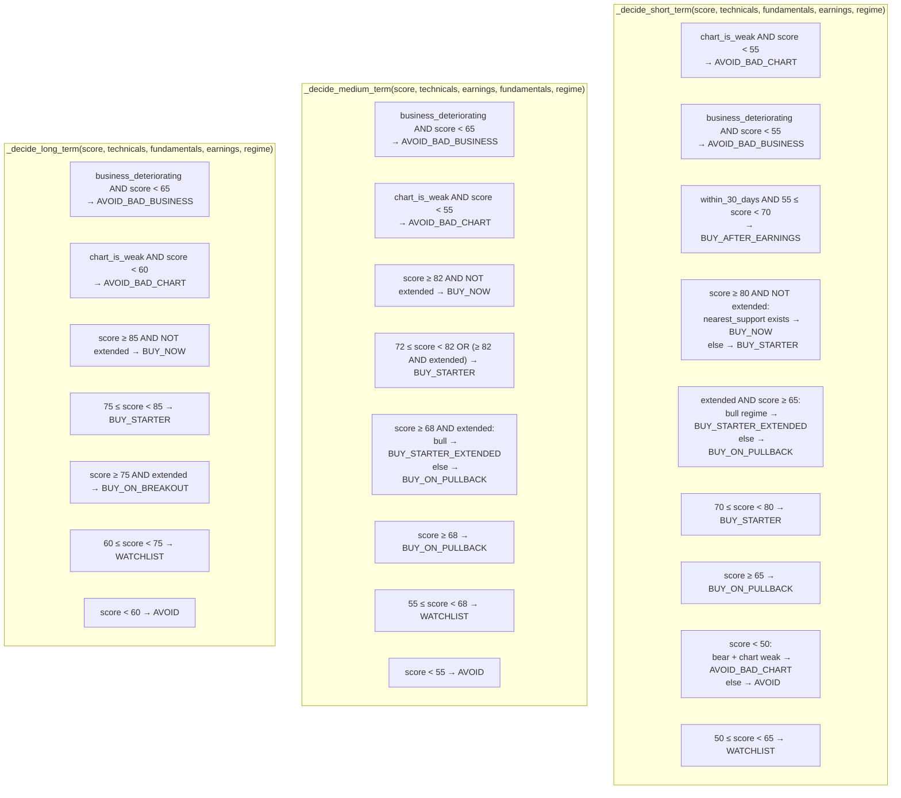

**Key regime rule:** In BULL_RISK_ON, valuation-driven low scores alone cannot trigger AVOID. Expensive + strong chart → `BUY_STARTER_EXTENDED`.

### `build_recommendations` Signature

```python
def build_recommendations(
    technicals: TechnicalIndicators,
    fundamentals: FundamentalData,
    valuation: ValuationData,
    earnings: EarningsData,
    news: NewsSummary,
    scores: dict[str, dict[str, float]],
    horizons: list[str],
    risk_profile: str,
    current_price: float,
    regime_assessment: Optional[MarketRegimeAssessment] = None,
    has_options_data: bool = False,
    has_sufficient_price_history: bool = True,
) -> list[HorizonRecommendation]:
```

**Flow:**
1. Call `compute_completeness()` once before the horizon loop
2. For each horizon: if `completeness < 55.0` → force `AVOID_LOW_CONFIDENCE` (skip normal decision logic)
3. Otherwise call horizon-specific `_decide_*` function
4. Populate `HorizonRecommendation` with `confidence_score` and `data_completeness_score`

### Confidence Mapping

```
score ≥ 80 → "high"
score ≥ 65 → "medium_high"
score ≥ 50 → "medium"
score < 50 → "low"
```

---

## 14. Data Completeness Service

**File:** `backend/app/services/data_completeness_service.py`

### Deduction Table

| Gap Category | Deduction | Warning Message |
|---|---|---|
| No news items | -15 | "No recent news found — sentiment signal unavailable." |
| No next earnings date | -10 | "Next earnings date could not be determined." |
| No peer comparison | -5 | "Peer valuation comparison unavailable." |
| No options data | -15 | "Options flow data unavailable — catalyst signal is estimated." |
| Insufficient price history | -5 | "Less than 6 months of price history available." |

**Maximum deductions: -50 → minimum completeness = 50**

### Constants

```python
_CONFIDENCE_CAP_THRESHOLD = 60.0   # completeness below this → cap confidence
_CONFIDENCE_CAP_VALUE     = 60.0   # confidence capped to this value
AVOID_LOW_CONFIDENCE_THRESHOLD = 55.0
# Rationale: min completeness = 50 (all 5 deductions). 55.0 is reachable when
# options + news + (earnings date OR insufficient history) all missing.
```

### `compute_completeness` Signature

```python
def compute_completeness(
    news: NewsSummary,
    earnings: EarningsData,
    valuation: ValuationData,
    has_options_data: bool = False,
    has_sufficient_price_history: bool = True,
) -> tuple[float, float, list[str]]:
    # Returns: (data_completeness_score, confidence_score, warnings)
```

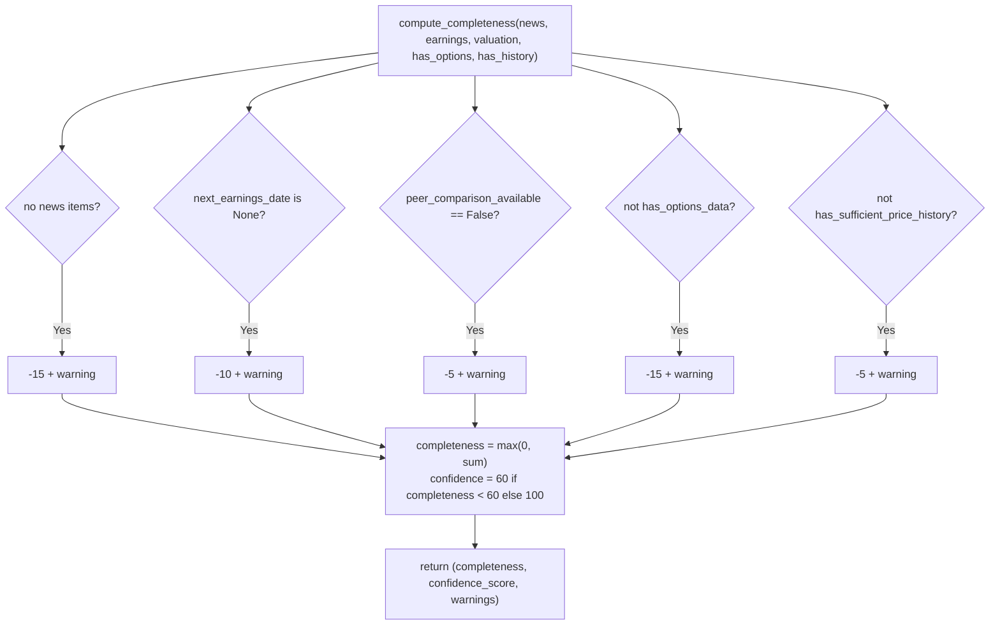

---

## 15. Signal Profile Service

**File:** `backend/app/services/signal_profile_service.py`

### Label Domains

| Field | Possible Values | Source |
|-------|----------------|--------|
| `momentum` | VERY_BULLISH / BULLISH / NEUTRAL / BEARISH / VERY_BEARISH | technicals.technical_score + is_extended |
| `growth` | VERY_BULLISH / BULLISH / NEUTRAL / BEARISH / VERY_BEARISH | fundamentals.fundamental_score |
| `valuation` | ATTRACTIVE / FAIR / ELEVATED / RISKY | archetype_adjusted_score (fallback: valuation_score) |
| `entry_timing` | IDEAL / ACCEPTABLE / EXTENDED / VERY_EXTENDED | is_extended + extension_pct_above_20ma + trend |
| `sentiment` | VERY_BULLISH / BULLISH / NEUTRAL / BEARISH / VERY_BEARISH | news.news_score |
| `risk_reward` | EXCELLENT / GOOD / ACCEPTABLE / POOR | avg(earnings_score, technical_score) |

### Score → Label Mapping

```python
def _momentum_label(technical_score, is_extended) -> str:
    # ≥ 80 AND not extended → VERY_BULLISH
    # ≥ 65                  → BULLISH
    # ≥ 50                  → NEUTRAL
    # ≥ 35                  → BEARISH
    # < 35                  → VERY_BEARISH

def _growth_label(fundamental_score) -> str:
    # Same thresholds as momentum (80/65/50/35)

def _valuation_label(valuation_score) -> str:
    # ≥ 70 → ATTRACTIVE
    # ≥ 55 → FAIR
    # ≥ 40 → ELEVATED
    # < 40 → RISKY
    # Note: uses archetype_adjusted_score if > 0, else raw valuation_score

def _entry_label(technicals) -> str:
    # is_extended AND ext_20ma ≥ 15% → VERY_EXTENDED
    # is_extended                    → EXTENDED
    # strong_uptrend AND not extended → IDEAL
    # else                           → ACCEPTABLE

def _sentiment_label(news_score) -> str:
    # ≥ 75 → VERY_BULLISH
    # ≥ 60 → BULLISH
    # ≥ 40 → NEUTRAL
    # ≥ 25 → BEARISH
    # < 25 → VERY_BEARISH

def _risk_reward_label(earnings_score, technical_score) -> str:
    # combined = (earnings_score + technical_score) / 2
    # ≥ 75 → EXCELLENT
    # ≥ 60 → GOOD
    # ≥ 45 → ACCEPTABLE
    # < 45 → POOR
```

### `build_signal_profile` Signature

```python
def build_signal_profile(
    technicals: TechnicalIndicators,
    fundamentals: FundamentalData,
    valuation: ValuationData,
    earnings: EarningsData,
    news: NewsSummary,
) -> SignalProfile:
```

**Key design principle:** Signal profile dimensions are independent — NVDA-like stocks legitimately show `momentum=VERY_BULLISH` alongside `valuation=RISKY`. The composite score would average these; the signal profile preserves the nuance.

---

## 16. Risk Management Service

**File:** `backend/app/services/risk_management_service.py`

### Position Sizing Config

```python
_POSITION_SIZING = {
    "conservative": {"starter_pct": 15, "max_allocation": 3.0},
    "moderate":     {"starter_pct": 25, "max_allocation": 5.0},
    "aggressive":   {"starter_pct": 40, "max_allocation": 8.0},
}
# Earnings halving: if within_30_days_earnings:
#   starter_pct = int(starter_pct * 0.5)
#   max_allocation = round(max_allocation * 0.7, 1)
```

### Entry Price Logic by Decision

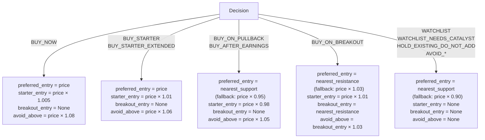

### Stop-Loss & Target Logic

```
Stop-loss:
  nearest_support exists → stop = nearest_support × 0.99
                           invalidation = nearest_support × 0.98
  no support             → stop = price × 0.92
                           invalidation = price × 0.90

Targets:
  first_target  = resistances[0]  (fallback: price × 1.10)
  second_target = resistances[1]  (fallback: price × 1.20)

Risk/Reward:
  entry_ref = preferred_entry (or price)
  downside_pct = (entry_ref - stop_loss) / entry_ref × 100
  upside_pct   = (first_target - entry_ref) / entry_ref × 100
  ratio        = upside_abs / downside_abs
```

---

## 17. Markdown Report Service

**File:** `backend/app/services/markdown_report_service.py`

Generates a structured Markdown string from a completed `StockAnalysisResult`. Sections:

1. Header (ticker, price, date, archetype, regime, disclaimer)
2. Signal Profile (6-dimension summary)
3. Data Quality Warnings
4. Per-horizon recommendation (decision, score, confidence, entry/exit plan, factors)
5. Technical Analysis summary
6. Fundamental Quality
7. Valuation
8. Earnings
9. News & Sentiment
10. Risk Management notes

The markdown is stored in `StockAnalysisResult.markdown_report` and rendered by `react-markdown` in the frontend's `MarkdownReport.tsx` collapsible panel.

---

## 18. API Router

**File:** `backend/app/routers/stock.py`

### Endpoints

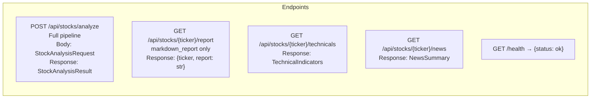

### `analyze_stock` Orchestration (step-by-step)

```python
# Step 1 — Market data
market_data = get_market_data(ticker)
price = market_data.current_price

# Step 2 — Historical data (fetched once, reused)
hist_1y    = get_history(ticker, "1y", "1d")
spy_hist   = get_history("SPY", "1y", "1d")
qqq_hist   = get_history("QQQ", "1y", "1d")     # NEW: for regime classification
sector_etf = get_sector_etf(ticker)               # e.g. "XLK"
sector_hist = get_history(sector_etf, "6mo", "1d") if sector_etf else None  # 6mo for RS

# Step 2a — Technical analysis
technicals = compute_technicals(hist_1y, spy_df=spy_hist, sector_df=sector_hist)

# Step 3 — Fundamentals & valuation (baseline scores)
fundamentals = get_fundamental_data(ticker)
fundamentals.fundamental_score = score_fundamentals(fundamentals)
valuation = get_valuation_data(ticker, market_cap=market_data.market_cap)
valuation.valuation_score = score_valuation(valuation)

# Step 3a — Archetype classification + growth-adjusted valuation  NEW
fundamentals = classify_and_attach(fundamentals, valuation)
valuation.archetype_adjusted_score = score_valuation_with_archetype(
    valuation,
    archetype=fundamentals.archetype,
    revenue_growth_yoy=fundamentals.revenue_growth_yoy,
    operating_margin=fundamentals.operating_margin,
    gross_margin=fundamentals.gross_margin,
)

# Step 4 — Earnings
earnings = get_earnings_data(ticker)
earnings.earnings_score = score_earnings(earnings)

# Step 5 — News & sentiment
news_items = get_news_items(ticker)
news = classify_news(news_items)

# Step 6 — Options catalyst
options = get_options_snapshot(ticker)
catalyst_score = 65.0 if (options.put_call_ratio or 1.0) < 0.7 else \
                 35.0 if (options.put_call_ratio or 1.0) > 1.3 else 50.0

# Step 6a — Real sector macro score  NEW
sector_macro_score = 50.0
if sector_etf and sector_hist is not None:
    spy_6m = get_history("SPY", "6mo", "1d")
    sector_rs = compute_relative_strength(sector_hist["Close"], spy_6m["Close"], period=63)
    if sector_rs and sector_rs > 1.05:
        sector_macro_score = 65.0
    elif sector_rs and sector_rs < 0.95:
        sector_macro_score = 35.0

# Step 6b — Market regime classification  NEW
vix_hist = get_history("^VIX", "1mo", "1d")
vix_level = float(vix_hist["Close"].iloc[-1]) if not vix_hist.empty else None
regime_assessment = classify_regime(spy_hist, qqq_hist, vix_level)

# Step 7 — Aggregate scores (regime-aware)
scores = compute_scores(
    technicals, fundamentals, valuation, earnings, news,
    catalyst_score=catalyst_score,
    sector_macro_score=sector_macro_score,
    regime_assessment=regime_assessment,
)

# Step 8 — Recommendations (data completeness + regime-aware decisions)
recommendations = build_recommendations(
    technicals, fundamentals, valuation, earnings, news,
    scores, request.horizons, request.risk_profile, price,
    regime_assessment=regime_assessment,
    has_options_data=options.available,
    has_sufficient_price_history=(len(hist_1y) >= 126),
)

# Step 9 — Data quality
data_quality = _build_data_quality(fundamentals, valuation, earnings,
                                   news, options.available, technicals)

# Step 10 — Signal profile  NEW
signal_profile = build_signal_profile(technicals, fundamentals, valuation, earnings, news)

# Step 11 — Assemble result + generate markdown
result = StockAnalysisResult(
    ...,
    archetype=fundamentals.archetype,
    archetype_confidence=fundamentals.archetype_confidence,
    market_regime=regime_assessment.regime,
    regime_confidence=regime_assessment.confidence,
    signal_profile=signal_profile,
)
result.markdown_report = generate_markdown(result)
return result
```

### Data Quality Scoring

```
Start: 100

-5  peer_comparison_available is False   (always)
-5  news.coverage_limited                (always)
-5  not options.available
-5  earnings.next_earnings_date is None
-10 earnings.last_earnings_date is None
-10 fundamentals.revenue_ttm is None
-10 technicals.ma_200 is None           (< 200 bars of data)
```

*Note: This is the legacy `DataQualityReport.score`, separate from `data_completeness_score` computed by the Data Completeness Service. Both appear in the API response.*

---

## 19. Pydantic Models (Full Schema)

### Request

```python
class StockAnalysisRequest(BaseModel):
    ticker: str                                              # required
    horizons: list[str] = ["short_term","medium_term","long_term"]
    risk_profile: str = "moderate"                           # conservative|moderate|aggressive
    max_position_percent: Optional[float] = None
    max_loss_percent: Optional[float] = None
    current_holding_shares: Optional[float] = None
    average_cost: Optional[float] = None
```

### Core Models

```mermaid
classDiagram
    class StockArchetype {
        +str HYPER_GROWTH
        +str PROFITABLE_GROWTH
        +str CYCLICAL_GROWTH
        +str MATURE_VALUE
        +str TURNAROUND
        +str SPECULATIVE_STORY
        +str DEFENSIVE
        +str COMMODITY_CYCLICAL
        +list ALL
    }
    class MarketRegime {
        +str BULL_RISK_ON
        +str BULL_NARROW_LEADERSHIP
        +str SIDEWAYS_CHOPPY
        +str BEAR_RISK_OFF
        +str SECTOR_ROTATION
        +str LIQUIDITY_RALLY
        +list ALL
    }
    class MarketRegimeAssessment {
        +str regime
        +float confidence
        +str implication
        +Optional~bool~ spy_above_50dma
        +Optional~bool~ spy_above_200dma
        +Optional~bool~ qqq_above_200dma
        +Optional~float~ vix_level
    }
    class FundamentalData {
        +Optional~float~ revenue_ttm, revenue_growth_yoy, revenue_growth_qoq
        +Optional~float~ eps_ttm, eps_growth_yoy
        +Optional~float~ gross_margin, operating_margin, net_margin
        +Optional~float~ free_cash_flow, free_cash_flow_margin
        +Optional~float~ cash, total_debt, net_debt, current_ratio
        +Optional~float~ debt_to_equity, shares_outstanding, roe, roic
        +Optional~str~ sector
        +Optional~float~ beta
        +float fundamental_score
        +str archetype
        +float archetype_confidence
    }
    class ValuationData {
        +Optional~float~ trailing_pe, forward_pe, peg_ratio
        +Optional~float~ price_to_sales, ev_to_ebitda, price_to_fcf, fcf_yield
        +bool peer_comparison_available
        +float valuation_score
        +float archetype_adjusted_score
    }
    class SignalProfile {
        +str momentum
        +str growth
        +str valuation
        +str entry_timing
        +str sentiment
        +str risk_reward
    }
    class HorizonRecommendation {
        +str horizon
        +str decision
        +float score
        +str confidence
        +float confidence_score
        +float data_completeness_score
        +str summary
        +list~str~ bullish_factors
        +list~str~ bearish_factors
        +EntryPlan entry_plan
        +ExitPlan exit_plan
        +RiskReward risk_reward
        +PositionSizing position_sizing
        +list~str~ data_warnings
    }
    class StockAnalysisResult {
        +str ticker, generated_at
        +float current_price
        +DataQualityReport data_quality
        +MarketData market_data
        +TechnicalIndicators technicals
        +FundamentalData fundamentals
        +ValuationData valuation
        +EarningsData earnings
        +NewsSummary news
        +list~HorizonRecommendation~ recommendations
        +str markdown_report
        +str archetype
        +float archetype_confidence
        +str market_regime
        +float regime_confidence
        +Optional~SignalProfile~ signal_profile
        +str disclaimer
    }
```

---

## 20. Frontend Internals

### State Management (Dashboard.tsx)

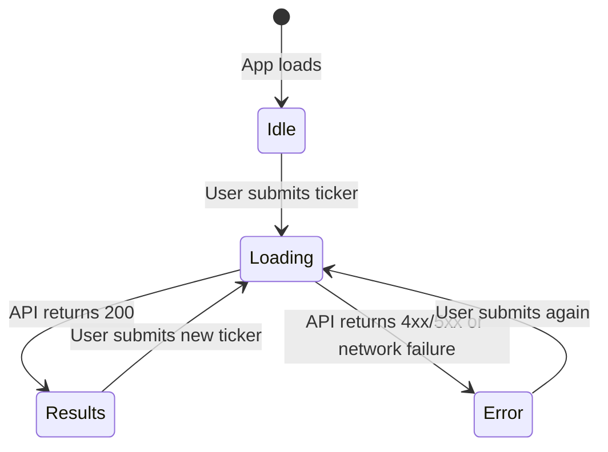

**State variables:**
```typescript
ticker: string          // controlled input (auto-uppercased)
riskProfile: string     // 'conservative' | 'moderate' | 'aggressive'
loading: boolean        // shows spinner, disables button
error: string | null    // shown in red banner
result: StockAnalysisResult | null  // full API response
```

**Error extraction:**
```typescript
const msg = (err as AxiosError)?.response?.data?.detail  // FastAPI HTTPException
         ?? (err as Error)?.message
         ?? 'Analysis failed';
```

### API Client (stockApi.ts)

```typescript
const client = axios.create({ baseURL: '/api' });
// Vite proxies /api → http://localhost:8000 (vite.config.ts)

export async function analyzeStock(req: AnalysisRequest): Promise<StockAnalysisResult> {
    const { data } = await client.post<StockAnalysisResult>('/stocks/analyze', {
        ticker: req.ticker.toUpperCase(),
        horizons: req.horizons ?? ['short_term', 'medium_term', 'long_term'],
        risk_profile: req.risk_profile ?? 'moderate',
    });
    return data;
}
```

### TypeScript Types (stock.ts)

```typescript
export interface SignalProfile {
    momentum: string;       // VERY_BULLISH | BULLISH | NEUTRAL | BEARISH | VERY_BEARISH
    growth: string;
    valuation: string;      // ATTRACTIVE | FAIR | ELEVATED | RISKY
    entry_timing: string;   // IDEAL | ACCEPTABLE | EXTENDED | VERY_EXTENDED
    sentiment: string;
    risk_reward: string;    // EXCELLENT | GOOD | ACCEPTABLE | POOR
}

export interface HorizonRecommendation {
    // ...existing fields...
    confidence_score: number;       // 0–100
    data_completeness_score: number; // 0–100
}

export interface StockAnalysisResult {
    // ...existing fields...
    archetype: string;
    archetype_confidence: number;
    market_regime: string;
    regime_confidence: number;
    signal_profile?: SignalProfile;
}
```

### Component Props

```typescript
// RecommendationCard.tsx
interface Props { rec: HorizonRecommendation }
// DECISION_STYLES — all 14 labels with distinct Tailwind colors:
// BUY_NOW               → bg-green-500
// BUY_STARTER           → bg-emerald-500
// BUY_STARTER_EXTENDED  → bg-teal-600        (smaller size, still bullish)
// BUY_ON_PULLBACK       → bg-cyan-600
// BUY_ON_BREAKOUT       → bg-blue-500
// BUY_AFTER_EARNINGS    → bg-indigo-600
// WATCHLIST             → bg-slate-500
// WATCHLIST_NEEDS_CATALYST → bg-slate-600
// HOLD_EXISTING_DO_NOT_ADD → bg-orange-600
// AVOID                 → bg-red-600
// AVOID_BAD_BUSINESS    → bg-red-950/60 border-red-900
// AVOID_BAD_CHART       → bg-rose-900/60
// AVOID_BAD_RISK_REWARD → bg-pink-900/60
// AVOID_LOW_CONFIDENCE  → bg-neutral-700
//
// Card footer: completeness bar + confidence bar rendered as progress bars

// SignalProfileCard.tsx  (new)
interface Props { profile: SignalProfile }
// 6-cell grid using SignalCell component
// SIGNAL_COLORS maps all label strings to Tailwind text classes:
//   VERY_BULLISH → text-green-400, RISKY → text-red-400, EXTENDED → text-yellow-400, etc.
// BG_COLORS maps to border+background classes for the card background

// RegimeArchetypeBar.tsx  (new)
interface Props {
    archetype: string;
    archetypeConfidence: number;
    marketRegime: string;
    regimeConfidence: number;
}
// Renders two pill-shaped badges (rounded-full)
// ARCHETYPE_STYLES: 8 entries — HYPER_GROWTH→violet, DEFENSIVE→teal, MATURE_VALUE→slate, etc.
// REGIME_STYLES: 6 entries with colored dot — BULL_RISK_ON→green dot, BEAR_RISK_OFF→red dot

// ScoreBreakdown.tsx
interface Props {
    technicals: TechnicalIndicators;
    fundamentals: FundamentalData;
    valuation: ValuationData;
    earnings: EarningsData;
    news: NewsSummary;
}

// TechnicalChart.tsx
interface Props { technicals: TechnicalIndicators; currentPrice: number }

// NewsSection.tsx
interface Props { news: NewsSummary }

// DataWarnings.tsx
interface Props { quality: DataQualityReport }

// MarkdownReport.tsx
interface Props { markdown: string }
// Renders inside <details><summary> — collapsed by default
// Uses react-markdown with no custom plugins
```

### Dashboard Layout (result sections, top to bottom)

1. Price header with `RegimeArchetypeBar`
2. `DataWarnings` (completeness gaps)
3. `SignalProfileCard` (6 signal dimensions)
4. Recommendation cards (3 horizons)
5. ScoreBreakdown + TechnicalChart (side by side)
6. Fundamental Quality + Valuation (side by side)
7. NewsSection
8. Earnings table
9. MarkdownReport (collapsible)
10. Disclaimer

### Vite Proxy Configuration

```typescript
// vite.config.ts
server: { proxy: { '/api': 'http://localhost:8000' } }
// All requests to /api/* are forwarded to the FastAPI backend
// No CORS configuration needed in development
// For production: configure a reverse proxy (nginx) or use the same origin
```

---

## 21. Backtest Engine Internals

### Module Responsibilities

```mermaid
flowchart TD
    CFG["config.py\n─────────────────────────────\nBACKTEST_TICKERS: list[str] (20)\nSECTOR_ETF_MAP: dict[str, str|None]\nBACKTEST_START = '2024-05-06'\nBACKTEST_END   = '2026-05-04'\nHISTORY_START  = '2022-05-01'\nHOLDING_PERIODS = {short:20, med:65, long:252}\nMIN_ROWS_FOR_ANALYSIS = 252\nCACHE_DIR = 'backtest_results/cache'\nRESULTS_DIR = 'backtest_results'\nBENCHMARK_TICKERS = {'SPY', 'QQQ'}"]

    DL["data_loader.py\n─────────────────────────────\nload_all_data(force_refresh, extra_tickers)\n  → {prices: dict[str,DataFrame], quarterly: dict[str,dict]}\n\nPre-fetches ALL tickers in one batch:\n  set(BACKTEST_TICKERS) | {'SPY','QQQ'} | {sector ETFs} | extra_tickers\nPersists to pickle:\n  backtest_results/cache/prices.pkl\n  backtest_results/cache/quarterly.pkl"]

    SN["snapshot.py\n─────────────────────────────\nbuild_historical_fundamentals(\n  ticker, test_date, quarterly_data, price_at_date\n) → (FundamentalData, ValuationData, EarningsData)\n\nget_price_slice(df, test_date) → df[df.index ≤ test_date]\nneutral_news() → NewsSummary(news_score=50, coverage_limited=True)\n_filter_stmt_cols(stmt, cutoff) → stmt with cols ≤ cutoff\n_normalize_ts(ts) → tz-naive Timestamp"]

    RN["runner.py\n─────────────────────────────\nPer iteration:\n  price_slice = get_price_slice(full_df, test_date)\n  spy_slice, qqq_slice = sliced benchmark DFs\n  technicals = compute_technicals(slice, spy_slice, sector_slice)\n  fund,val,earn = build_historical_fundamentals(...)\n  fund = classify_and_attach(fund, val)          ← NEW\n  val.archetype_adjusted_score = score_valuation_with_archetype(...) ← NEW\n  fund.fundamental_score = score_fundamentals(fund)\n  real sector_macro_score from compute_relative_strength  ← NEW\n  vix_level = 20.0 (proxy — VIX history not pre-fetched)\n  regime = classify_regime(spy_slice, qqq_slice, vix_level)  ← NEW\n  scores = compute_scores(..., regime_assessment=regime)\n  recs = build_recommendations(...)"]

    OT["outcome.py\n─────────────────────────────\nattach_outcomes(signals, prices) → signals (modified in place)\n_get_price_at_offset(df, from_date, N_trading_days)\n  → Close.iloc[N-1] of rows after from_date\n\nFor each signal:\n  forward_return = (exit_price - entry_price) / entry_price × 100\n  spy_return     = (spy_exit - spy_entry) / spy_entry × 100\n  excess_return  = forward_return - spy_return\n  qqq_return     = (qqq_exit - qqq_entry) / qqq_entry × 100  ← NEW\n  excess_return_vs_qqq = forward_return - qqq_return          ← NEW"]

    MT["metrics.py\n─────────────────────────────\nbuild_metrics(signals, horizon) → dict\n  by_decision: win rate, avg/median return, best/worst, vs SPY\n  by_score_bucket: [0-40, 40-55, 55-70, 70-85, 85-100]\n  by_ticker: sorted by avg_return desc\n  monthly_breakdown: by YYYY-MM period\n  by_regime: win rate, avg_return, avg_excess_vs_qqq, n_signals ← NEW\n  by_archetype: win rate, avg_return, best_decision, avg_score  ← NEW\n  portfolio_simulation: BUY_NOW+BUY_STARTER only\n  overall_stats: correlation, best/worst signal"]
```

### Historical Fundamentals Construction (snapshot.py)

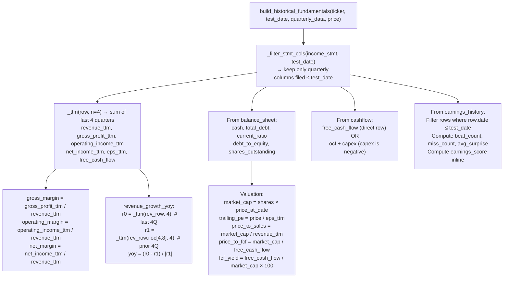

### Signal Record Schema (output of runner)

```python
{
    "ticker": str,
    "date": str,                    # YYYY-MM-DD
    "horizon": str,                 # short_term | medium_term | long_term
    "decision": str,                # any of 14 labels in ALL_DECISIONS
    "score": float,                 # composite 0–100
    "confidence": str,
    "price": float,                 # entry price at signal date
    "technical_score": float,
    "fundamental_score": float,
    "valuation_score": float,
    "earnings_score": float,
    "trend": str,
    "rsi": Optional[float],
    "is_extended": bool,
    "entry_preferred": Optional[float],
    "stop_loss": Optional[float],
    "first_target": Optional[float],
    # NEW fields (US-009):
    "archetype": str,               # StockArchetype value
    "market_regime": str,           # MarketRegime value
    # Filled in by outcome.py:
    "forward_return": Optional[float],
    "spy_return": Optional[float],
    "excess_return": Optional[float],
    "qqq_return": Optional[float],         # NEW
    "excess_return_vs_qqq": Optional[float], # NEW
}
```

### Backtest Metrics Structure (`by_regime`, `by_archetype`)

```python
# by_regime output structure
{
    "BULL_RISK_ON": {
        "n_signals": int,
        "win_rate": float,          # fraction of signals with forward_return > 0
        "avg_return": float,
        "avg_excess_vs_qqq": float, # avg(excess_return_vs_qqq) for this regime
    },
    "BEAR_RISK_OFF": { ... },
    ...
}

# by_archetype output structure
{
    "HYPER_GROWTH": {
        "n_signals": int,
        "win_rate": float,
        "avg_return": float,
        "avg_score": float,
        "best_decision": str,       # decision with highest avg_return for this archetype
    },
    "MATURE_VALUE": { ... },
    ...
}
```

---

## 22. Error Handling Map

```mermaid
flowchart TD
    subgraph Providers["Provider Layer — Graceful Degradation"]
        E1["yfinance HTTP 429\n→ tenacity retry (3×, exp backoff 2–30s)"]
        E2["yfinance returns empty DataFrame\n→ ValueError → retry → HTTPException(503)"]
        E3["earnings_dates KeyError\n→ try/except → last_date=None, next_date=None"]
        E4["quarterly_income_stmt missing row labels\n→ _stmt_row() returns None → _ttm() returns None"]
        E5["ticker.news returns []\n→ returns empty list → news_score=50, coverage_limited=True\n→ DataCompletenessService deducts -15 and flags warning"]
        E6["options_provider fails\n→ options.available=False, catalyst_score=50\n→ DataCompletenessService deducts -15 and flags warning"]
        E7["sector ETF not found\n→ get_sector_etf() returns None → sector_macro_score=50"]
        E8["VIX fetch fails (^VIX returns empty)\n→ vix_level=None → classify_regime defaults to SIDEWAYS_CHOPPY"]
    end

    subgraph Services["Service Layer — Null Safety"]
        S1["All indicator functions return Optional[float]\n→ score_technicals() treats None as neutral"]
        S2["score_fundamentals/valuation skip None fields\n→ partial scoring still works"]
        S3["OpenAI API failure\n→ falls back to keyword classifier automatically"]
        S4["JSON parse failure from OpenAI\n→ falls back to keyword classifier"]
        S5["Missing sector/beta in fundamentals\n→ classify_archetype() falls back to PROFITABLE_GROWTH"]
        S6["spy_df < 50 bars in classify_regime()\n→ returns SIDEWAYS_CHOPPY, confidence=20"]
    end

    subgraph API["API Layer"]
        A1["Any unhandled exception\n→ FastAPI returns HTTP 500"]
        A2["Ticker not found / empty\n→ yfinance raises ValueError\n→ HTTPException(503, detail=str(e))"]
        A3["Validation error\n→ Pydantic returns HTTP 422"]
    end

    subgraph Frontend["Frontend Layer"]
        F1["HTTP 4xx/5xx\n→ extract error.response.data.detail\n→ display in red banner"]
        F2["Network failure\n→ error.message → display in red banner"]
        F3["Optional fields\n→ TypeScript ?. checks + 'N/A' fallback via fmt()"]
        F4["signal_profile absent\n→ SignalProfileCard rendered conditionally (result.signal_profile &&)"]
    end
```

---

## 23. Test Coverage Map

**Total: 241 tests across 9 test files**

```mermaid
flowchart LR
    subgraph TA["test_technical_analysis.py (38 tests)"]
        TA1["_sma: correct value, insufficient data"]
        TA2["compute_rsi: known values, insufficient data"]
        TA3["compute_macd: sign, insufficient data"]
        TA4["compute_atr: positive value"]
        TA5["classify_trend: all 4 labels + unknown"]
        TA6["detect_extension: each of 3 conditions"]
        TA7["find_support_resistance: levels in range, clustering"]
        TA8["compute_volume_trend: above/below/average"]
        TA9["compute_relative_strength: outperform/underperform"]
        TA10["score_technicals: each bonus/penalty component"]
        TA11["compute_technicals: integration with spy_df, sector_df"]
    end

    subgraph FA["test_fundamental_analysis.py (32 tests)"]
        FA1["score_fundamentals: each +/- component isolated"]
        FA2["High-growth company → score > 80"]
        FA3["Declining company → score < 40"]
        FA4["score_valuation: forward P/E buckets"]
        FA5["score_valuation: PEG, P/S, EV/EBITDA, FCF yield"]
        FA6["PEG calculation fallback"]
        FA7["P/FCF calculation"]
        FA8["score_valuation_with_archetype: HYPER_GROWTH + fwd_pe=80 + rev=40% → score > 60"]
        FA9["score_valuation_with_archetype: MATURE_VALUE + pe=12 + FCF=5% → score > 70"]
        FA10["score_valuation_with_archetype: CYCLICAL_GROWTH peak-PE handling"]
        FA11["Rule of 40 bonus applied correctly (≥ 60 → +15)"]
        FA12["HYPER_GROWTH P/S exempt if gross_margin > 60%"]
        FA13["score_valuation_with_archetype: PROFITABLE_GROWTH falls through to baseline"]
        FA14["score_valuation_with_archetype: revenue slowing → score penalized"]
        FA15["score_valuation_with_archetype: SPECULATIVE_STORY treated like HYPER_GROWTH"]
    end

    subgraph EA["test_earnings_analysis.py (29 tests)"]
        EA1["score_earnings: beat rate buckets"]
        EA2["score_earnings: surprise % buckets"]
        EA3["score_earnings: within_30_days penalty"]
        EA4["earnings_dates KeyError → None (not exception)"]
        EA5["classify_news with OpenAI mock → correct sentiment"]
        EA6["classify_news with no API key → keyword fallback"]
        EA7["keyword_classify: positive/negative/neutral cases"]
        EA8["news_score: weighted formula correctness"]
    end

    subgraph SR["test_scoring_recommendation.py (53 tests)"]
        SR1["SHORT/MEDIUM/LONG_TERM_WEIGHTS each sum to 100"]
        SR2["compute_scores: all three horizons returned"]
        SR3["Regime multipliers applied: BULL → momentum score increases"]
        SR4["Regime multipliers applied: BEAR → valuation/balance-sheet increase"]
        SR5["Missing score key defaults to 50"]
        SR6["ALL_DECISIONS constant contains all 14 expected labels"]
        SR7["_decide_short_term: BUY_NOW, BUY_STARTER, BUY_ON_PULLBACK, AVOID, WATCHLIST"]
        SR8["Extension → BUY_STARTER_EXTENDED in bull regime"]
        SR9["Extension → BUY_ON_PULLBACK in non-bull regime"]
        SR10["AVOID_BAD_CHART: downtrend + weak RS required (both conditions)"]
        SR11["AVOID_BAD_BUSINESS: revenue declining + secondary indicator required"]
        SR12["BUY_AFTER_EARNINGS when earnings near and score 55–70"]
        SR13["BULL regime + expensive + strong chart → NOT AVOID"]
        SR14["_decide_medium_term: all decisions reachable"]
        SR15["_decide_long_term: all decisions reachable"]
        SR16["build_recommendations: integration, 3 HorizonRecommendation objects"]
        SR17["earnings halving: starter_pct/max_alloc reduced within_30_days"]
        SR18["compute_risk_management: entry/exit/R/R/sizing per risk_profile"]
    end

    subgraph SAR["test_stock_archetype.py (19 tests)"]
        SA1["NVDA-like data → HYPER_GROWTH"]
        SA2["JNJ-like data → DEFENSIVE"]
        SA3["XOM-like data → COMMODITY_CYCLICAL"]
        SA4["MSFT-like data → PROFITABLE_GROWTH"]
        SA5["Turnaround scenario → TURNAROUND"]
        SA6["Missing data → PROFITABLE_GROWTH fallback, conf=40"]
        SA7["PLTR-like: high P/S + unprofitable + fast growth → SPECULATIVE_STORY"]
        SA8["classify_and_attach mutates fundamentals in place"]
        SA9["Priority order: SPECULATIVE_STORY before HYPER_GROWTH"]
        SA10["confidence scales with rev_growth for HYPER_GROWTH"]
    end

    subgraph MR["test_market_regime.py (18 tests)"]
        MR1["SPY above 50DMA+200DMA, VIX=16, QQQ above → BULL_RISK_ON conf=85"]
        MR2["SPY below 200DMA, VIX=30 → BEAR_RISK_OFF conf=82"]
        MR3["SPY near 200DMA (above 200, below 50) → SIDEWAYS_CHOPPY conf=60"]
        MR4["Missing VIX data + bull MAs → BULL_RISK_ON conf=70"]
        MR5["QQQ below 200DMA while SPY above → BULL_NARROW_LEADERSHIP"]
        MR6["spy_df empty → SIDEWAYS_CHOPPY conf=20 (fallback)"]
        MR7["REGIME_WEIGHT_ADJUSTMENTS has all 6 regimes as keys"]
        MR8["BULL_RISK_ON multiplier for technical_momentum is 1.20"]
        MR9["BEAR_RISK_OFF multiplier for balance_sheet_strength is 1.25"]
    end

    subgraph DC["test_data_completeness.py (16 tests)"]
        DC1["No news → completeness = 85, warning contains 'news'"]
        DC2["No options → completeness = 85, warning contains 'Options'"]
        DC3["No next earnings → completeness = 90, warning contains 'earnings date'"]
        DC4["All 5 deductions → completeness = 50, confidence = 60"]
        DC5["Completeness < 60 → confidence capped at 60"]
        DC6["Full data → completeness = 100, confidence = 100"]
        DC7["Completeness < 55 → AVOID_LOW_CONFIDENCE decision forced"]
        DC8["High score not overridden when completeness ≥ 55"]
        DC9["Completeness never goes below 0"]
    end

    subgraph SP["test_signal_profile.py (22 tests)"]
        SP1["technical_score≥80 + not extended → momentum=VERY_BULLISH"]
        SP1b["technical_score≥80 + extended → momentum=BULLISH (extended penalty)"]
        SP2["fundamental_score < 35 → growth=VERY_BEARISH"]
        SP3["valuation_score ≥ 70 → valuation=ATTRACTIVE"]
        SP4["valuation_score < 40 → valuation=RISKY"]
        SP5["archetype_adjusted_score > 0 used instead of raw valuation_score"]
        SP6["is_extended + ext_20ma ≥ 15 → entry=VERY_EXTENDED"]
        SP7["strong_uptrend + not extended → entry=IDEAL"]
        SP8["news_score ≥ 75 → sentiment=VERY_BULLISH"]
        SP9["earnings+technical avg ≥ 75 → risk_reward=EXCELLENT"]
        SP10["SignalProfile fields all valid enum values"]
        SP11["NVDA-like: momentum=VERY_BULLISH + valuation=RISKY both coexist"]
    end

    subgraph BT["test_backtest_metrics.py (14 tests)"]
        BT1["SPY and QQQ in BENCHMARK_TICKERS"]
        BT2["by_regime groups signals correctly by regime column"]
        BT3["by_regime win_rate computed correctly"]
        BT4["by_regime avg_excess_vs_qqq computed correctly"]
        BT5["by_regime returns empty dict when no 'market_regime' column"]
        BT6["by_archetype groups by archetype column"]
        BT7["by_archetype best_decision = decision with highest avg_return"]
        BT8["by_archetype avg_score computed correctly"]
        BT9["by_archetype returns empty dict when no 'archetype' column"]
        BT10["build_metrics output contains 'by_regime' and 'by_archetype' keys"]
        BT11["by_regime structure: has win_rate, avg_return, n_signals per regime"]
        BT12["by_archetype structure: has best_decision per archetype"]
        BT13["excess_return_vs_qqq = forward_return - qqq_return"]
        BT14["portfolio_simulation still present in build_metrics output"]
    end
```

**Running tests:**
```bash
cd backend
source .venv/bin/activate
PYTHONPATH=. pytest tests/ -v                    # all 241 tests
PYTHONPATH=. pytest tests/test_stock_archetype.py -v   # single suite
PYTHONPATH=. pytest tests/ -v --tb=short         # compact output
```

**Regression gate:** All previously passing tests must still pass after each new story.

**OpenAI test pattern** (module-level import required for patch to work):
```python
# In test:
with patch("app.services.news_sentiment_service.OpenAI") as mock_openai:
    mock_client = MagicMock()
    mock_openai.return_value = mock_client
    mock_client.chat.completions.create.return_value = ...
    result = classify_news(items)
```

---

## 24. Extension Guide

### A. Swap the News Data Source

The sentiment service is provider-agnostic. It only consumes `list[NewsItem]`.

```python
# 1. Create backend/app/providers/newsapi_provider.py
def get_news_items(ticker: str) -> list[NewsItem]:
    # Call NewsAPI, Alpha Vantage, or any other news source
    # Map to NewsItem(title, source, published_at, url)
    ...

# 2. In routers/stock.py, replace:
from app.providers.news_provider import get_news_items
# with:
from app.providers.newsapi_provider import get_news_items
# No other changes needed
```

---

### B. Swap the Price Data Source (Polygon, Alpha Vantage, etc.)

```python
# 1. Create backend/app/providers/polygon_market_provider.py
# Must implement the same return types:
def get_history(ticker, period, interval) -> pd.DataFrame:
    # Columns: Open, High, Low, Close, Volume
    # Index: DatetimeIndex (tz-naive)
    ...

def get_market_data(ticker) -> MarketData: ...
def get_sector_etf(ticker) -> Optional[str]: ...

# 2. In routers/stock.py, replace the import — pipeline unchanged
```

---

### C. Add a New Scoring Dimension

Example: add a separate `momentum_score` sub-component distinct from `technical_score`.

```python
# 1. Compute the score (0–100) in a new service or add to existing
momentum_score = compute_momentum_score(technicals)

# 2. Pass to compute_scores() as a new kwarg:
def compute_scores(..., momentum_score: float = 50.0) -> dict:
    short_base = {
        ...,
        "momentum_quality": momentum_score,   # add here
    }

# 3. Add "momentum_quality" key to whichever horizon weight dict needs it,
#    and reduce another weight to keep sum = 100.
# _verify_weights() will catch any sum ≠ 100 at import time.
```

---

### D. Add a New Stock Archetype

```python
# 1. Add constant to StockArchetype class in models/fundamentals.py
class StockArchetype:
    ...
    BIOTECH_PIPELINE = "BIOTECH_PIPELINE"   # example: pre-revenue drug developer
    ALL = [..., BIOTECH_PIPELINE]

# 2. Add classification rule in stock_archetype_service.py
#    (insert at appropriate priority level in classify_archetype())
if fundamentals.sector == "Healthcare" and fundamentals.revenue_ttm is None:
    return StockArchetype.BIOTECH_PIPELINE, 75.0

# 3. Add scoring rules in valuation_analysis_service.py
elif archetype == StockArchetype.BIOTECH_PIPELINE:
    # P/S and burn rate matter; P/E irrelevant for pre-revenue names
    ...

# 4. Add UI style in frontend/src/components/RegimeArchetypeBar.tsx
ARCHETYPE_STYLES["BIOTECH_PIPELINE"] = { bg: 'bg-purple-900/50', text: 'text-purple-300' }
```

---

### E. Add a New Market Regime

```python
# 1. Add constant to MarketRegime class in models/market.py
class MarketRegime:
    ...
    HIGH_INFLATION_STAGFLATION = "HIGH_INFLATION_STAGFLATION"
    ALL = [..., HIGH_INFLATION_STAGFLATION]

# 2. Add classification logic in market_regime_service.py
#    (in _determine_regime() before the fallback)

# 3. Add weight multipliers in REGIME_WEIGHT_ADJUSTMENTS
REGIME_WEIGHT_ADJUSTMENTS[MarketRegime.HIGH_INFLATION_STAGFLATION] = {
    "balance_sheet_strength": 1.30,
    "fcf_quality": 1.20,
    "technical_momentum": 0.80,
}

# 4. Add implication text in _REGIME_IMPLICATIONS

# 5. Add UI style in RegimeArchetypeBar.tsx REGIME_STYLES
```

---

### F. Add Risk/Reward Score to Scoring Pipeline

Currently `risk_reward_score = 50.0` (default). To make it dynamic:

```python
# After compute_risk_management() is called per-horizon in build_recommendations(),
# extract the R/R ratio and convert to a score:
def _rr_to_score(ratio: Optional[float]) -> float:
    if ratio is None: return 50.0
    if ratio >= 3.0: return 80.0
    if ratio >= 2.0: return 65.0
    if ratio >= 1.0: return 50.0
    return 30.0

# Pass this back into compute_scores() for a second pass,
# or compute scores after risk management (requires refactor of orchestration order)
```

---

### G. Add a New API Endpoint

FastAPI pattern — add to `routers/stock.py`:

```python
@router.get("/{ticker}/fundamentals", response_model=FundamentalData)
async def get_fundamentals(ticker: str) -> FundamentalData:
    fundamentals = get_fundamental_data(ticker.upper())
    fundamentals.fundamental_score = score_fundamentals(fundamentals)
    valuation = get_valuation_data(ticker.upper())
    fundamentals = classify_and_attach(fundamentals, valuation)
    return fundamentals
```

---

### H. Make the Backtest Multi-Threaded

The runner loop is currently single-threaded. To parallelize over tickers:

```python
# In runner.py, replace the ticker loop with ThreadPoolExecutor:
from concurrent.futures import ThreadPoolExecutor, as_completed

def run_backtest(data, tickers, ...):
    ...
    with ThreadPoolExecutor(max_workers=4) as executor:
        futures = {
            executor.submit(_run_ticker, ticker, test_dates, data, ...): ticker
            for ticker in tickers
        }
        for future in as_completed(futures):
            signals.extend(future.result())
    return signals

# Note: yfinance is not thread-safe — data_loader must pre-fetch ALL data
# before parallelism starts (already the case in the current design)
```

---

### I. Add VIX History to Backtest (improve regime accuracy)

Currently the backtest uses `vix_level=20.0` (static proxy) because VIX history is not pre-fetched.

```python
# 1. In data_loader.py, add "^VIX" to the fetch set:
all_tickers = set(BACKTEST_TICKERS) | {"SPY", "QQQ", "^VIX"} | {sector ETFs}

# 2. In runner.py, retrieve actual VIX at each test date:
vix_hist = prices.get("^VIX", pd.DataFrame())
vix_slice = get_price_slice(vix_hist, test_date)
vix_level = float(vix_slice["Close"].iloc[-1]) if not vix_slice.empty else 20.0

# 3. Pass actual vix_level to classify_regime() — regime labels improve immediately.
# This will cause the regime segmentation to differ from the static-VIX results.
```

---

*Last updated: 2026-05-04 | Reflects US-001 through US-010. 241 Python tests passing · 0 TypeScript errors.*
