# Low Level Design — Stock Decision Tool

> Reference document for implementation details, scoring algorithms, data contracts, and extension points.  
> Use this alongside [HLD.md](HLD.md) for any refactoring or enhancement work.

---

## Table of Contents

1. [Project Layout](#1-project-layout)
2. [Configuration & Environment](#2-configuration--environment)
3. [Cache Layer](#3-cache-layer)
4. [Data Providers](#4-data-providers)
5. [Technical Analysis Service](#5-technical-analysis-service)
6. [Fundamental Analysis Service](#6-fundamental-analysis-service)
7. [Valuation Analysis Service](#7-valuation-analysis-service)
8. [Earnings Analysis](#8-earnings-analysis)
9. [News Sentiment Service](#9-news-sentiment-service)
10. [Scoring Service](#10-scoring-service)
11. [Recommendation Service](#11-recommendation-service)
12. [Risk Management Service](#12-risk-management-service)
13. [Markdown Report Service](#13-markdown-report-service)
14. [API Router](#14-api-router)
15. [Pydantic Models (Full Schema)](#15-pydantic-models-full-schema)
16. [Frontend Internals](#16-frontend-internals)
17. [Backtest Engine Internals](#17-backtest-engine-internals)
18. [Error Handling Map](#18-error-handling-map)
19. [Test Coverage Map](#19-test-coverage-map)
20. [Extension Guide](#20-extension-guide)

---

## 1. Project Layout

```
usingGptStrategy/
├── backend/
│   ├── app/
│   │   ├── main.py                          # FastAPI app init, CORS, router mount
│   │   ├── config.py                        # Pydantic settings (env vars)
│   │   ├── cache/
│   │   │   └── cache_manager.py             # TTLCache singleton + helpers
│   │   ├── models/
│   │   │   ├── request.py                   # StockAnalysisRequest
│   │   │   ├── response.py                  # StockAnalysisResult + sub-models
│   │   │   ├── market.py                    # MarketData, TechnicalIndicators, S/R
│   │   │   ├── fundamentals.py              # FundamentalData, ValuationData
│   │   │   ├── earnings.py                  # EarningsData, EarningsRecord
│   │   │   └── news.py                      # NewsItem, NewsSummary
│   │   ├── providers/
│   │   │   ├── market_data_provider.py      # OHLCV, ticker.info, sector ETF
│   │   │   ├── fundamental_provider.py      # income_stmt, balance_sheet, cashflow
│   │   │   ├── earnings_provider.py         # earnings_history, earnings_dates
│   │   │   ├── news_provider.py             # ticker.news
│   │   │   └── options_provider.py          # option_chain (nearest expiry)
│   │   ├── services/
│   │   │   ├── technical_analysis_service.py
│   │   │   ├── fundamental_analysis_service.py
│   │   │   ├── valuation_analysis_service.py
│   │   │   ├── news_sentiment_service.py
│   │   │   ├── scoring_service.py
│   │   │   ├── recommendation_service.py
│   │   │   ├── risk_management_service.py
│   │   │   └── markdown_report_service.py
│   │   └── routers/
│   │       └── stock.py                     # All REST endpoints
│   ├── backtest/
│   │   ├── config.py                        # Ticker list, date range, holding periods
│   │   ├── data_loader.py                   # Fetch + pickle-cache 3yr history
│   │   ├── snapshot.py                      # Time-sliced inputs for a test date
│   │   ├── runner.py                        # Weekly backtest loop
│   │   ├── outcome.py                       # Forward return computation
│   │   ├── metrics.py                       # Aggregation: win rate, score correlation
│   │   ├── report.py                        # CSV + self-contained HTML
│   │   └── run_backtest.py                  # CLI entry point
│   ├── tests/
│   │   ├── test_technical_analysis.py       # 38 tests
│   │   ├── test_fundamental_analysis.py     # 24 tests
│   │   ├── test_earnings_analysis.py        # 29 tests
│   │   └── test_scoring_recommendation.py   # 34 tests
│   ├── requirements.txt
│   └── .env.example
├── frontend/
│   └── src/
│       ├── App.tsx
│       ├── pages/Dashboard.tsx
│       ├── components/
│       │   ├── RecommendationCard.tsx
│       │   ├── ScoreBreakdown.tsx
│       │   ├── TechnicalChart.tsx
│       │   ├── NewsSection.tsx
│       │   ├── DataWarnings.tsx
│       │   └── MarkdownReport.tsx
│       ├── api/stockApi.ts
│       └── types/stock.ts
├── HLD.md
├── LLD.md
├── backtest_plan.md
├── backtest_readme.md
├── backtest_results_2024_2026.md
└── README.md
```

---

## 2. Configuration & Environment

**File:** `backend/app/config.py`

```python
class Settings(BaseSettings):
    model_config = SettingsConfigDict(env_file=".env", env_file_encoding="utf-8")
    openai_api_key: str = ""            # Empty = keyword fallback for news sentiment
    cache_ttl_price_seconds: int = 900  # 15 min
    cache_ttl_fundamentals_seconds: int = 86400  # 24 h
    log_level: str = "INFO"

settings = Settings()   # module-level singleton, imported by all services
```

**Loading order:** `.env` file → environment variables → defaults.  
**`settings` is a module-level singleton** — imported directly, never passed as argument.

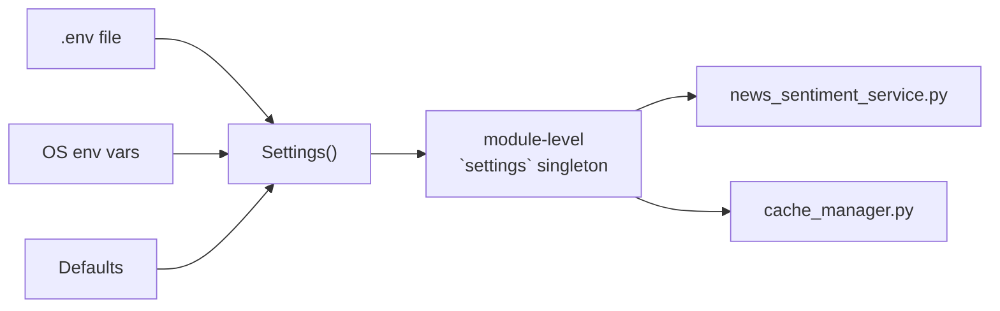

**Extension point:** Add new env vars by adding fields to `Settings`. Pydantic auto-reads them from `.env` with no other changes.

---

## 3. Cache Layer

**File:** `backend/app/cache/cache_manager.py`

### Design

Two separate `TTLCache` instances, both protected by a single `threading.Lock`:

| Cache | Variable | Key Format | TTL | Max entries |
|-------|----------|------------|-----|-------------|
| Price | `_price_cache` | `"{ticker}:{period}:{interval}"` | 900 s (15 min) | 256 |
| Fundamentals | `_fundamental_cache` | `"fundamental:{ticker}"` | 86400 s (24 h) | 256 |

```python
# All public functions
get_cached(cache, key)    → Optional[Any]   # thread-safe read
set_cached(cache, key, v) → None            # thread-safe write
price_cache_key(ticker, period, interval) → str
fundamental_cache_key(ticker)             → str
get_price_cache()         → TTLCache       # returns module-level instance
get_fundamental_cache()   → TTLCache       # returns module-level instance
```

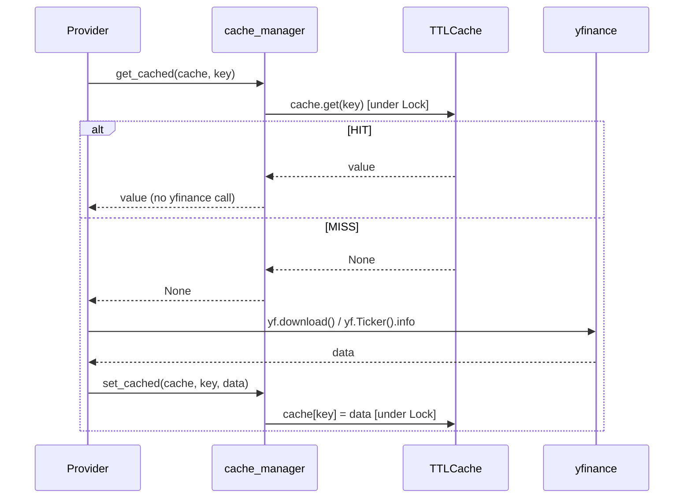

**Threading note:** The single `Lock` serialises all cache reads/writes. For a multi-worker deployment, this cache is **not shared** across processes — each uvicorn worker has its own in-memory cache.

**Enhancement opportunity:** Replace `TTLCache` with Redis to share cache across workers. Interface is already isolated — only `get_cached`/`set_cached` need to change.

---

## 4. Data Providers

### 4.1 MarketDataProvider

**File:** `backend/app/providers/market_data_provider.py`

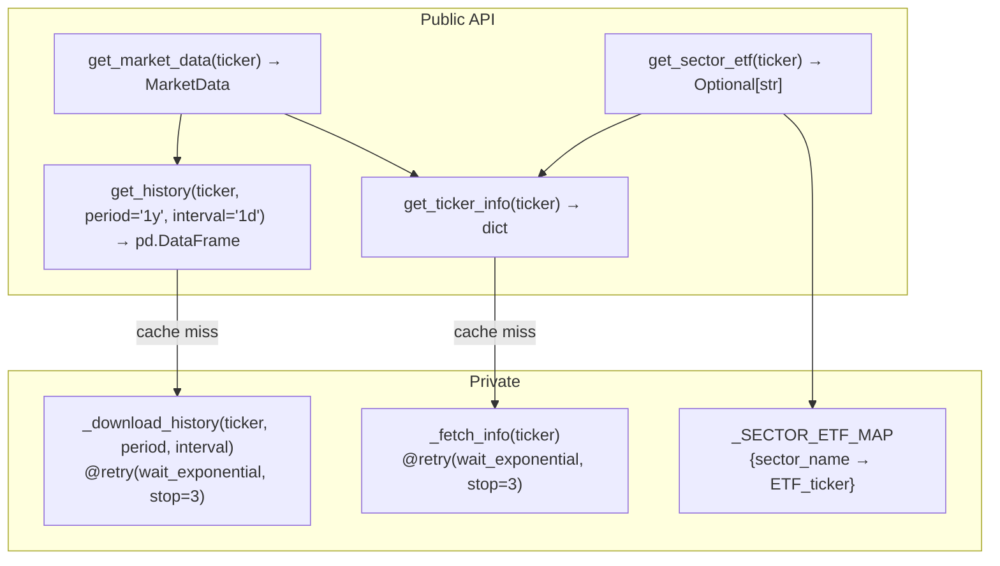

**`_download_history` internals:**
```python
@retry(
    retry=retry_if_exception_type(Exception),
    wait=wait_exponential(multiplier=2, min=2, max=30),   # 2s, 4s, 8s... capped at 30s
    stop=stop_after_attempt(3),
    reraise=True,   # re-raises after 3 failures
)
def _download_history(ticker, period, interval):
    df = yf.download(ticker, period=period, interval=interval,
                     progress=False, auto_adjust=True)
    if df.empty: raise ValueError(...)   # triggers retry
    return df
```

**MultiIndex column handling** (yfinance quirk for single ticker):
```python
if isinstance(df.columns, pd.MultiIndex):
    df.columns = df.columns.get_level_values(0)
# Result: always ["Open", "High", "Low", "Close", "Volume"]
```

**`get_market_data` — periods fetched:**
- `"1y"` — for 1-year return + avg volume 30d
- `"3mo"`, `"6mo"` — for 3M/6M returns
- `"ytd"` — for YTD return  
- `"1mo"` — for 1M return

**Sector ETF map** (used for relative strength vs sector):
```
Technology → XLK        Healthcare → XLV        Financial → XLF
Consumer Cyclical → XLY Consumer Defensive → XLP Energy → XLE
Industrials → XLI       Basic Materials → XLB    Real Estate → XLRE
Communication Services → XLC                      Utilities → XLU
```

---

### 4.2 FundamentalProvider

**File:** `backend/app/providers/fundamental_provider.py`

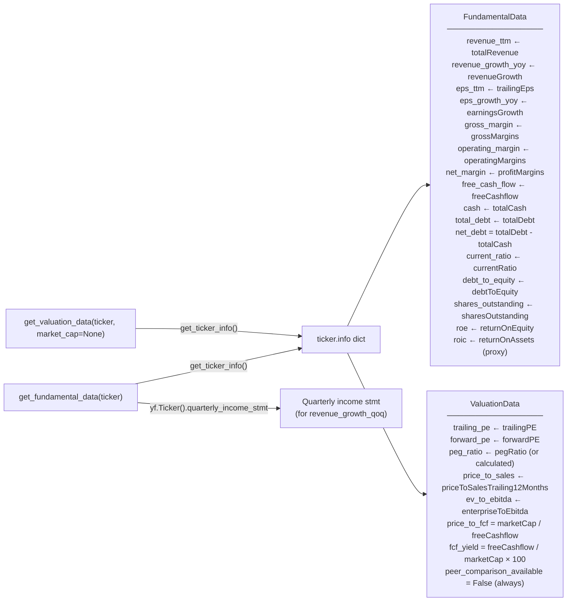

**Calculated fields:**
- `net_debt = total_debt - cash`
- `fcf_margin = free_cash_flow / revenue_ttm`
- `peg_ratio`: uses yfinance `pegRatio`; falls back to `forward_PE / (earningsGrowth × 100)` if missing
- `price_to_fcf = market_cap / free_cash_flow` (only when FCF > 0)
- `revenue_growth_qoq`: computed from `quarterly_income_stmt` — `(Q0 - Q1) / |Q1|`

---

### 4.3 EarningsProvider

**File:** `backend/app/providers/earnings_provider.py`

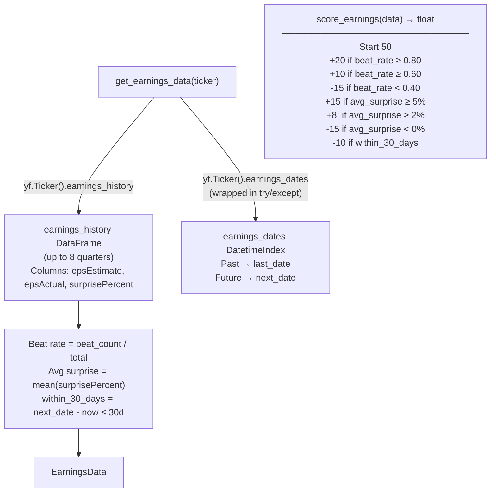

**KeyError guard:** `earnings_dates` raises `KeyError` for some tickers. Entire block is wrapped in `try/except Exception` — returns `None` for both dates gracefully.

---

### 4.4 NewsProvider

**File:** `backend/app/providers/news_provider.py`

```python
def get_news_items(ticker: str) -> list[NewsItem]:
    t = yf.Ticker(ticker)
    raw_news = t.news or []   # list of dicts from Yahoo Finance
    items = []
    for article in raw_news[:20]:   # cap at 20 articles
        items.append(NewsItem(
            title=article.get("title", ""),
            source=article.get("publisher"),
            published_at=str(article.get("providerPublishTime", "")),
            url=article.get("link"),
        ))
    return items
```

**Known limitation:** `ticker.news` is unreliable — some tickers return 0 articles, others return 20. Always flagged as `coverage_limited=True` in `NewsSummary`.

---

### 4.5 OptionsProvider

**File:** `backend/app/providers/options_provider.py`

```python
# Fetches nearest expiry option chain
# Returns: put_call_ratio = put_volume / call_volume
# Used only to derive catalyst_score in the router:
#   PCR < 0.7  → catalyst_score = 65  (bullish flow)
#   PCR > 1.3  → catalyst_score = 35  (bearish flow)
#   else       → catalyst_score = 50  (neutral)
```

`OptionsSnapshot` model: `available: bool`, `put_call_ratio: Optional[float]`, `implied_volatility: Optional[float]`.

---

## 5. Technical Analysis Service

**File:** `backend/app/services/technical_analysis_service.py`

### Function Map

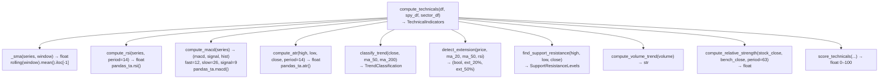

### Trend Classification Logic

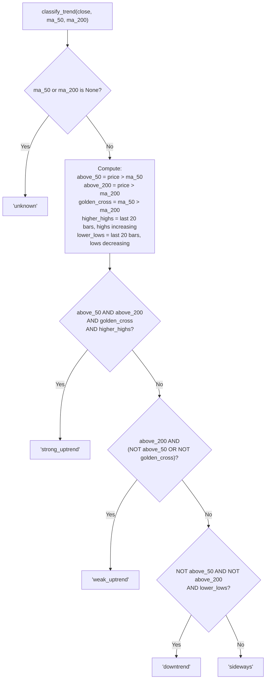

### Extension Detection Thresholds

| Condition | Threshold | Triggers `is_extended=True` |
|-----------|-----------|----------------------------|
| Price vs MA(20) | > 8% above | Yes |
| Price vs MA(50) | > 15% above | Yes |
| RSI | > 75 | Yes |

```python
# ext_20 = (price - ma_20) / ma_20 * 100   (percent above 20MA)
# ext_50 = (price - ma_50) / ma_50 * 100   (percent above 50MA)
# Any single condition above is sufficient to set is_extended = True
```

### Support / Resistance Algorithm

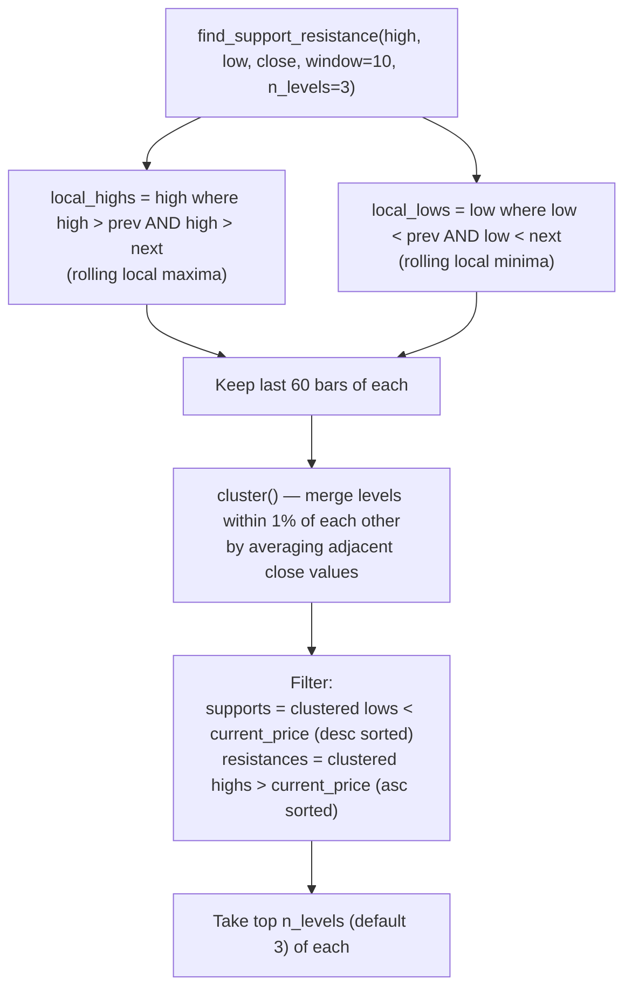

### Technical Score Formula

```
Base: 50

Trend:
  strong_uptrend  → +20
  weak_uptrend    → +5
  sideways        → -5
  downtrend       → -20
  unknown         → 0

RSI (14):
  50–70           → +15  (healthy momentum)
  40–50           → +5
  >75             → -5   (overbought)
  <30             → -15  (oversold)

MACD Histogram:
  > 0             → +10
  ≤ 0             → -10

Extension:
  is_extended     → -10

Volume:
  above_average   → +5
  below_average   → -5

RS vs SPY (63-day return ratio):
  > 1.2           → +10
  > 1.0           → +5
  < 0.8           → -10
  < 1.0           → -5

Support cushion (nearest_support):
  within 5%       → +5   (good risk/reward entry)
  beyond 15%      → -5

Clamped to [0, 100]
```

---

## 6. Fundamental Analysis Service

**File:** `backend/app/services/fundamental_analysis_service.py`

### Score Formula (starts at 50)

```
Revenue Growth YoY:           EPS Growth YoY:
  ≥ 20%  → +15                ≥ 20%  → +10
  ≥ 10%  → +8                 ≥ 10%  → +5
  ≥ 5%   → +3                 < 0%   → -10
  < 0%   → -15

Revenue Growth QoQ:           Gross Margin:
  ≥ 5%   → +5                 ≥ 50%  → +5
  < 0%   → -5                 ≥ 30%  → +2
                               < 10%  → -5

Operating Margin:             Free Cash Flow:
  ≥ 20%  → +5                 > 0    → +10
  ≥ 10%  → +2                 ≤ 0    → -10
  < 0%   → -5

FCF Margin:                   Net Debt vs Cash:
  ≥ 15%  → +5                 net_debt < 0 (net cash) → +5
  < 0%   → -5                 net_debt > cash × 2     → -5

Debt-to-Equity:               ROE:
  < 0.5  → +5                 ≥ 20%  → +5
  > 2.0  → -5                 < 0%   → -5

Clamped to [0, 100]
```

---

## 7. Valuation Analysis Service

**File:** `backend/app/services/valuation_analysis_service.py`

### Score Formula (starts at 50)

```
Forward P/E:                  PEG Ratio:
  ≤ 15   → +20               ≤ 1.0  → +15
  ≤ 20   → +10               ≤ 1.5  → +8
  ≤ 30   → 0                 ≤ 2.0  → 0
  ≤ 40   → -10               ≤ 3.0  → -10
  > 40   → -20               > 3.0  → -15

Price/Sales:                  EV/EBITDA:
  ≤ 2    → +10               ≤ 10   → +10
  ≤ 5    → +5                ≤ 15   → +5
  ≤ 10   → 0                 ≤ 25   → 0
  ≤ 20   → -5                ≤ 40   → -5
  > 20   → -10               > 40   → -10

FCF Yield:                    Trailing P/E (sanity check):
  ≥ 5%   → +10               ≤ 20   → +5
  ≥ 2%   → +5                > 60   → -5
  < 0%   → -10

Clamped to [0, 100]
```

**Why valuation scores are low for high-growth tech:** Forward P/E > 40 = -20 points alone. NVDA, PLTR, AVGO all had P/E > 40 throughout 2024–2025, so their valuation scores consistently sat at 23–45. This is a known calibration issue for growth stocks — see [Extension Guide](#20-extension-guide).

---

## 8. Earnings Analysis

**File:** `backend/app/providers/earnings_provider.py`

### Data Sources

| Field | Source | Notes |
|-------|--------|-------|
| `history` | `ticker.earnings_history` | Up to 8 most recent quarters |
| `beat_count` / `miss_count` | Computed from `surprisePercent ≥ 0` | |
| `beat_rate` | `beat_count / (beat + miss)` | None if no data |
| `avg_eps_surprise_pct` | `mean(surprisePercent)` | None if no data |
| `last_earnings_date` | `earnings_dates` index, most recent past | try/except guarded |
| `next_earnings_date` | `earnings_dates` index, nearest future | try/except guarded |
| `within_30_days` | `(next_date - now).days ≤ 30` | False if next_date is None |

### Score Formula (in `score_earnings`)

```
Start: 50

Beat rate:                    Avg EPS Surprise:
  ≥ 80%  → +20               ≥ 5%   → +15
  ≥ 60%  → +10               ≥ 2%   → +8
  < 40%  → -15               < 0%   → -15

Upcoming earnings (<30d):
  within_30_days → -10  (binary event risk)

Clamped to [0, 100]
```

---

## 9. News Sentiment Service

**File:** `backend/app/services/news_sentiment_service.py`

### Classification Flow

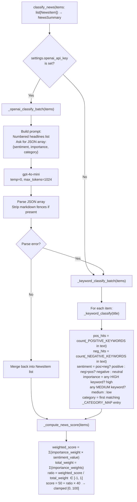

### Keyword Lists

**Positive keywords (sample):** beat, beats, raised guidance, upgrade, upgraded, price target raised, strong earnings, record revenue, customer win, partnership, fda approval, buyback, dividend increase, expansion, growth, profit, outperform, buy rating, insider buying

**Negative keywords (sample):** miss, missed, guidance cut, downgrade, downgraded, price target cut, earnings miss, revenue miss, layoffs, lawsuit, investigation, recall, margin pressure, slower growth, loss, bankruptcy, debt, dilution, regulatory probe, class action, insider selling

**Importance weights:**
```
high   → 3.0   (earnings, guidance, fda, acquisition, merger, sec, bankruptcy)
medium → 2.0   (upgrade, downgrade, analyst, partnership, buyback, dividend)
low    → 1.0   (everything else)
```

**Sentiment values for score:** `positive → 1.0`, `neutral → 0.0`, `negative → -1.0`

**Category priority order** (first match wins — legal before product to avoid "launch" matching product):
```
legal → earnings → analyst → management → macro → sector → product → other
```

### Score Formula
```
ratio = Σ(weight × sentiment_val) / Σ(weights)   ∈ [-1, 1]
score = 50 + ratio × 40   → range [10, 90] in practice
```

---

## 10. Scoring Service

**File:** `backend/app/services/scoring_service.py`

### Weights (all sum to 100, verified at module import time)

```python
SHORT_TERM_WEIGHTS = {
    "technical": 35, "catalyst": 20, "news_sentiment": 15,
    "risk_reward": 15, "sector_macro": 10, "fundamental": 5,
}
MEDIUM_TERM_WEIGHTS = {
    "fundamental": 25, "earnings": 25, "technical": 20,
    "valuation": 15, "catalyst": 10, "risk_reward": 5,
}
LONG_TERM_WEIGHTS = {
    "fundamental": 35, "valuation": 20, "earnings": 15,
    "risk_reward": 10, "sector_macro": 10, "technical": 5, "news_sentiment": 5,
}
# _verify_weights() called at module load — AssertionError if any sum ≠ 100
```

### `compute_scores` Signature

```python
def compute_scores(
    technicals: TechnicalIndicators,
    fundamentals: FundamentalData,
    valuation: ValuationData,
    earnings: EarningsData,
    news: NewsSummary,
    catalyst_score: float = 50.0,     # derived from put/call ratio
    sector_macro_score: float = 50.0, # always 50 (static)
    risk_reward_score: float = 50.0,  # always 50 (default; not computed separately)
) -> dict[str, dict[str, float]]:
```

**Return structure:**
```python
{
    "short_term":  {"composite": 62.5, "technical": 70.0, "fundamental": 85.0, ...},
    "medium_term": {"composite": 58.3, ...},
    "long_term":   {"composite": 61.1, ...},
}
```

**`_weighted_average` formula:**
```python
composite = Σ(score[key] * weight[key]) / Σ(weights)
# Missing keys default to 50.0 (neutral)
```

---

## 11. Recommendation Service

**File:** `backend/app/services/recommendation_service.py`

### Decision Thresholds by Horizon

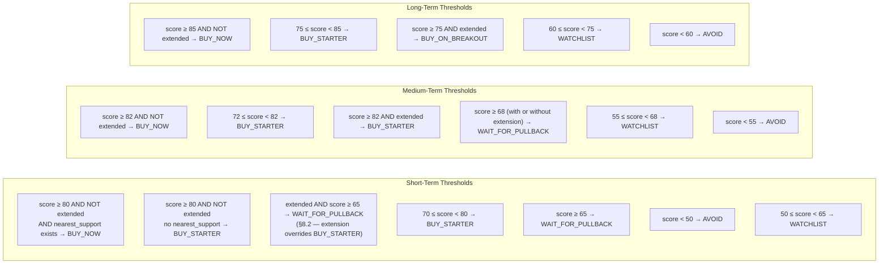

### Confidence Mapping

```
score ≥ 80 → "high"
score ≥ 65 → "medium_high"
score ≥ 50 → "medium"
score < 50 → "low"
```

### Bullish/Bearish Factor Rules

Each factor is generated by inspecting the computed indicators against fixed thresholds. Up to 5 bullish and 5 bearish factors are returned per horizon. Medium/long-term horizons additionally check fundamental and valuation factors.

```
Technical factors (all horizons):
  trend == strong_uptrend        → bullish: "Strong uptrend..."
  trend == downtrend             → bearish: "Downtrend..."
  50 ≤ RSI ≤ 70                  → bullish: "RSI at X — healthy momentum"
  RSI > 75                       → bearish: "RSI at X — overbought"
  RSI < 35                       → bearish: "RSI at X — oversold"
  MACD histogram > 0             → bullish
  is_extended                    → bearish
  volume == above_average        → bullish
  volume == below_average        → bearish
  rs_vs_spy > 1.2                → bullish: "Strong relative strength vs SPY"
  rs_vs_spy < 0.8                → bearish: "Underperforming SPY"

Medium/Long-term additional:
  revenue_growth_yoy ≥ 15%       → bullish
  revenue_growth_yoy < 0%        → bearish
  free_cash_flow > 0             → bullish
  net_debt < 0 (net cash)        → bullish
  forward_pe ≤ 20                → bullish: "Forward P/E of Xx — reasonable"
  forward_pe > 40                → bearish: "Forward P/E of Xx — extended"
  peg_ratio ≤ 1.5                → bullish: "PEG ratio X — GARP"
  beat_rate ≥ 75%                → bullish: "Consistent earnings beats"
  beat_rate < 40%                → bearish: "Poor beat history"
  within_30_days                 → bearish: "Earnings within 30 days"
  positive_count > negative_count → bullish
  negative_count > positive_count → bearish
```

---

## 12. Risk Management Service

**File:** `backend/app/services/risk_management_service.py`

### Position Sizing Config

```python
_POSITION_SIZING = {
    "conservative": {"starter_pct": 15, "max_allocation": 3.0},
    "moderate":     {"starter_pct": 25, "max_allocation": 5.0},
    "aggressive":   {"starter_pct": 40, "max_allocation": 8.0},
}
# Earnings halving: if within_30_days_earnings:
#   starter_pct = int(starter_pct * 0.5)
#   max_allocation = round(max_allocation * 0.7, 1)
```

### Entry Price Logic by Decision

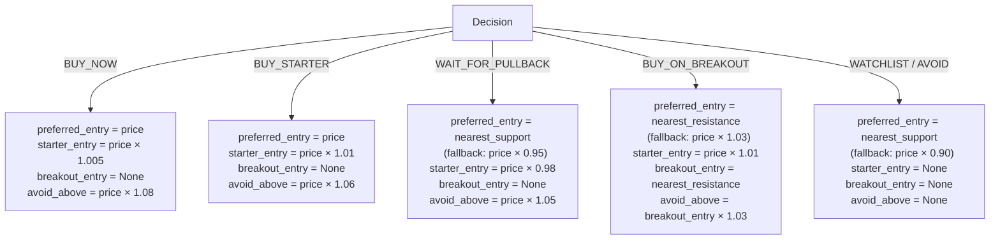

### Stop-Loss & Target Logic

```
Stop-loss:
  nearest_support exists → stop = nearest_support × 0.99
                           invalidation = nearest_support × 0.98
  no support             → stop = price × 0.92
                           invalidation = price × 0.90

Targets:
  first_target  = resistances[0]  (fallback: price × 1.10)
  second_target = resistances[1]  (fallback: price × 1.20)

Risk/Reward:
  entry_ref = preferred_entry (or price)
  downside_pct = (entry_ref - stop_loss) / entry_ref × 100
  upside_pct   = (first_target - entry_ref) / entry_ref × 100
  ratio        = upside_abs / downside_abs
```

---

## 13. Markdown Report Service

**File:** `backend/app/services/markdown_report_service.py`

Generates a structured Markdown string from a completed `StockAnalysisResult`. Sections:

1. Header (ticker, price, date, disclaimer)
2. Data Quality Warnings
3. Per-horizon recommendation (decision, score, confidence, entry/exit plan, factors)
4. Technical Analysis summary
5. Fundamental Quality
6. Valuation
7. Earnings
8. News & Sentiment
9. Risk Management notes

The markdown is stored in `StockAnalysisResult.markdown_report` and rendered by `react-markdown` in the frontend's `MarkdownReport.tsx` collapsible panel.

---

## 14. API Router

**File:** `backend/app/routers/stock.py`

### Endpoints

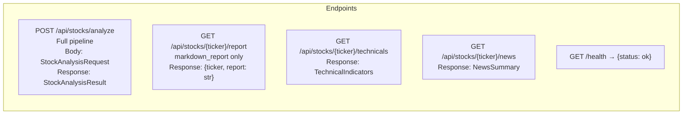

### `analyze_stock` Orchestration (step-by-step)

```python
# Step 1 — Market data
market_data = get_market_data(ticker)      # MarketData
price = market_data.current_price

# Step 2 — Technical analysis
hist_1y   = get_history(ticker, "1y")
spy_hist  = get_history("SPY", "1y")
sector_etf = get_sector_etf(ticker)        # e.g. "XLK"
sector_hist = get_history(sector_etf, "1y") if sector_etf else None
technicals = compute_technicals(hist_1y, spy_df=spy_hist, sector_df=sector_hist)

# Step 3 — Fundamentals & valuation
fundamentals = get_fundamental_data(ticker)
fundamentals.fundamental_score = score_fundamentals(fundamentals)
valuation = get_valuation_data(ticker, market_cap=market_data.market_cap)
valuation.valuation_score = score_valuation(valuation)

# Step 4 — Earnings
earnings = get_earnings_data(ticker)
earnings.earnings_score = score_earnings(earnings)

# Step 5 — News & sentiment
news_items = get_news_items(ticker)
news = classify_news(news_items)

# Step 6 — Options catalyst
options = get_options_snapshot(ticker)
catalyst_score = 65.0 if options.put_call_ratio < 0.7 else \
                 35.0 if options.put_call_ratio > 1.3 else 50.0

# Step 7 — Aggregate scores
scores = compute_scores(technicals, fundamentals, valuation, earnings, news,
                        catalyst_score=catalyst_score)

# Step 8 — Recommendations (includes risk management internally)
recommendations = build_recommendations(
    technicals, fundamentals, valuation, earnings, news,
    scores, request.horizons, request.risk_profile, price
)

# Step 9 — Data quality
data_quality = _build_data_quality(fundamentals, valuation, earnings,
                                   news, options.available, technicals)

# Step 10 — Assemble result + generate markdown
result = StockAnalysisResult(...)
result.markdown_report = generate_markdown(result)
return result
```

### Data Quality Scoring

```
Start: 100

-5  peer_comparison_available is False   (always)
-5  news.coverage_limited                (always)
-5  not options.available
-5  earnings.next_earnings_date is None
-10 earnings.last_earnings_date is None
-10 fundamentals.revenue_ttm is None
-10 technicals.ma_200 is None           (< 200 bars of data)
```

---

## 15. Pydantic Models (Full Schema)

### Request

```python
class StockAnalysisRequest(BaseModel):
    ticker: str                                              # required
    horizons: list[str] = ["short_term","medium_term","long_term"]
    risk_profile: str = "moderate"                           # conservative|moderate|aggressive
    max_position_percent: Optional[float] = None
    max_loss_percent: Optional[float] = None
    current_holding_shares: Optional[float] = None
    average_cost: Optional[float] = None
```

### Core Models

```mermaid
classDiagram
    class TrendClassification {
        +str label
        +str description
    }
    class SupportResistanceLevels {
        +list~float~ supports
        +list~float~ resistances
        +Optional~float~ nearest_support
        +Optional~float~ nearest_resistance
    }
    class TechnicalIndicators {
        +Optional~float~ ma_10, ma_20, ma_50, ma_100, ma_200
        +Optional~float~ rsi_14
        +Optional~float~ macd, macd_signal, macd_histogram
        +Optional~float~ atr
        +str volume_trend
        +TrendClassification trend
        +bool is_extended
        +Optional~float~ extension_pct_above_20ma
        +Optional~float~ extension_pct_above_50ma
        +SupportResistanceLevels support_resistance
        +Optional~float~ rs_vs_spy, rs_vs_sector
        +float technical_score
    }
    class FundamentalData {
        +Optional~float~ revenue_ttm, revenue_growth_yoy, revenue_growth_qoq
        +Optional~float~ eps_ttm, eps_growth_yoy
        +Optional~float~ gross_margin, operating_margin, net_margin
        +Optional~float~ free_cash_flow, free_cash_flow_margin
        +Optional~float~ cash, total_debt, net_debt, current_ratio
        +Optional~float~ debt_to_equity, shares_outstanding, roe, roic
        +float fundamental_score
    }
    class ValuationData {
        +Optional~float~ trailing_pe, forward_pe, peg_ratio
        +Optional~float~ price_to_sales, ev_to_ebitda, price_to_fcf, fcf_yield
        +bool peer_comparison_available
        +float valuation_score
    }
    class EarningsData {
        +Optional~str~ last_earnings_date, next_earnings_date
        +list~EarningsRecord~ history
        +Optional~float~ avg_eps_surprise_pct
        +int beat_count, miss_count
        +Optional~float~ beat_rate
        +bool within_30_days
        +float earnings_score
    }
    class NewsSummary {
        +list~NewsItem~ items
        +int positive_count, negative_count, neutral_count
        +float news_score
        +bool coverage_limited
    }
    class EntryPlan {
        +Optional~float~ preferred_entry, starter_entry
        +Optional~float~ breakout_entry, avoid_above
    }
    class ExitPlan {
        +Optional~float~ stop_loss, invalidation_level
        +Optional~float~ first_target, second_target
    }
    class RiskReward {
        +Optional~float~ downside_percent, upside_percent, ratio
    }
    class PositionSizing {
        +int suggested_starter_pct_of_full
        +float max_portfolio_allocation_pct
    }
    class HorizonRecommendation {
        +str horizon
        +str decision
        +float score
        +str confidence
        +str summary
        +list~str~ bullish_factors
        +list~str~ bearish_factors
        +EntryPlan entry_plan
        +ExitPlan exit_plan
        +RiskReward risk_reward
        +PositionSizing position_sizing
        +list~str~ data_warnings
    }
    TechnicalIndicators --> TrendClassification
    TechnicalIndicators --> SupportResistanceLevels
    HorizonRecommendation --> EntryPlan
    HorizonRecommendation --> ExitPlan
    HorizonRecommendation --> RiskReward
    HorizonRecommendation --> PositionSizing
```

---

## 16. Frontend Internals

### State Management (Dashboard.tsx)

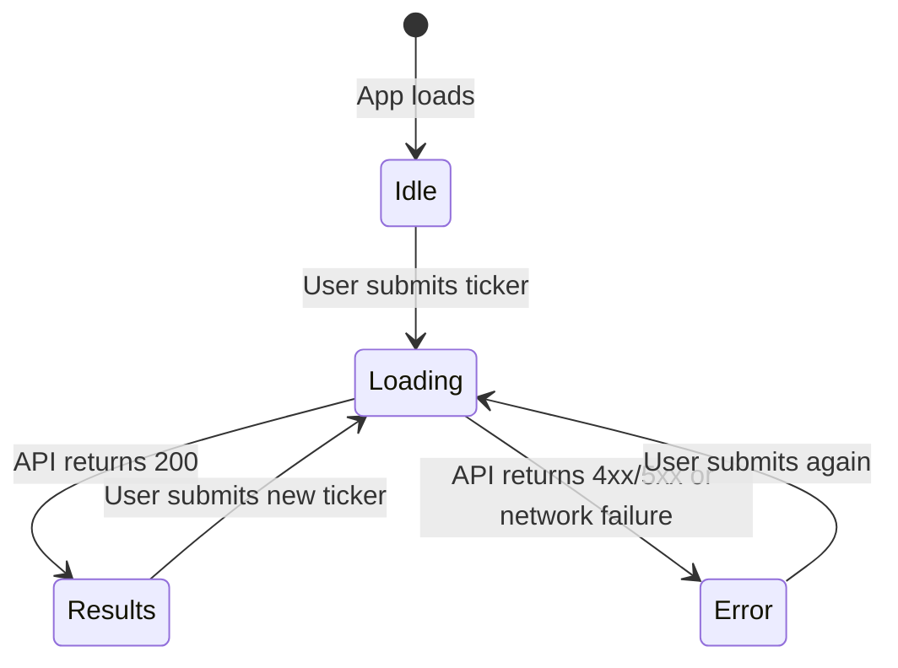

**State variables:**
```typescript
ticker: string          // controlled input (auto-uppercased)
riskProfile: string     // 'conservative' | 'moderate' | 'aggressive'
loading: boolean        // shows spinner, disables button
error: string | null    // shown in red banner
result: StockAnalysisResult | null  // full API response
```

**Error extraction:**
```typescript
const msg = (err as AxiosError)?.response?.data?.detail  // FastAPI HTTPException
         ?? (err as Error)?.message
         ?? 'Analysis failed';
```

### API Client (stockApi.ts)

```typescript
const client = axios.create({ baseURL: '/api' });
// Vite proxies /api → http://localhost:8000 (vite.config.ts)

export async function analyzeStock(req: AnalysisRequest): Promise<StockAnalysisResult> {
    const { data } = await client.post<StockAnalysisResult>('/stocks/analyze', {
        ticker: req.ticker.toUpperCase(),
        horizons: req.horizons ?? ['short_term', 'medium_term', 'long_term'],
        risk_profile: req.risk_profile ?? 'moderate',
    });
    return data;
}
```

### Component Props

```typescript
// RecommendationCard.tsx
interface Props { rec: HorizonRecommendation }
// Decision badge color map:
// BUY_NOW        → bg-green-500
// BUY_STARTER    → bg-emerald-500
// BUY_ON_BREAKOUT→ bg-blue-500
// WAIT_FOR_PULLBACK → bg-yellow-500
// WATCHLIST      → bg-slate-500
// AVOID          → bg-red-500

// ScoreBreakdown.tsx
interface Props {
    technicals: TechnicalIndicators;
    fundamentals: FundamentalData;
    valuation: ValuationData;
    earnings: EarningsData;
    news: NewsSummary;
}

// TechnicalChart.tsx
interface Props { technicals: TechnicalIndicators; currentPrice: number }

// NewsSection.tsx
interface Props { news: NewsSummary }

// DataWarnings.tsx
interface Props { quality: DataQualityReport }

// MarkdownReport.tsx
interface Props { markdown: string }
// Renders inside <details><summary> — collapsed by default
// Uses react-markdown with no custom plugins
```

### Vite Proxy Configuration

```typescript
// vite.config.ts
server: { proxy: { '/api': 'http://localhost:8000' } }
// All requests to /api/* are forwarded to the FastAPI backend
// No CORS configuration needed in development
// For production: configure a reverse proxy (nginx) or use the same origin
```

---

## 17. Backtest Engine Internals

### Module Responsibilities

```mermaid
flowchart TD
    CFG["config.py\n─────────────────────────────\nBACKTEST_TICKERS: list[str] (20)\nSECTOR_ETF_MAP: dict[str, str|None]\nBACKTEST_START = '2024-05-06'\nBACKTEST_END   = '2026-05-04'\nHISTORY_START  = '2022-05-01'\nHOLDING_PERIODS = {short:20, med:65, long:252}\nMIN_ROWS_FOR_ANALYSIS = 252\nCACHE_DIR = 'backtest_results/cache'\nRESULTS_DIR = 'backtest_results'"]

    DL["data_loader.py\n─────────────────────────────\nload_all_data(force_refresh, extra_tickers)\n  → {prices: dict[str,DataFrame], quarterly: dict[str,dict]}\n\nPre-fetches ALL tickers in one batch:\n  set(BACKTEST_TICKERS) | {'SPY'} | {sector ETFs} | extra_tickers\nPersists to pickle:\n  backtest_results/cache/prices.pkl\n  backtest_results/cache/quarterly.pkl"]

    SN["snapshot.py\n─────────────────────────────\nbuild_historical_fundamentals(\n  ticker, test_date, quarterly_data, price_at_date\n) → (FundamentalData, ValuationData, EarningsData)\n\nget_price_slice(df, test_date) → df[df.index ≤ test_date]\nneutral_news() → NewsSummary(news_score=50, coverage_limited=True)\n_filter_stmt_cols(stmt, cutoff) → stmt with cols ≤ cutoff\n_normalize_ts(ts) → tz-naive Timestamp"]

    RN["runner.py\n─────────────────────────────\n_generate_weekly_dates(start, end) → list[Timestamp]\n  → every Monday in range\nrun_backtest(data, tickers, start, end, risk_profile)\n  → list[dict]  (one per ticker×date×horizon)\n\nPer iteration:\n  price_slice = get_price_slice(full_df, test_date)\n  if len(price_slice) < 252: skip\n  technicals = compute_technicals(slice, spy_slice, sector_slice)\n  fund,val,earn = build_historical_fundamentals(...)\n  fund.fundamental_score = score_fundamentals(fund)\n  val.valuation_score = score_valuation(val)\n  scores = compute_scores(..., catalyst_score=50, news_score=50)\n  recs = build_recommendations(...)"]

    OT["outcome.py\n─────────────────────────────\nattach_outcomes(signals, prices) → signals (modified in place)\n_get_price_at_offset(df, from_date, N_trading_days)\n  → Close.iloc[N-1] of rows after from_date\n\nFor each signal:\n  forward_return = (exit_price - entry_price) / entry_price × 100\n  spy_return     = (spy_exit - spy_entry) / spy_entry × 100\n  excess_return  = forward_return - spy_return"]

    MT["metrics.py\n─────────────────────────────\nbuild_metrics(signals, horizon) → dict\n  by_decision: win rate, avg/median return, best/worst, vs SPY\n  by_score_bucket: [0-40, 40-55, 55-70, 70-85, 85-100]\n  by_ticker: sorted by avg_return desc\n  monthly_breakdown: by YYYY-MM period\n  portfolio_simulation: BUY_NOW+BUY_STARTER only\n  overall_stats: correlation, best/worst signal"]

    RP["report.py\n─────────────────────────────\nsave_csvs(signals, metrics_by_horizon)\n  → raw_signals.csv, summary_by_decision.csv, summary_by_ticker.csv\ngenerate_html_report(signals, metrics_by_horizon) → str\n  Charts: matplotlib embedded as base64 PNG\n  _chart_win_rate_by_decision(by_decision)\n  _chart_score_bucket(by_score_bucket)\n  _chart_monthly(monthly_breakdown)\nsave_report(signals, metrics_by_horizon)\n  → report.html, report.json"]
```

### Historical Fundamentals Construction (snapshot.py)

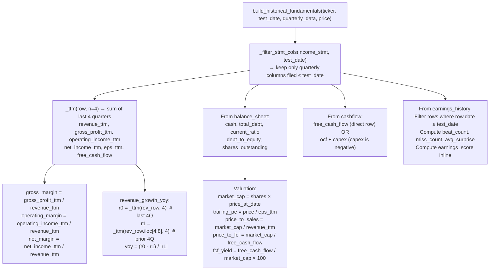

### Signal Record Schema (output of runner)

```python
{
    "ticker": str,
    "date": str,                    # YYYY-MM-DD
    "horizon": str,                 # short_term | medium_term | long_term
    "decision": str,                # BUY_NOW | BUY_STARTER | ...
    "score": float,                 # composite 0–100
    "confidence": str,
    "price": float,                 # entry price at signal date
    "technical_score": float,
    "fundamental_score": float,
    "valuation_score": float,
    "earnings_score": float,
    "trend": str,
    "rsi": Optional[float],
    "is_extended": bool,
    "entry_preferred": Optional[float],
    "stop_loss": Optional[float],
    "first_target": Optional[float],
    # Filled in by outcome.py:
    "forward_return": Optional[float],   # None if outcome date in future
    "spy_return": Optional[float],
    "excess_return": Optional[float],
}
```

---

## 18. Error Handling Map

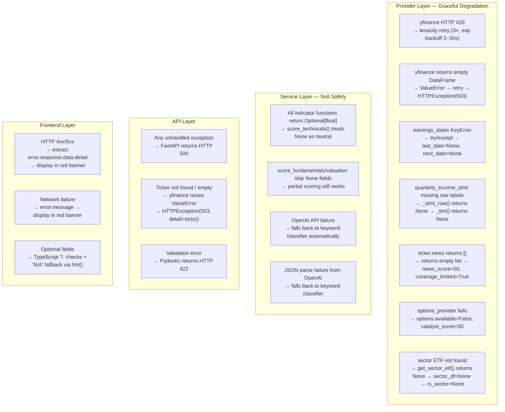

---

## 19. Test Coverage Map

```mermaid
flowchart LR
    subgraph TA["test_technical_analysis.py (38 tests)"]
        TA1["_sma: correct value, insufficient data"]
        TA2["compute_rsi: known values, insufficient data"]
        TA3["compute_macd: sign, insufficient data"]
        TA4["compute_atr: positive value"]
        TA5["classify_trend: all 4 labels + unknown"]
        TA6["detect_extension: each of 3 conditions"]
        TA7["find_support_resistance: levels in range, clustering"]
        TA8["compute_volume_trend: above/below/average"]
        TA9["compute_relative_strength: outperform/underperform"]
        TA10["score_technicals: each bonus/penalty component"]
        TA11["compute_technicals: integration with spy_df, sector_df"]
    end

    subgraph FA["test_fundamental_analysis.py (24 tests)"]
        FA1["score_fundamentals: each +/- component isolated"]
        FA2["High-growth company → score > 80"]
        FA3["Declining company → score < 40"]
        FA4["score_valuation: forward P/E buckets"]
        FA5["score_valuation: PEG, P/S, EV/EBITDA, FCF yield"]
        FA6["PEG calculation: forwardPE / (earningsGrowth × 100)"]
        FA7["P/FCF calculation: marketCap / freeCashFlow"]
    end

    subgraph EA["test_earnings_analysis.py (29 tests)"]
        EA1["score_earnings: beat rate buckets"]
        EA2["score_earnings: surprise % buckets"]
        EA3["score_earnings: within_30_days penalty"]
        EA4["earnings_dates KeyError → None (not exception)"]
        EA5["classify_news with OpenAI mock → correct sentiment"]
        EA6["classify_news with no API key → keyword fallback"]
        EA7["keyword_classify: positive/negative/neutral cases"]
        EA8["news_score: weighted formula correctness"]
    end

    subgraph SR["test_scoring_recommendation.py (34 tests)"]
        SR1["SHORT_TERM_WEIGHTS sum to 100"]
        SR2["MEDIUM_TERM_WEIGHTS sum to 100"]
        SR3["LONG_TERM_WEIGHTS sum to 100"]
        SR4["compute_scores: all three horizons returned"]
        SR5["_decide_short_term: BUY_NOW, BUY_STARTER, WAIT, AVOID, WATCHLIST"]
        SR6["Extension overrides BUY_STARTER → WAIT_FOR_PULLBACK (§8.2)"]
        SR7["_decide_medium_term: all 5 decisions"]
        SR8["_decide_long_term: all 5 decisions"]
        SR9["_confidence: all 4 levels"]
        SR10["compute_risk_management: entry/exit/R/R/sizing per risk_profile"]
        SR11["earnings halving: starter_pct/max_alloc reduced within_30_days"]
        SR12["build_recommendations: integration, 3 HorizonRecommendation objects"]
    end
```

**Running tests:**
```bash
cd backend
source .venv/bin/activate
PYTHONPATH=. pytest tests/ -v                    # all 125 tests
PYTHONPATH=. pytest tests/test_technical_analysis.py -v   # single suite
PYTHONPATH=. pytest tests/ -v --tb=short         # compact output
```

**OpenAI test pattern** (module-level import required for patch to work):
```python
# In test:
with patch("app.services.news_sentiment_service.OpenAI") as mock_openai:
    mock_client = MagicMock()
    mock_openai.return_value = mock_client
    mock_client.chat.completions.create.return_value = ...
    result = classify_news(items)
```

---

## 20. Extension Guide

### A. Swap the News Data Source

The sentiment service is provider-agnostic. It only consumes `list[NewsItem]`.

```python
# 1. Create backend/app/providers/newsapi_provider.py
def get_news_items(ticker: str) -> list[NewsItem]:
    # Call NewsAPI, Alpha Vantage, or any other news source
    # Map to NewsItem(title, source, published_at, url)
    ...

# 2. In routers/stock.py, replace:
from app.providers.news_provider import get_news_items
# with:
from app.providers.newsapi_provider import get_news_items
# No other changes needed
```

---

### B. Swap the Price Data Source (Polygon, Alpha Vantage, etc.)

```python
# 1. Create backend/app/providers/polygon_market_provider.py
# Must implement the same return types:
def get_history(ticker, period, interval) -> pd.DataFrame:
    # Columns: Open, High, Low, Close, Volume
    # Index: DatetimeIndex (tz-naive)
    ...

def get_market_data(ticker) -> MarketData: ...
def get_sector_etf(ticker) -> Optional[str]: ...

# 2. In routers/stock.py, replace the import — pipeline unchanged
```

---

### C. Add a New Scoring Dimension

Example: add a `momentum_score` sub-component.

```python
# 1. Compute the score (0–100) in a new service or add to existing
momentum_score = compute_momentum_score(technicals)

# 2. Pass to compute_scores() as a new kwarg:
def compute_scores(..., momentum_score: float = 50.0) -> dict:
    base_scores = {
        ...,
        "momentum": momentum_score,   # add here
    }

# 3. Add "momentum" key to whichever horizon weights need it,
#    and reduce another weight to keep sum = 100.
# _verify_weights() will catch any sum ≠ 100 at import time.
```

---

### D. Fix Valuation Scoring for High-Growth Names

The current valuation scorer penalises any forward P/E > 40 by -20 points, which systematically underscores high-growth stocks (NVDA, PLTR, AVGO). Two approaches:

**Option 1 — Growth-adjusted thresholds (recommended):**
```python
# In score_valuation(), check if EPS growth is high before penalising P/E:
def score_valuation(data: ValuationData) -> float:
    # ... existing code ...
    # Replace forward_pe block:
    fpe = data.forward_pe
    peg = data.peg_ratio   # already penalises expensive growth appropriately
    if fpe is not None and peg is None:
        # Only penalise high P/E when PEG is unavailable
        if fpe <= 15: score += 20
        elif fpe <= 25: score += 10
        elif fpe <= 40: score += 0
        else: score -= 10   # soften from -20 to -10
    # When PEG is available, let PEG do the work — reduce P/E weight
```

**Option 2 — Sector-relative P/E:**
```python
# Instead of absolute thresholds, compare to sector median P/E.
# Requires a paid data source (Polygon sector snapshots, etc.)
# Plug in via get_sector_pe(ticker, sector) in fundamental_provider.py
```

---

### E. Add a Real Sector/Macro Score

Currently `sector_macro_score = 50.0` (static). To wire it up:

```python
# In routers/stock.py, after getting sector_etf:
sector_macro_score = 50.0
if sector_etf:
    sector_hist_6m = get_history(sector_etf, "6mo")
    spy_hist_6m    = get_history("SPY", "6mo")
    sector_rs = compute_relative_strength(
        sector_hist_6m["Close"], spy_hist_6m["Close"], period=126
    )
    # Map RS ratio to score: RS > 1.1 → 65, RS < 0.9 → 35, else 50
    if sector_rs and sector_rs > 1.1: sector_macro_score = 65.0
    elif sector_rs and sector_rs < 0.9: sector_macro_score = 35.0
# Pass sector_macro_score to compute_scores(...)
```

---

### F. Add Risk/Reward Score to Scoring Pipeline

Currently `risk_reward_score = 50.0` (default). To make it dynamic:

```python
# After compute_risk_management() is called per-horizon in build_recommendations(),
# extract the R/R ratio and convert to a score:
def _rr_to_score(ratio: Optional[float]) -> float:
    if ratio is None: return 50.0
    if ratio >= 3.0: return 80.0
    if ratio >= 2.0: return 65.0
    if ratio >= 1.0: return 50.0
    return 30.0

# Pass this back into compute_scores() for a second pass,
# or compute scores after risk management (requires refactor of orchestration order)
```

---

### G. Add a New API Endpoint

FastAPI pattern — add to `routers/stock.py`:

```python
@router.get("/{ticker}/fundamentals", response_model=FundamentalData)
async def get_fundamentals(ticker: str) -> FundamentalData:
    fundamentals = get_fundamental_data(ticker.upper())
    fundamentals.fundamental_score = score_fundamentals(fundamentals)
    return fundamentals
```

---

### H. Make the Backtest Multi-Threaded

The runner loop is currently single-threaded. To parallelize over tickers:

```python
# In runner.py, replace the ticker loop with ThreadPoolExecutor:
from concurrent.futures import ThreadPoolExecutor, as_completed

def run_backtest(data, tickers, ...):
    ...
    with ThreadPoolExecutor(max_workers=4) as executor:
        futures = {
            executor.submit(_run_ticker, ticker, test_dates, data, ...): ticker
            for ticker in tickers
        }
        for future in as_completed(futures):
            signals.extend(future.result())
    return signals

# Note: yfinance is not thread-safe — data_loader must pre-fetch ALL data
# before parallelism starts (already the case in the current design)
```

---

*Last updated: 2026-05-04 | Corresponds to implementation at commit HEAD on this date*
