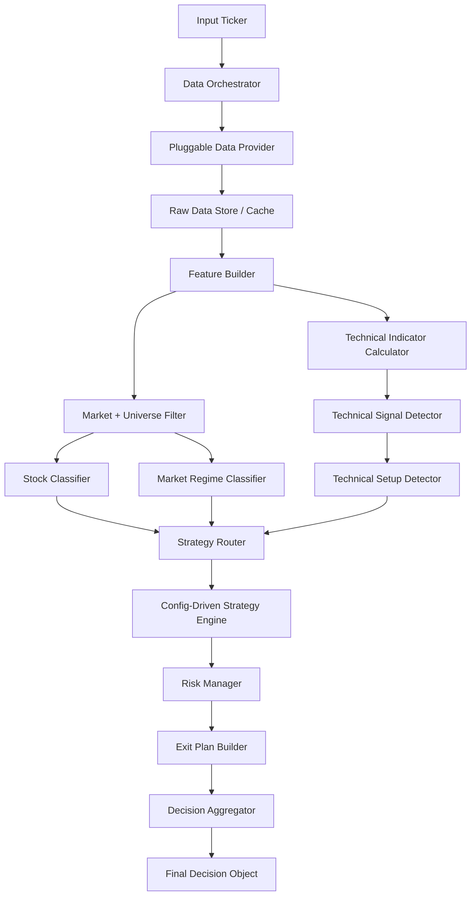
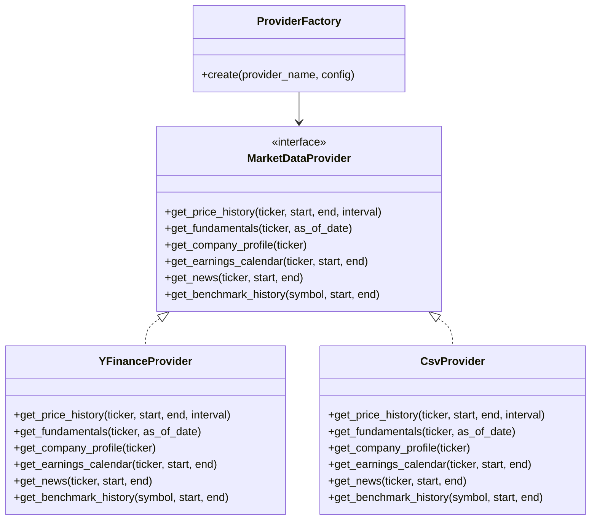
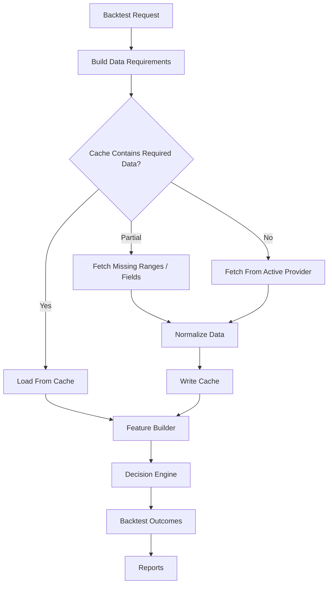
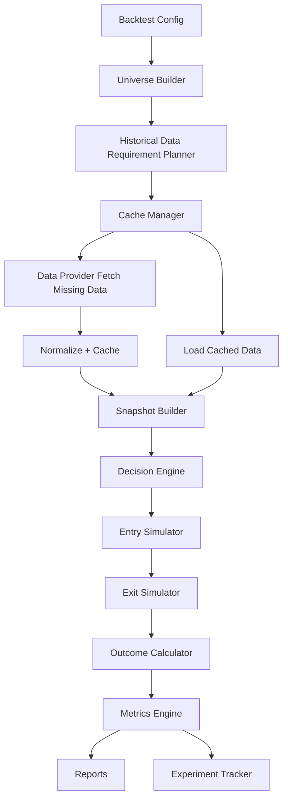
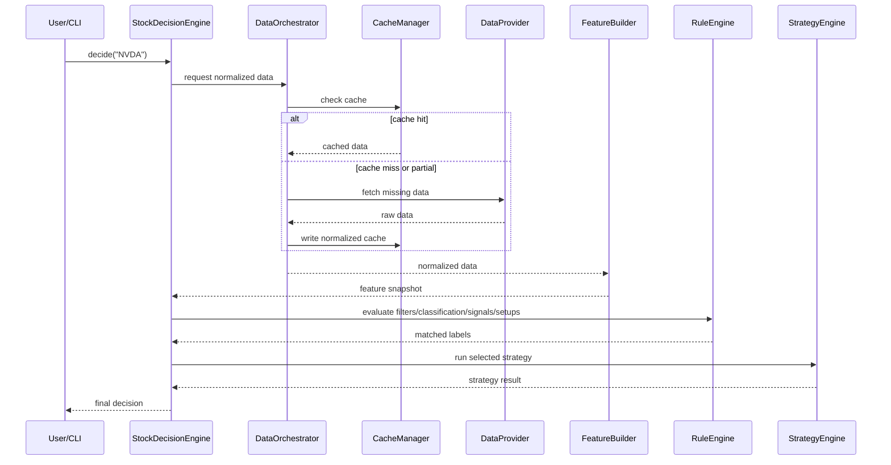
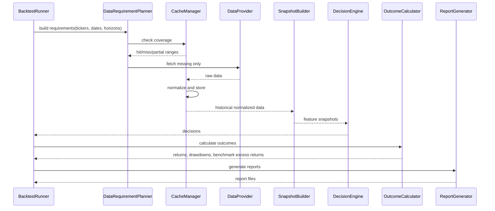

# High-Level Design (HLD): Config-Driven Stock Buy Decision Tool

**Version:** 1.0  
**Date:** 2026-05-15  
**Project:** Stock Buy Decision / Strategy Router Tool  
**Primary implementation language:** Python  
**Primary config format:** JSON  

---

## 1. Executive Summary

This project builds a **stock buy decision engine** that avoids the weakness of one generic all-stock algorithm. Instead, it uses a **config-driven strategy-router architecture**:

```text
Raw ticker data
→ Market/universe filter
→ Stock classification
→ Technical setup detection
→ Strategy routing
→ Specialized strategy engine
→ Risk/position sizing
→ Exit plan
→ Final recommendation
```

The key design principle is:

```text
Stock category selects the strategy family.
Technical setup selects the timing.
Market regime adjusts thresholds.
Risk management controls position size.
Governance controls what is tunable.
```

The system is designed so that most strategy behavior can be changed through JSON configs, minimizing Python code changes during fine-tuning.

---

## 2. Goals

### 2.1 Functional Goals

- Given a ticker, produce a structured buy/wait/avoid decision.
- Classify the stock into a primary category and secondary tags.
- Detect technical signals and technical setups.
- Route the stock to the correct strategy engine.
- Produce a final recommendation with confidence, position size, risk labels, and exit plan.
- Support short-term, medium-term, and long-term decision horizons.
- Support backtesting by strategy, label, stock category, market regime, sector, and horizon.
- Cache reusable historical data during backtesting to speed up future runs.
- Make the data source pluggable: today `yfinance`, tomorrow another provider.

### 2.2 Non-Functional Goals

- Config-driven fine-tuning.
- Low coupling between data source and decision engine.
- Reproducible experiments.
- Clear experiment traceability.
- Avoid look-ahead bias in backtesting.
- Support benchmark-relative performance against SPY, QQQ, and sector ETFs.
- Support future expansion into fundamentals, news, options flow, and point-in-time datasets.

---

## 3. Non-Goals for v1

- No live automated order execution.
- No broker integration.
- No real-time intraday scalping engine.
- No machine learning model training in v1.
- No assumption that yfinance is the permanent data source.
- No guarantee that fundamental data from non-point-in-time providers is valid for historical backtesting without proper reporting-date lag.

---

## 4. Core Architecture



---

## 5. Final Decision Pipeline

For a ticker such as `NVDA`, the tool performs these phases:

1. **Input ticker**  
   Example: `NVDA`

2. **Fetch raw data**  
   Price, OHLCV, volume, fundamentals, valuation, sector/industry, market benchmarks, earnings date, optional news/options data.

3. **Read/write cache**  
   If reusable historical data already exists, load from cache. If missing, fetch only missing ranges/fields.

4. **Build feature snapshot**  
   Example features:
   - RSI14
   - SMA20/SMA50/SMA200 relative distance
   - ATR%
   - relative volume
   - sales growth
   - EPS growth
   - relative strength vs SPY/QQQ/sector ETF

5. **Apply universe filters**  
   Example checks:
   - minimum price
   - minimum market cap
   - minimum dollar volume
   - optionability preference
   - earnings proximity warning

6. **Detect market regime**  
   Example:
   - SPY above SMA200
   - QQQ above SMA200
   - VIX below threshold
   - regime = `BULL_RISK_ON`

7. **Classify stock**  
   Example:
   - primary category = `PROFITABLE_GROWTH_LEADER`
   - secondary tags = `HIGH_MOMENTUM`, `EXPENSIVE_VALUATION`, `HIGH_ATR`, `SECTOR_LEADER`

8. **Calculate technical indicators**  
   Example:
   - RSI
   - MACD
   - SMA/EMA
   - ATR
   - Bollinger Bands
   - ADX
   - volume dry-up ratio

9. **Detect technical signals**  
   Example:
   - `STRONG_UPTREND`
   - `SMA50_PULLBACK`
   - `RSI_PULLBACK_ZONE`
   - `VOLUME_DRY_UP`
   - `RS_LEADER_VS_SECTOR`

10. **Detect technical setup**  
    Example:
    - selected setup = `GROWTH_LEADER_PULLBACK`

11. **Route to strategy engine**  
    Example:
    - `PROFITABLE_GROWTH_LEADER + GROWTH_LEADER_PULLBACK + BULL_RISK_ON`
    - selected engine = `growth_leader_pullback`

12. **Run strategy scoring**  
    Example:
    - SMA50 pullback: +20
    - RSI pullback: +20
    - volume dry-up: +15
    - sector relative strength: +15
    - growth score: +15

13. **Apply recommendation thresholds**  
    Example:
    - score >= 70 → `BUY_ON_PULLBACK`

14. **Apply risk management**  
    Example:
    - high ATR → starter size
    - expensive valuation → reduce size
    - earnings near → reduce or wait

15. **Build exit plan**  
    Example:
    - target horizon = 1–3 months
    - stop = 2.5x ATR below entry
    - trailing stop = close below SMA50 for 3 days

16. **Return final decision object**

---

## 6. Configuration Design

The project uses multiple JSON configs. Classification and setup definitions are separated from strategy tuning so that fine-tuning can focus mainly on strategy logic.

```text
config/
  market_and_universe_config.json
  stock_classification_config.json
  technical_setup_config.json
  strategy_logic_config.json
  parameter_governance_config.json
```

> Note: If an existing file is named `strategy_params_config.json`, it can be evolved or renamed to `strategy_logic_config.json` because it contains not only raw params but also routing, scoring, recommendation, risk, and exit logic.

---

## 7. Config File Responsibilities

### 7.1 `market_and_universe_config.json`

Purpose:

```text
Can this stock be traded, and what market environment are we in?
```

Contains:

- Universe filters
- Liquidity filters
- Price filters
- Market cap filters
- Sector benchmark mapping
- Market regime rules
- Benchmark selection rules
- Earnings proximity rules

Example fields:

```json
{
  "universe_filters": {
    "min_price": 5,
    "min_market_cap": 1000000000,
    "min_avg_volume": 500000,
    "min_dollar_volume": 25000000,
    "avoid_earnings_within_days": 3
  },
  "sector_benchmarks": {
    "Technology": "XLK",
    "Semiconductors": "SMH",
    "Software": "IGV",
    "Financials": "XLF",
    "Healthcare": "XLV",
    "Energy": "XLE"
  },
  "market_regime": {
    "bull_risk_on": {
      "spy_above_sma200": true,
      "qqq_above_sma200": true,
      "vix_max": 20
    },
    "bear_risk_off": {
      "spy_below_sma200": true,
      "qqq_below_sma200": true,
      "vix_min": 25
    }
  }
}
```

---

### 7.2 `stock_classification_config.json`

Purpose:

```text
What kind of stock is this?
```

Primary categories:

```text
HYPER_GROWTH_STORY
PROFITABLE_GROWTH_LEADER
QUALITY_COMPOUNDER
CYCLICAL_RECOVERY
MATURE_VALUE
DEFENSIVE_DIVIDEND
TURNAROUND_RESTRUCTURING
SPECULATIVE_CATALYST
```

Secondary tags:

```text
HIGH_MOMENTUM
LOW_MOMENTUM
HIGH_QUALITY
LOW_QUALITY
EXPENSIVE_VALUATION
CHEAP_VALUATION
HIGH_BETA
LOW_BETA
HIGH_ATR
LOW_ATR
HIGH_SHORT_INTEREST
HIGH_INSTITUTIONAL_OWNERSHIP
EARNINGS_NEAR
POST_EARNINGS_DRIFT
SECTOR_LEADER
SECTOR_LAGGARD
LOW_LIQUIDITY
```

Example:

```json
{
  "primary_categories": [
    "HYPER_GROWTH_STORY",
    "PROFITABLE_GROWTH_LEADER",
    "QUALITY_COMPOUNDER",
    "CYCLICAL_RECOVERY",
    "MATURE_VALUE",
    "DEFENSIVE_DIVIDEND",
    "TURNAROUND_RESTRUCTURING",
    "SPECULATIVE_CATALYST"
  ],
  "archetype_rules": {
    "PROFITABLE_GROWTH_LEADER": {
      "sales_growth_yoy_min": 10,
      "eps_growth_yoy_min": 10,
      "net_margin_min": 5,
      "relative_strength_required": true
    },
    "QUALITY_COMPOUNDER": {
      "roic_min": 15,
      "operating_margin_min": 15,
      "debt_equity_max": 1.5
    }
  }
}
```

This file should be relatively stable and rarely tuned.

---

### 7.3 `technical_setup_config.json`

Purpose:

```text
What is the chart doing right now?
```

Contains:

- Technical indicator settings
- Technical signal definitions
- Technical setup definitions
- Blocking signals
- Setup confidence rules

Important distinction:

```text
technical_indicators = raw calculations
technical_signals = interpreted market facts
technical_setups = combinations of signals
```

Example signals:

```text
STRONG_UPTREND
SMA50_PULLBACK
RSI_PULLBACK_ZONE
VOLUME_DRY_UP
BREAKOUT_CONFIRMED
BREAKOUT_VOLUME_CONFIRMATION
EXTENDED_ABOVE_SMA20
OVERSOLD_REVERSAL
TRUE_BROKEN_CHART
BROKEN_SUPPORT
POST_EARNINGS_DRIFT
```

Example setup:

```json
{
  "technical_setups": {
    "GROWTH_LEADER_PULLBACK": {
      "required_signals": [
        "STRONG_UPTREND",
        "SMA50_PULLBACK",
        "RSI_PULLBACK_ZONE"
      ],
      "optional_signals": [
        "VOLUME_DRY_UP",
        "RS_LEADER_VS_SPY",
        "RS_LEADER_VS_SECTOR"
      ],
      "blocking_signals": [
        "TRUE_BROKEN_CHART",
        "HIGH_VOLUME_BREAKDOWN",
        "BROKEN_SUPPORT"
      ],
      "min_required_optional_signals": 1
    }
  }
}
```

This file is semi-stable. It may be tuned occasionally, but not as frequently as strategy logic.

---

### 7.4 `strategy_logic_config.json`

Purpose:

```text
Given category + setup + regime, what strategy should run and what decision should be produced?
```

Contains:

- Strategy router rules
- Strategy engine scoring rules
- Recommendation thresholds
- Risk management rules
- Position sizing rules
- Exit plan rules
- Decision aggregation rules

Example router:

```json
{
  "strategy_router": {
    "method": "priority_first_match",
    "rules": [
      {
        "id": "avoid_broken_chart_any_category",
        "priority": 100,
        "logic": {
          "all": [
            { "setup": "TRUE_BROKEN_CHART_AVOID" }
          ]
        },
        "strategy": "true_broken_chart_avoid"
      },
      {
        "id": "growth_leader_pullback_route",
        "priority": 80,
        "logic": {
          "all": [
            {
              "field": "primary_category",
              "operator": "in",
              "value": [
                "HYPER_GROWTH_STORY",
                "PROFITABLE_GROWTH_LEADER"
              ]
            },
            {
              "field": "selected_setup",
              "operator": "==",
              "value": "GROWTH_LEADER_PULLBACK"
            },
            {
              "field": "market_regime",
              "operator": "!=",
              "value": "BEAR_RISK_OFF"
            }
          ]
        },
        "strategy": "growth_leader_pullback"
      }
    ],
    "fallback_strategy": "watchlist_low_confidence"
  }
}
```

Example scoring rule:

```json
{
  "strategy_engines": {
    "growth_leader_pullback": {
      "scoring_method": "sum_points",
      "score_rules": [
        {
          "id": "sma50_pullback_zone",
          "points": 20,
          "logic": {
            "all": [
              { "field": "sma50_relative", "operator": ">=", "value": -3 },
              { "field": "sma50_relative", "operator": "<=", "value": 5 }
            ]
          },
          "reason": "Price is in SMA50 pullback zone"
        }
      ],
      "decision_thresholds": [
        {
          "recommendation": "BUY_ON_PULLBACK",
          "logic": {
            "all": [
              { "field": "strategy_score", "operator": ">=", "value": 70 },
              { "field": "confidence", "operator": ">=", "value": 60 }
            ]
          }
        }
      ],
      "fallback_recommendation": "WATCHLIST"
    }
  }
}
```

---

### 7.5 `parameter_governance_config.json`

Purpose:

```text
What is allowed to be tuned?
```

Contains:

- Frozen params
- Active tuning params
- Conditional tuning params
- Research-only params
- Experiment limits
- Validation requirements

Example:

```json
{
  "tuning_policy": {
    "max_active_parameters_per_experiment": 6,
    "max_total_grid_combinations": 250,
    "require_out_of_sample_validation": true,
    "require_regime_breakdown": true,
    "require_archetype_breakdown": true,
    "require_benchmark_relative_metrics": true
  },
  "tiers": {
    "frozen": [
      "technical_indicators.rsi.period",
      "technical_indicators.macd.fast_period",
      "technical_indicators.macd.slow_period",
      "technical_indicators.macd.signal_period",
      "technical_indicators.atr.period"
    ],
    "active": [
      "strategy_engines.growth_leader_pullback.score_rules.sma50_pullback_zone",
      "strategy_engines.growth_leader_pullback.score_rules.rsi_pullback_zone",
      "strategy_engines.growth_leader_pullback.score_rules.volume_dryup",
      "strategy_engines.growth_leader_pullback.score_rules.sector_relative_strength"
    ],
    "research_only": [
      "signal_card_weights",
      "valuation_thresholds",
      "indicator_periods"
    ]
  }
}
```

---

## 8. Rule Engine Design

To avoid touching Python during fine-tuning, Python should act as a generic rule evaluator.

Supported logical constructs:

```text
all
any
not
```

Supported operators:

```text
>
>=
<
<=
==
!=
between
in
not_in
exists
missing
contains
```

Example JSON rule:

```json
{
  "logic": {
    "all": [
      { "field": "rsi14", "operator": ">=", "value": 38 },
      { "field": "rsi14", "operator": "<=", "value": 58 },
      { "field": "sma50_relative", "operator": ">=", "value": -3 },
      { "field": "sma50_relative", "operator": "<=", "value": 5 }
    ]
  }
}
```

Python only evaluates the rule. JSON owns the strategy intelligence.

---

## 9. Pluggable Data Source Architecture

The data source must be replaceable. The engine should not care whether data comes from `yfinance`, Polygon, Tiingo, Alpha Vantage, Finnhub, custom CSV, database, or paid point-in-time vendor.

### 9.1 Data Provider Interface



### 9.2 Provider Selection Config

Add this section to `market_and_universe_config.json` or a separate `data_sources_config.json`:

```json
{
  "data_sources": {
    "active_provider": "yfinance",
    "providers": {
      "yfinance": {
        "class": "YFinanceProvider",
        "enabled": true,
        "rate_limit_per_minute": 60,
        "supports_point_in_time_fundamentals": false,
        "supports_news": true
      },
      "csv": {
        "class": "CsvProvider",
        "enabled": false,
        "base_path": "data/external/csv"
      },
      "future_vendor": {
        "class": "VendorProvider",
        "enabled": false,
        "supports_point_in_time_fundamentals": true
      }
    }
  }
}
```

### 9.3 Data Source Principle

```text
Provider returns normalized raw data.
Feature builder transforms normalized data into model features.
Decision engine only consumes feature snapshots.
```

This prevents provider-specific code from leaking into strategy logic.

---

## 10. Data Flow With Cache



---

## 11. Cache Design

Backtesting must cache reusable data. The cache should be provider-agnostic and normalized.

### 11.1 Cache Goals

- Avoid repeated calls for the same ticker/date range.
- Support partial cache hits.
- Fetch only missing date ranges or missing data types.
- Separate raw provider cache from normalized canonical cache.
- Make backtests reproducible.
- Track provider, fetch timestamp, and schema version.

### 11.2 Cache Directory Structure

```text
data/
  cache/
    raw/
      yfinance/
        prices/
          NVDA_1d_2018-01-01_2026-05-15.parquet
        fundamentals/
          NVDA_latest.json
        earnings/
          NVDA_earnings.json
        news/
          NVDA_2024-01-01_2026-05-15.json

    normalized/
      prices/
        ticker=NVDA/interval=1d/part-000.parquet
      fundamentals/
        ticker=NVDA/part-000.parquet
      earnings/
        ticker=NVDA/part-000.parquet
      benchmarks/
        symbol=SPY/interval=1d/part-000.parquet
        symbol=QQQ/interval=1d/part-000.parquet
        symbol=SMH/interval=1d/part-000.parquet

    features/
      config_hash=<hash>/
        ticker=NVDA/frequency=weekly/features.parquet

    snapshots/
      config_hash=<hash>/
        run_id=<run_id>/snapshots.parquet
```

### 11.3 Cache Metadata

Each cached dataset should have metadata:

```json
{
  "ticker": "NVDA",
  "data_type": "price_history",
  "provider": "yfinance",
  "interval": "1d",
  "start_date": "2018-01-01",
  "end_date": "2026-05-15",
  "fetched_at": "2026-05-15T21:00:00Z",
  "schema_version": 1,
  "provider_version": "unknown",
  "adjusted_prices": true
}
```

### 11.4 Cache Manager Responsibilities

```text
CacheManager
- check coverage
- identify missing date ranges
- identify missing fields
- read raw cache
- read normalized cache
- write raw cache
- write normalized cache
- invalidate stale cache if schema/provider changes
- expose deterministic cache keys
```

### 11.5 Partial Fetch Example

Backtest requests:

```text
Ticker: NVDA
Date range: 2018-01-01 to 2026-05-15
Interval: 1d
```

Cache has:

```text
2018-01-01 to 2025-12-31
```

Tool fetches only:

```text
2026-01-01 to 2026-05-15
```

Then merges and writes updated cache.

---

## 12. Python Code Structure

```text
stock_decision/
  __init__.py

  config/
    config_loader.py
    config_validator.py
    config_hash.py

  data/
    providers/
      base.py
      yfinance_provider.py
      csv_provider.py
      provider_factory.py
    cache/
      cache_manager.py
      cache_keys.py
      cache_metadata.py
      parquet_store.py
    normalization/
      price_normalizer.py
      fundamental_normalizer.py
      benchmark_normalizer.py

  features/
    feature_builder.py
    technical_indicators.py
    relative_strength.py
    volume_features.py
    fundamental_features.py
    risk_features.py
    feature_snapshot.py

  engine/
    rule_engine.py
    universe_filter.py
    market_regime_classifier.py
    stock_classifier.py
    technical_signal_detector.py
    setup_detector.py
    strategy_router.py
    config_driven_strategy_engine.py
    risk_manager.py
    exit_plan_builder.py
    decision_aggregator.py
    stock_decision_engine.py

  backtesting/
    backtest_runner.py
    snapshot_builder.py
    outcome_calculator.py
    entry_simulator.py
    exit_simulator.py
    metrics.py
    report_generator.py
    walk_forward.py

  experiments/
    experiment_runner.py
    grid_generator.py
    experiment_tracker.py
    result_comparator.py

  cli/
    decide.py
    backtest.py
    run_experiment.py
```

---

## 13. Key Python Components

### 13.1 `MarketDataProvider`

Abstract interface for all data sources.

Responsibilities:

- Fetch OHLCV.
- Fetch company profile.
- Fetch fundamentals.
- Fetch earnings dates.
- Fetch news if available.
- Fetch benchmark data.

### 13.2 `CacheManager`

Responsibilities:

- Determine cache hit/miss/partial-hit.
- Fetch only missing data.
- Store normalized data.
- Store feature snapshots by config hash.
- Support deterministic backtest reruns.

### 13.3 `FeatureBuilder`

Responsibilities:

- Convert normalized raw data into `FeatureSnapshot`.
- Compute technical indicators.
- Compute relative strength vs SPY/QQQ/sector ETF.
- Compute volume dry-up, ATR%, drawdown, and risk/reward features.

### 13.4 `RuleEngine`

Responsibilities:

- Evaluate JSON logic.
- Support `all`, `any`, `not`.
- Support comparison operators.
- Return matched rules, missing fields, reasons, confidence penalties.

### 13.5 `StockDecisionEngine`

Responsibilities:

- Execute the full pipeline.
- Produce final `DecisionResult`.

### 13.6 `BacktestRunner`

Responsibilities:

- Generate historical snapshots.
- Run decision engine over snapshots.
- Simulate entry and exit.
- Calculate forward returns and benchmark-relative returns.
- Generate reports.

---

## 14. Data Model: Feature Snapshot

Example normalized feature snapshot:

```json
{
  "ticker": "NVDA",
  "as_of_date": "2026-05-15",
  "price": 125.0,
  "sector": "Technology",
  "industry": "Semiconductors",
  "market_cap": 3000000000000,
  "avg_volume": 45000000,
  "dollar_volume": 5600000000,
  "rsi14": 52,
  "atr_percent": 3.4,
  "relative_volume": 0.9,
  "sma20_relative": 2.5,
  "sma50_relative": 1.8,
  "sma200_relative": 28.0,
  "sma50_slope": 0.4,
  "performance_1w": 2.1,
  "performance_1m": 8.0,
  "performance_3m": 22.0,
  "rs20_spy": 3.5,
  "rs63_spy": 9.0,
  "rs20_sector": 2.0,
  "volume_dryup_ratio": 0.82,
  "sales_growth_yoy": 18.0,
  "eps_growth_yoy": 25.0,
  "net_margin": 20.0,
  "roic": 18.0,
  "forward_pe": 42.0,
  "ps": 14.0,
  "earnings_days_away": 15
}
```

---

## 15. Data Model: Final Decision Result

```json
{
  "ticker": "NVDA",
  "as_of_date": "2026-05-15",
  "tradability": {
    "tradable": true,
    "liquidity_bucket": "MEGA_CAP_LIQUID",
    "sector_benchmark": "SMH",
    "market_regime": "BULL_RISK_ON"
  },
  "classification": {
    "primary_category": "PROFITABLE_GROWTH_LEADER",
    "secondary_tags": [
      "HIGH_MOMENTUM",
      "EXPENSIVE_VALUATION",
      "HIGH_ATR",
      "SECTOR_LEADER"
    ]
  },
  "technical_setup": {
    "selected_setup": "GROWTH_LEADER_PULLBACK",
    "detected_signals": [
      "STRONG_UPTREND",
      "SMA50_PULLBACK",
      "RSI_PULLBACK_ZONE",
      "VOLUME_DRY_UP",
      "RS_LEADER_VS_SECTOR"
    ],
    "blocking_signals": []
  },
  "strategy": {
    "selected_engine": "growth_leader_pullback",
    "strategy_score": 78,
    "confidence": 72,
    "recommendation": "BUY_ON_PULLBACK"
  },
  "risk_management": {
    "position_size": "STARTER_50_PERCENT",
    "risk_labels": [
      "EXPENSIVE_BUT_WORKING",
      "HIGH_VOL_STARTER_ONLY"
    ],
    "stop_loss": "2.5x ATR below entry",
    "invalidation": "Close below SMA50 with high volume"
  },
  "exit_plan": {
    "target_horizon": "1-3 months",
    "target_reward_risk": 2.5,
    "trailing_stop": "Close below SMA50 for 3 days"
  },
  "final_decision": {
    "label": "BUY_ON_PULLBACK",
    "confidence": 72,
    "position": "STARTER",
    "reason": "Profitable growth leader with SMA50 pullback, healthy RSI zone, volume dry-up, and sector relative strength."
  }
}
```

---

## 16. Backtesting Architecture

Backtesting validates the engine as a decision system, not just as a score predictor.



---

## 17. Backtesting Structure

```text
backtests/
  configs/
    backtest_technical_only_weekly.json
    backtest_full_model_weekly.json
    backtest_walk_forward.json

  runs/
    2026-05-15_001_baseline/
      run_config.json
      config_snapshot/
        market_and_universe_config.json
        stock_classification_config.json
        technical_setup_config.json
        strategy_logic_config.json
        parameter_governance_config.json
      cache_manifest.json
      decisions.parquet
      trades.parquet
      outcomes.parquet
      metrics_summary.json
      reports/
        signal_performance.md
        regime_performance.md
        archetype_performance.md
        benchmark_relative_performance.md
        score_bucket_report.md
        entry_method_comparison.md
        exit_method_comparison.md
```

---

## 18. Backtesting Inputs

Backtest config example:

```json
{
  "run_name": "baseline_weekly_technical_plus_growth",
  "universe": {
    "tickers_file": "universes/us_liquid_200.txt",
    "include_benchmarks": ["SPY", "QQQ"]
  },
  "date_range": {
    "start": "2018-01-01",
    "end": "2026-05-15"
  },
  "snapshot_frequency": "weekly",
  "snapshot_day": "FRIDAY",
  "horizons": [5, 10, 20, 63, 126, 252],
  "entry_methods": [
    "next_open",
    "next_close",
    "pullback_to_sma20",
    "pullback_to_sma50",
    "breakout_confirmation"
  ],
  "exit_methods": [
    "fixed_horizon",
    "atr_stop_target",
    "trailing_stop",
    "signal_based_exit"
  ],
  "benchmarks": {
    "broad": "SPY",
    "growth": "QQQ",
    "sector": "auto"
  },
  "slippage": {
    "large_liquid": 0.001,
    "small_volatile": 0.005
  }
}
```

---

## 19. Backtesting Metrics

Each run should produce metrics grouped by:

```text
recommendation label
selected strategy
primary category
technical setup
market regime
sector
benchmark
score bucket
year
entry method
exit method
```

Core metrics:

```text
signal_count
average_forward_return
median_forward_return
average_excess_return_vs_SPY
average_excess_return_vs_QQQ
average_excess_return_vs_sector_ETF
win_rate
benchmark_win_rate
profit_factor
max_drawdown
max_adverse_excursion
max_favorable_excursion
return_drawdown_ratio
Sharpe
Sortino
Calmar
```

---

## 20. Backtesting Cache Requirements

### 20.1 What Should Be Cached

```text
price history
benchmark history
sector ETF history
fundamental snapshots
earnings calendars
news events
normalized feature snapshots
computed technical indicators
model decisions
backtest outcomes
```

### 20.2 Cache Key Inputs

```text
ticker
data_type
provider
start_date
end_date
interval
adjusted/unadjusted flag
schema_version
config_hash for derived features
```

### 20.3 Cache Reuse Rules

- Raw historical prices can be reused across configs.
- Normalized prices can be reused across configs.
- Feature snapshots depend on indicator config and should include `config_hash`.
- Decisions depend on all model configs and should include `decision_config_hash`.
- Outcomes can be reused if entry/exit rules and horizons are unchanged.

---

## 21. Experiment Directory Structure

```text
experiments/
  configs/
    001_baseline.json
    002_pullback_rsi_tuned.json
    003_volume_dryup_tuned.json
    004_rebound_split.json
    005_breakout_tuned.json

  runs/
    001_baseline/
      experiment_manifest.json
      changed_params.json
      config_snapshot/
      backtest_run_id.txt
      metrics_summary.json
      reports/

    002_pullback_rsi_tuned/
      experiment_manifest.json
      changed_params.json
      config_snapshot/
      backtest_run_id.txt
      metrics_summary.json
      comparison_vs_baseline.json
      reports/

  results/
    experiment_leaderboard.csv
    experiment_leaderboard.parquet
    best_configs.json

  notebooks/
    analysis_pullback_tuning.ipynb
    analysis_rebound_split.ipynb
```

---

## 22. Experiment Manifest

Every experiment must describe what changed.

```json
{
  "experiment_id": "002_pullback_rsi_tuned",
  "experiment_type": "PARAM_TUNING",
  "base_config": "001_baseline.json",
  "code_version": "git_commit_hash",
  "config_version": "002_pullback_rsi_tuned",
  "logic_changed": false,
  "changed_params": [
    {
      "path": "strategy_engines.growth_leader_pullback.score_rules.rsi_pullback_zone.logic.all[0].value",
      "old_value": 38,
      "new_value": 40
    },
    {
      "path": "strategy_engines.growth_leader_pullback.score_rules.rsi_pullback_zone.logic.all[1].value",
      "old_value": 58,
      "new_value": 55
    }
  ],
  "primary_metric": "63D_excess_return_vs_sector_etf",
  "secondary_metrics": [
    "profit_factor",
    "max_drawdown",
    "benchmark_win_rate"
  ]
}
```

---

## 23. Horizon-Specific Tuning

### 23.1 Short-Term Horizon

Timeframe:

```text
1 day to 4 weeks
```

Tune:

```text
RSI
Stoch RSI
SMA20 distance
EMA8/EMA21
relative volume
breakout volume
gap rules
1W performance
close-near-high
ATR stop
short holding days
```

Strategies:

```text
momentum_breakout
downtrend_rebound
post_earnings_drift
```

### 23.2 Medium-Term Horizon

Timeframe:

```text
1 to 6 months
```

Tune:

```text
SMA50 pullback zone
SMA50 slope
SMA200 relationship
RS20/RS63 vs SPY
RS20/RS63 vs sector
volume dry-up
1M/3M performance
growth score
earnings surprise
medium ATR stop
medium holding days
```

Strategies:

```text
growth_leader_pullback
quality_growth_expensive_but_working
cyclical_recovery
```

### 23.3 Long-Term Horizon

Timeframe:

```text
6 months to 5 years
```

Tune:

```text
sales growth 3Y
EPS growth 3Y
EPS growth next 5Y
ROIC
ROE
gross margin
operating margin
debt/equity
forward P/E
PEG
EV/Sales
P/FCF
SMA200 slope
max drawdown 1Y
long holding days
```

Strategies:

```text
quality_compounder
defensive_value
mature_value
long_term_accumulation
```

---

## 24. Recommended MVP Build Order

```text
1. ConfigLoader
2. JSON schema validation
3. MarketDataProvider interface
4. YFinanceProvider implementation
5. CacheManager
6. FeatureSnapshot model
7. FeatureBuilder for technical-only features
8. RuleEngine
9. UniverseFilter
10. MarketRegimeClassifier
11. StockClassifier
12. TechnicalSignalDetector
13. SetupDetector
14. StrategyRouter
15. ConfigDrivenStrategyEngine
16. RiskManager
17. ExitPlanBuilder
18. DecisionAggregator
19. Single-ticker CLI: decide TICKER
20. BacktestRunner with weekly snapshots
21. Backtest cache reuse
22. Reports
23. ExperimentRunner
```

---

## 25. MVP Strategy Engines

Start with these first:

```text
growth_leader_pullback
downtrend_rebound
true_broken_chart_avoid
quality_growth_expensive_but_working
```

Do not start by building every possible strategy. The initial focus should be:

```text
1. Controlled pullback entries
2. Separating true broken charts from rebound candidates
3. Handling expensive growth correctly
4. Avoiding immediate chasing
```

---

## 26. CLI Commands

Suggested CLI:

```bash
# Single ticker decision
python -m stock_decision.cli.decide --ticker NVDA --config-dir config/

# Backtest
python -m stock_decision.cli.backtest \
  --backtest-config backtests/configs/backtest_full_model_weekly.json \
  --config-dir config/ \
  --run-name baseline_weekly

# Experiment
python -m stock_decision.cli.run_experiment \
  --experiment-config experiments/configs/002_pullback_rsi_tuned.json
```

---

## 27. Mermaid: Runtime Sequence



---

## 28. Mermaid: Backtest With Cache



---

## 29. Risk and Mitigation

| Risk | Mitigation |
|---|---|
| Overfitting too many params | Use parameter governance and tuning budgets |
| Look-ahead bias | Use only data available as of snapshot date |
| yfinance data limitations | Keep provider pluggable and mark PIT support false |
| Slow backtests | Cache raw, normalized, feature, decision, and outcome data |
| Strategy logic leaking into Python | Use JSON rule engine |
| One strategy overdominates | Report performance by strategy, archetype, setup, and regime |
| False alpha in bull market | Measure excess return vs SPY, QQQ, and sector ETF |
| Bad avoid logic catching rebound winners | Split true broken chart avoid from rebound setup |
| Valuation blocking growth winners | Treat valuation as risk/position-sizing input for growth stocks |

---

## 30. Open Design Decisions

1. Whether to keep `strategy_params_config.json` or rename it to `strategy_logic_config.json`.
2. Whether to store cache in local filesystem, DuckDB, SQLite, or object storage later.
3. Whether fundamentals in v1 are latest-only or reporting-date-lagged.
4. Whether to run weekly snapshots first or daily snapshots immediately.
5. Whether to create separate strategy logic per horizon or unified strategy with horizon-specific sections.
6. Whether to include news/options in v1 or defer to later phases.

---

## 31. Recommended v1 Scope

### Include in v1

- yfinance provider
- provider interface
- local parquet/JSON cache
- technical-only and basic fundamental feature builder
- weekly backtest snapshots
- SPY/QQQ/sector benchmark-relative returns
- stock classification
- technical setup detection
- config-driven rule engine
- four MVP strategy engines
- risk/exit overlay
- experiment directory structure

### Defer to v2

- paid point-in-time fundamentals
- robust news sentiment
- options flow
- intraday indicators
- ML feature importance
- web dashboard
- broker integration

---

## 32. Final Design Summary

The final system is a **JSON-config-driven, pluggable-data-source, cache-backed, strategy-router stock decision engine**.

```text
Python owns mechanics:
- data fetching interface
- caching
- normalization
- feature calculation
- rule evaluation
- backtesting
- reporting

JSON owns strategy intelligence:
- stock classification rules
- technical signal definitions
- technical setup definitions
- strategy routing
- scoring rules
- recommendation thresholds
- risk sizing
- exit plans
- tuning governance
```

This gives the project the right balance:

```text
Flexible enough to tune strategies without code changes.
Structured enough to avoid random parameter chaos.
Extensible enough to replace yfinance with any future data source.
Fast enough to support repeated backtests through reusable caching.
```

